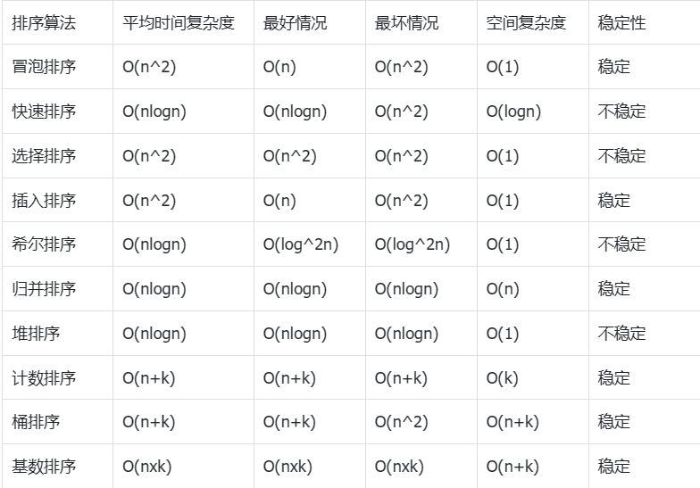

# 面经

## 智能指针

1. std::shared_ptr 基于引用计数，用于管理动态分配对象，适用于多个智能指针共享同一块内存，引用计数为0时对象被删除

```c++
#include <memory>

int main() {
    std::shared_ptr<int> sharedPtr = std::make_shared<int>(42);

    // 可以通过 std::shared_ptr 构造函数或 make_shared 函数创建
    std::shared_ptr<int> anotherSharedPtr(sharedPtr);

    // 引用计数减1
    sharedPtr.reset();

    // 另一个共享指针仍然有效，引用计数为1
    return 0; // 离开作用域，引用计数减1，对象被销毁
}
```

2. std::unique_ptr独占拥有所管理的对象，当其生命周期结束时，对象会被自动销毁.通常用于资源管理，例如动态分配的对象或文件

```c++
int main() {
    std::unique_ptr<int> uniquePtr = std::make_unique<int>(42);
    // 不允许直接赋值
    // std::unique_ptr<int> anotherUniquePtr = uniquePtr; // 错误，不允许直接赋值
    // 通过 std::move 进行所有权转移
    std::unique_ptr<int> anotherUniquePtr = std::move(uniquePtr);
    // uniquePtr 不再拥有对象的所有权，变为 nullptr
    // 在 uniquePtr 销毁时，不会删除对象，因为所有权已经转移
return 0; // 离开作用域，anotherUniquePtr 被销毁，对象也被销毁

}
```

1. std::week_ptr是一种弱引用指针，它不增加引用计数。它通常用于协助std::shared_ptr，以避免循环引用问题。
使用场景：适用于协助解决std::shared_ptr的循环引用问题，其中多个shared_ptr互相引用，导致内存泄漏。

```c++
#include<memory>

int main(){
std::shared_ptr<int>sharedPtr=std::make_shared<int>(42);

std::weak_ptr<int>weakPtr=sharedPtr;

//使用lock函数获取shared_ptr

if(autoshared=weakPtr.lock()){
    //可以安全地使用shared指针
}

//当sharedPtr被销毁后，weakPtr不再有效

return 0;
}
```

## 栈和堆的区别

1. 存储内容

    栈：栈主要存储局部变量、函数参数和函数调用的上下文。它的存储生命周期通常是有限的，当超出其作用域时，内存会自动释放。

    堆：堆主要用于存储动态分配的对象和数据结构。它的存储生命周期没有那么明确，需要手动释放。

2. 生命周期:

    栈：栈上的变量生命周期与其作用域（通常是一个函数的执行）相对应。一旦超出作用域，栈上的变量将自动销毁。

    堆：堆上的内存生命周期由程序员控制。在程序员显式释放内存之前，内存将一直存在。

3. 分配速度:
    栈：由于栈上的内存分配和释放是自动管理的，通常比堆更快。

    堆：堆上的内存分配和释放需要较多的开销，通常比较慢。

4. 大小限制:

    栈：栈的大小通常受到限制，因为它由操作系统管理，可以很小，通常在几MB以内。

    堆：堆的大小可以较大，受到系统资源的限制，通常比栈要大得多。

5. 数据访问:

    栈：栈上的数据访问速度较快，因为它是线性存储，访问局部变量通常只需要一次寻址操作。

    堆：堆上的数据访问速度较慢，因为它是散乱存储，需要进行额外的寻址操作。

## 用const的目的？

1. 防止修改变量的值

2. 指定函数参数为只读：在函数定义中，使用 const 可以指定某个参数是只读的，防止在函数内部修改参数的值。

``void printMessage(conststd::string&message){
//message+="!"; //错误，无法修改只读参数
std::cout<<message<<std::endl;
}``

3. 确保成员函数不修改对象状态：在成员函数声明和定义中使用 const 关键字，可以确保该成员函数不会修改调用对象的状态。这种方法被称为常量成员函数。

```c++
Class MyClass{
public:
void modifyState();//普通成员函数
void queryState() const;//常量成员函数，不修改对象状态
};
```

4. 指定常量指针或常量引用：在指针或引用声明中使用 const 可以指定指针指向的对象是常量，或者引用的对象是常量。

``const int ptrToConst;//指向常量的指针``
``int const constPtr;//指针不可变``

5. 避免不必要的拷贝：在函数参数传递和返回值中使用 const 可以避免不必要的拷贝，提高性能。

## 重载和重写的区别？

1. 重载（Overloading）：

    定义：在同一个作用域内，允许存在多个同名的函数，但是这些函数的参数列表必须不同（包括参数的个数、类型、顺序等）。

    目的：通过相同的函数名来处理不同类型的参数，提高代码的灵活性。

    ```c++
    int add(int a,int b){

    return
    a+b;
    }

    double add(double a,double b){

    return
    a+b;
    }
    ```

2. 重写（Overriding）：

    定义：在派生类中重新实现（覆盖）其基类的虚函数。发生在继承关系中，子类重新定义基类的虚函数，实现子类自己的版本。

    目的：支持多态性，允许基类的指针或引用在运行时指向派生类对象，并调用相应的派生类函数。

     ```c++
    class Shape{
    public:
    virtual void draw()const{
    //具体的实现
    }
    };

    class Circle:publicShape{
    public:
    void draw()const override{
    //Circle版本的实现，覆盖了基类的虚函数
    }
    };
    ```

总结：

重载是指在同一作用域中定义多个同名函数，通过参数列表的不同来区分；

重写是指派生类重新实现（覆盖）其基类的虚函数，以支持多态性。

## 定义指针时要注意的问题？

1. 初始化：指针在定义时最好立即初始化，可以为其赋予 nullptr（C++11 及以上）或 NULL，或者指向有效的内存地址。未初始化的指针具有不确定的值。

    ``int *ptr=nullptr;//推荐使用nullptr初始化指针``

2. 悬空指针：当指针指向的内存被释放后，如果不将指针置为 nullptr，该指针就成了悬空指针。使用悬空指针可能导致未定义行为。

    ```c++
    int*  ptr=new int;
    delete ptr;
    //ptr现在是悬空指针
    ```

3. 野指针：指针指向未知的内存地址，可能是未初始化的指针或者指向已释放的内存。使用野指针可能导致程序崩溃或不可预测的行为。

    ```c++
    int*ptr;//未初始化的指针
    *ptr=42;//野指针
    ```

4. 空指针解引用：尝试解引用空指针会导致未定义行为。在解引用指针之前，应该确保指针不为 nullptr。

    ```c++
    int*ptr=nullptr;
    //*ptr;//错误，解引用空指针
    ```

5. 指针的生命周期：指针在超出其作用域后不再有效，但如果指针指向的是动态分配的内存，需要手动释放以防止内存泄漏。

6. 指向栈上的内存：当指针指向栈上的内存时，应该确保在指针超出作用域之前，该内存仍然有效。

    ```c++
    int* func(){
    int x=42;
    return &x;//错误，返回指向栈上的内存地址
    }//x超出作用域，指向的内存已经无效
    ```

7. 空指针与野指针：空指针（nullptr）表示指针不指向任何有效的内存地址，而野指针是指指针的值是一个不确定的地址。合理使用空指针，并尽量避免野指针。

## c++内存分配？

栈区（Stack）：用于存储局部变量和函数调用的信息。栈是一种后进先出（LIFO）的数据结构。每当进入一个新的函数，系统会为其分配一个栈帧，用于存储局部变量、参数和函数调用的返回地址等信息。当函数执行完成，对应的栈帧会被销毁。

堆区（Heap）：用于动态分配内存。程序员通过new运算符从堆上分配内存，通过delete运算符释放堆上的内存。堆上的内存分配和释放需要程序员手动管理，确保在不再使用时及时释放，以防止内存泄漏。

全局区/静态区（Global/Static Area）：用于存储全局变量和静态变量。全局变量存储在全局数据区，静态变量存储在静态数据区。这些变量在程序启动时被分配，直到程序结束时才会释放。

常量区（Constant Area）：用于存储常量字符串和全局常量。这部分内存是只读的，程序运行期间不能修改。

代码区（Code Area）：用于存储程序的执行代码。在程序运行时，代码区是只读的。

## new/delete和malloc/free的联系及区别？

new 和 delete 是 C++ 中用于动态内存分配和释放的运算符，而 malloc 和 free 是 C 语言中对应的库函数。

联系：

目的相同：new 和 malloc 都用于在堆上动态分配内存，而 delete 和 free 用于释放动态分配的内存。

使用方式：new 和 delete 是 C++ 中的运算符，可以直接使用，而 malloc 和 free 是 C 语言中的库函数，需要包含头文件

区别：

类型安全：new 和 delete 是类型安全的，它们会调用对象的构造函数和析构函数。malloc 和 free 是基于 void*，不会调用构造和析构函数，因此不是类型安全的。

大小参数：new 和 delete 不需要显式指定要分配的内存大小，它们会根据类型自动计算。而 malloc 和 free 需要显式指定分配或释放的内存大小。

操作对象：new 和 delete 主要用于操作对象，而 malloc 和 free 可以用于分配任意大小的内存块。

对NULL的处理：new 在分配失败时会抛出 std::bad_alloc 异常，而 malloc 在分配失败时返回 NULL。

适用范围：new 和 delete 是 C++ 中的运算符，而 malloc 和 free 是 C 标准库中的函数。在 C++ 中，推荐使用 new 和 delete，因为它们更符合面向对象的编程思想。

## main函数前会有其他函数语句被执行吗？

在标准的 C++ 程序中，main函数是程序的入口点，程序从main函数开始执行。在main函数执行之前，不会有其他普通函数被自动调用。然而，有一些特殊情况可能导致main函数执行前调用其他函数或执行其他代码。

全局对象的构造：在 C++ 中，全局变量和静态变量的构造函数会在main函数执行之前调用。这意味着如果你有全局对象，它们的构造函数将在main函数执行前执行。

```c++
#include<iostream>


class GlobalObject{
public:

GlobalObject(){
std::cout<<"GlobalObjectconstructed!"<<std::endl;
}
};

GlobalObject globalVar;//全局变量，构造函数会在main函数执行前调用

int main(){
std::cout<<"Insidemainfunction!"<<std::endl;

return 0;
}
```

例子中，GlobalObject 类的构造函数会在 main 函数执行前被调用。

特殊初始化函数：在一些特殊的嵌入式系统或特定编译器中，可能存在一些特殊的初始化函数，这些函数可能在 main 函数之前执行。

## 虚函数

### 什么是虚函数

虚函数是在基类中声明的，而在派生类中进行重写（override）的函数。通过使用 virtual 关键字声明一个函数为虚函数，它使得在运行时能够动态地确定调用的是哪个版本的函数。

### 虚函数作用

1. 实现多态性（Polymorphism）：允许通过基类指针或引用调用派生类对象的函数，根据实际对象的类型选择相应的函数实现。

2. 运行时绑定（Runtime Binding）：虚函数通过表格（虚函数表）的方式实现，使得在运行时动态地绑定函数调用。

### 虚函数实现？

1. 虚函数表（vtable）：
每个含有虚函数的类都有一个虚函数表（数组），其中存储了虚函数的地址。对象的内存布局中包含一个指向虚函数表的指针。子类的虚函数表包含父类的虚函数表，并在适当的位置添加或替换新的虚函数地址。

2. 虚函数指针（vptr）：对象中的虚函数指针指向虚函数表。在对象的构造过程中，虚函数指针被设置为指向类的虚函数表。

3. 动态绑定：当通过基类指针或引用调用虚函数时，实际调用的是对象的实际类型的虚函数。这种调用方式被称为动态绑定。编译器通过虚函数指针找到对象的虚函数表，然后在表中查找对应虚函数的地址。

看个例子：

```c++
#include<iostream>


class Base{
public:
virtual void show
(){
std::cout<<"Base::show()"<<std::endl;
}
};

class Derived:public Base{
public:
void show()override{
std::cout<<"Derived::show()"<<std::endl;
}
};

int main(){
Base baseObj;
Derived derivedObj;

Base*basePtr=&baseObj;
Base*derivedPtr=&derivedObj;

//调用虚函数，实际执行Derived::show()
basePtr->show();
derivedPtr->show();


return 0;
}
```

例子中，Base 类有一个虚函数 show，而 Derived 类覆盖了这个虚函数。在 main 函数中，通过基类指针调用虚函数，实际执行的是对象的实际类型的虚函数。这就是虚函数实现动态绑定的基本原理。

### 纯虚函数

纯虚函数是一个在基类中声明但没有提供实现的虚函数，它通过在声明中使用 = 0 来标识。类含有纯虚函数的类被称为抽象类，不能被实例化。派生类必须实现纯虚函数，否则也会变为抽象类。

```c++
class AbstractBase{
    public:
        virtual void PureVirtualfunction() =0; 
}
```

### 虚析构函数

父类析构函数是虚函数时，通过父类指针删除子类的对象，会通过子类析构函数

## 内存池

1. 概念
内存池（Memory Pool）是一种用于管理内存分配的机制，它通过预先分配一块固定大小的内存块，然后根据需要从这个内存块中分配小块内存给应用程序使用，以减少内存碎片和提高内存分配的效率。

2. 内存池的目的：

    减少内存碎片：内存池通过预先分配一块连续的内存，避免了频繁的小块内存分配和释放，减少了内存碎片的产生。

    提高内存分配效率：内存池可以通过一次分配多次使用，减少了内存分配的开销，提高了内存分配的效率。

3. 内存池的实现方式：

   * 固定大小的块：内存池通常将内存划分成大小相等的块，每个块都可以独立地分配给应用程序。
   * 预分配内存：内存池在初始化时会预分配一定大小的内存块，并将这些块组织成链表或其他数据结构。
   * 分配策略：内存池可以采用不同的分配策略，例如首次适应、最佳适应、最差适应等。

4. 内存池的优势：
   1. 降低内存碎片：内存池通过将内存分配和释放控制在一个固定大小的块中，有效地减少了内存碎片的产生。
   2. 提高性能：内存池减少了频繁的内存分配和释放操作，降低了内存管理的开销，提高了程序性能。

5. 使用场景：
    1. 频繁地小块内存分配：内存池特别适用于需要频繁地分配和释放小块内存的场景，如网络编程、嵌入式系统等。
    实时系统：在实时系统中，内存分配的延迟是一个重要的考量因素，内存池可以帮助降低内存分配的延迟。
6. 内存池的实现步骤：
    1. 预分配内存块：在初始化时，内存池预分配一块固定大小的内存。
    2. 组织内存块：将预分配的内存划分成大小相等的块，并组织成链表或其他数据结构。
    3. 分配内存：当应用程序需要内存时，从内存池中分配一个块。
    4. 释放内存：当应用程序不再需要内存时，将内存块释放回内存池。
7. code

```c++
#include <iostream>
#include <vector>

class MemoryPool {
private:
    std::vector<void*> blocks;
    size_t block_size;

public:
    MemoryPool(size_t size) : block_size(size) {
        // 初始化时预分配一定数量的内存块
        allocateBlock();
    }

    ~MemoryPool() {
        // 释放所有内存块
        for (void* block : blocks) {
            delete[] static_cast<char*>(block);
        }
    }

    void* allocate() {
        // 从当前内存块中分配内存
        if (blocks.empty() || block_size - usedSpace() < sizeof(void*)) {
            allocateBlock();
        }

        void* allocated = static_cast<char*>(blocks.back()) + usedSpace();
        incrementUsedSpace(sizeof(void*));
        return allocated;
    }

    void deallocate(void* ptr) {
        // 内存释放回内存池
        // 此处简化实现，不进行内存复用
    }

private:
    void allocateBlock() {
        // 分配一个新的内存块
        void* block = new char[block_size];
        blocks.push_back(block);
        resetUsedSpace();
    }

    size_t usedSpace() const {
        // 计算当前内存块已使用的空间
        if (!blocks.empty()) {
            return reinterpret_cast<size_t>(blocks.back());
        }
        return 0;
    }

    void incrementUsedSpace(size_t size) {
        // 增加已使用空间的偏移量
        if (!blocks.empty()) {
            blocks.back() = static_cast<void*>(static_cast<char*>(blocks.back()) + size);
        }
    }

    void resetUsedSpace() {
        // 重置已使用空间的偏移量
        if (!blocks.empty()) {
            blocks.back() = nullptr;
        }
    }
};
```

## c++11特性

1. 自动类型推导（Auto）
2. 范围-based for 循环：简化了对容器元素的遍历。
``
std::vector<int> numbers = {1, 2, 3, 4, 5};
for (const auto& num : numbers) {
    // 使用num
}
``
3. 智能指针
4. Lambda 表达式：允许在函数内部定义匿名函数，提高代码可读性和灵活性。
``auto add = [](int a, int b) { return a + b; };``
5. nullptr：引入了空指针常量nullptr

6. 强制类型转换（Type Casting）：引入了static_cast、dynamic_cast、const_cast、reinterpret_cast等更安全和灵活的类型转换操作符。
``double x = 3.14;
int y = static_cast<int>(x);``

7. 右值引用和移动语义：支持通过右值引用实现移动语义，提高了对临时对象的处理效率。
``std::vector<int> getVector() {
    // 返回一个临时vector
    return std::vector<int>{1, 2, 3};
}
std::vector<int> numbers = getVector(); // 使用移动语义``

8. 线程支持（std::thread）：提供了原生的多线程支持，使得并发编程更加方便。
``include <thread>

void myFunction() {
    // 线程执行的代码
}

int main() {
    std::thread t(myFunction);
    t.join(); // 等待线程结束
    return 0;
}``

## C++中的运算符，单目运算符，三元运算符，所有运算符中哪些不可以重载?

算术运算符：+、-、*、/、%、++、--
关系运算符：==、!=、<、>、<=、>=
逻辑运算符：&&、||、!
位运算符：&、|、^、~、<<、>>
赋值运算符：=、+=、-=、*=、/=、%=、&=、|=、^=、<<=、>>=
条件运算符（三元运算符）：? :
成员访问运算符：.、->
指针运算符：、&、->
逗号运算符：,
sizeof 运算符
typeid 运算符
new 和 delete 运算符
强制类型转换运算符：dynamic_cast、static_cast、const_cast、reinterpret_cast

不可以被重载的：

1. 点运算符(.)
2. 成员访问运算符(->)
3. 条件运算符(?:)
4. sizeof 运算符
5. typeid 运算符
6. new 和 delete 运算符

## i++和++i，重载分别要怎么实现?

后缀递增运算符 i++：
返回原始值（未递增之前的值）。
先使用原始值进行计算，然后再递增。

前缀递增运算符 ++i：
返回递增后的值。
先递增，然后使用递增后的值进行计算。
给个例子：

```c++
#include <iostream>

class Counter {
private:
    int count;

public:
    // 构造函数
    Counter() : count(0) {}

    // 后缀递增运算符重载
    Counter operator++(int) {
        Counter temp(*this);  // 保存原始值
        count++;
        return temp;         // 返回原始值
    }

    // 前缀递增运算符重载
    Counter& operator++() {
        count++;
        return *this;        // 返回递增后的值
    }

    // 获取计数值
    int getCount() const {
        return count;
    }
};

int main() {
    Counter c;

    // 后缀递增运算符
    Counter result1 = c++;
    std::cout << "After c++, Count: " << c.getCount() << std::endl;  // 输出 1
    std::cout << "Original Value: " << result1.getCount() << std::endl;  // 输出 0

    // 前缀递增运算符
    Counter result2 = ++c;
    std::cout << "After ++c, Count: " << c.getCount() << std::endl;  // 输出 2
    std::cout << "Updated Value: " << result2.getCount() << std::endl;  // 输出 2

    return 0;
}
```

## hashmap出现哈希冲突，怎么解决？

1. 开放地址法（Open Addressing）：
在开放地址法中，当一个位置发生冲突时，就去寻找下一个空的位置，直到找到一个空位置或者遍历了整个哈希表。开放地址法有几种常见的处理冲突的方法：

   * 线性探测（Linear Probing）：发生冲突时，顺序地查找下一个空槽。
   * 二次探测（Quadratic Probing）：发生冲突时，使用二次方程来查找下一个空槽。
   * 双重哈希（Double Hashing）：使用第二个哈希函数来计算下一个槽的位置。

2. 链地址法（Chaining）：
在链地址法中，哈希表的每个槽对应一个链表，当发生冲突时，将冲突的元素插入到对应位置的链表中。链地址法的解决冲突的方式主要有两种：

   * 头插法：新元素插入到链表的头部。
   * 尾插法：新元素插入到链表的尾部。

3. 其他方法：

    * 再哈希（Rehashing）：当哈希表中元素达到一定阈值时，可以重新调整哈希表的大小，选择一个新的哈希函数，将所有元素重新插入新的哈希表中，以降低冲突的概率。

如何选择解决冲突的方法：

* 性能考虑：不同的解决冲突方法在不同的场景下性能表现可能有差异，需要综合考虑插入、删除、查找等操作的性能。
* 简单性：有些方法实现简单，容易理解和维护，这在一些应用场景中可能更为合适。

### 开链法出现聚集，最坏时间复杂度，怎么解决

开链法是一种解决哈希冲突的方法，其中每个哈希桶都包含一个链表，当发生冲突时，新的元素会被添加到相应的链表中。然而，如果哈希函数不够均匀，可能会导致某些链表变得过长，从而降低查找效率。

聚集是指在哈希表中出现了较长的链表，这可能导致查找效率的下降。为了解决这个问题，可以采取以下措施：

1. 重新哈希（Rehashing）：当聚集过多时，可以考虑增大哈希表的大小，然后重新哈希已有的元素。这样可以使每个桶中的元素分布更加均匀。
2. 动态调整哈希表大小：通过动态调整哈希表的大小，可以在运行时根据当前负载因子（已使用桶数与总桶数的比率）来调整表的大小。这有助于避免聚集的出现。
3. 链表优化：可以考虑使用更高效的链表结构，如跳表或平衡树，而不是传统的单链表。这样可以提高在链表中查找元素的效率。
4. 选择更好的哈希函数：一个好的哈希函数可以帮助均匀地分布元素，减少冲突的发生。

## 百万数据，找出TOP10？

要找出一个数据集中的 TOP 10 元素，可以使用堆（Heap）数据结构。

具体步骤：

1. 建立最小堆（Min Heap）：遍历数据集的前 10 个元素，将它们构建成一个最小堆。
2. 遍历剩余元素：对于数据集中的其他元素，如果该元素比最小堆的堆顶元素大，就将堆顶元素替换为当前元素，然后调整堆，确保最小堆的性质仍然保持。
3. 最终堆中的元素即为 TOP 10：遍历完整个数据集后，最小堆中的元素即为 TOP 10。

这种方法的时间复杂度为 O(n * log(k))，其中 n 是数据集的大小，k 是 TOP K 的大小。在这里，k 是 10，因此时间复杂度可以看作是 O(n)。

给个小demo：

```c++
#include <iostream>
#include <vector>
#include <algorithm>
#include <queue>

std::vector<int> findTopK(const std::vector<int>& data, int k) {
    // 使用最小堆
    std::priority_queue<int, std::vector<int>, std::greater<int>> minHeap;

    // 将前k个元素插入最小堆
    for (int i = 0; i < k; ++i) {
        minHeap.push(data[i]);
    }

    // 遍历剩余元素，维护最小堆
    for (int i = k; i < data.size(); ++i) {
        if (data[i] > minHeap.top()) {
            minHeap.pop();
            minHeap.push(data[i]);
        }
    }

    // 将最小堆中的元素取出
    std::vector<int> result;
    while (!minHeap.empty()) {
        result.push_back(minHeap.top());
        minHeap.pop();
    }

    // 由于是最小堆，需要翻转结果
    std::reverse(result.begin(), result.end());

    return result;
}

int main() {
    std::vector<int> data = {3, 1, 4, 1, 5, 9, 2, 6, 5, 3, 5};
    int k = 10;

    std::vector<int> topK = findTopK(data, k);

    std::cout << "Top " << k << " elements: ";
    for (int num : topK) {
        std::cout << num << " ";
    }
    std::cout << std::endl;

    return 0;
}

```

## 快排时间复杂度

给个表供大家参考：



## vector怎么扩容？

在 C++ 的标准库中，std::vector 是一个动态数组，其扩容是通过重新分配内存来实现的。当 std::vector 的元素数量达到当前分配的内存大小时，系统会为 std::vector 分配一块更大的内存，并将原来的元素复制到新的内存中。这个过程中原来的内存会被释放。

std::vector 扩容的基本步骤：

1. 分配新的内存：当 std::vector 中的元素个数达到当前分配的内存大小时，需要分配一块新的内存。新的内存大小通常是当前内存大小的两倍，这样做是为了保证 std::vector 的操作复杂度为平摊 O(1)。
2. 将元素复制到新内存：将原来的元素逐个复制到新分配的内存中。
3. 释放旧内存：释放原来的内存空间。

## 深拷贝浅拷贝？

1. 浅拷贝：
    * 浅拷贝是指将一个对象的值复制到另一个对象，但是只复制对象的基本数据类型的成员变量，而不复制引用类型的成员变量。
    * 对于引用类型的成员变量，浅拷贝后，原对象和拷贝对象仍然指向相同的引用，因此它们共享相同的引用对象。如果修改了其中一个对象的引用对象，另一个对象也会受到影响。
    * 浅拷贝通常通过拷贝构造函数或赋值运算符实现。

2. 深拷贝：
    * 深拷贝是指将一个对象的值复制到另一个对象，并且递归复制对象的所有引用类型的成员变量，而不是简单地复制引用。
    * 深拷贝后，原对象和拷贝对象拥有相同的值，但是它们所引用的对象是独立的，修改其中一个对象的引用对象不会影响另一个对象。
    * 深拷贝通常需要自定义实现，可以通过递归复制对象的所有成员变量来实现。

12、设计模式？

单例模式（Singleton Pattern）：

思想：保证一个类仅有一个实例，并提供一个访问它的全局访问点。

饿汉式（Eager Initialization）
在类加载的时候就创建实例，因此在使用时已经存在一个实例。

实现代码：

class SingletonEager {
private:
// 私有的构造函数，防止外部实例化
SingletonEager() {}

    // 静态实例，在类加载时初始化
    static SingletonEager instance;

public:
    // 公共的访问点
    static SingletonEager\* getInstance() {
        return &instance;
}
};

// 初始化静态实例
SingletonEager SingletonEager::instance;

优点：

实现简单，线程安全（C++11 之前，C++11 及之后需要添加一些关键字保证线程安全）。
缺点：

如果程序中未使用该单例，会造成资源浪费。
懒汉式（Lazy Initialization）
在需要使用时才创建实例，避免了不必要的资源浪费。

实现代码：

class SingletonLazy {
private:
// 私有的构造函数，防止外部实例化
SingletonLazy() {}

    // 静态实例，使用时初始化
    static SingletonLazy* instance;

public:
    // 公共的访问点，使用时创建实例
    static SingletonLazy\* getInstance() {
        if (!instance) {
          instance = new SingletonLazy();
        }
        return instance;
    }
};

// 初始化静态实例为 nullptr
SingletonLazy\* SingletonLazy::instance = nullptr;

优点：

节省了资源，只有在需要时才创建实例。
缺点：

需要处理线程安全问题，否则可能导致多个线程同时创建实例。
在多线程环境下，需要使用双重检查锁定或者其他机制来保证线程安全性。
工厂模式（Factory Pattern）：

思想：定义一个创建对象的接口，但由子类决定实例化哪个类。工厂方法使一个类的实例化延迟到其子类。
代码示例：

// 抽象产品
class Product {
public:
    virtual void create() = 0;
};

// 具体产品 A
class ConcreteProductA : public Product {
public:
    void create() override {
        std::cout << "Product A created.\n";
}
};

// 具体产品 B
class ConcreteProductB : public Product {
public:
    void create() override {
        std::cout << "Product B created.\n";
}
};

// 抽象工厂
class Factory {
public:
    virtual Product* createProduct() = 0;
};

// 具体工厂 A
class ConcreteFactoryA : public Factory {
public:
    Product* createProduct() override {
        return new ConcreteProductA();
    }
};

// 具体工厂 B
class ConcreteFactoryB : public Factory {
public:
    Product* createProduct() override {
        return new ConcreteProductB();
    }
};

观察者模式（Observer Pattern）：

思想：定义了一种一对多的依赖关系，当一个对象的状态发生改变时，所有依赖它的对象都得到通知并自动更新。
代码示例：
// 抽象观察者
class Observer {
public:
    virtual void update() = 0;
};

// 具体观察者 A
class ConcreteObserverA : public Observer {
public:
    void update() override {
        std::cout << "Observer A received update.\n";
    }
};

// 具体观察者 B
class ConcreteObserverB : public Observer {
public:
    void update() override {
        std::cout << "Observer B received update.\n";
    }
};

// 主题
class Subject {
private:
    std::vector<Observer*> observers;

public:
    void attach(Observer* observer) {
        observers.push_back(observer);
    }

    void notify() {
        for (auto observer : observers) {
            observer->update();
        }
    }

};

13、修饰器模式与代理模式的区别？

修饰器模式（Decorator Pattern）：

修饰器模式允许你通过将对象封装在装饰器类的对象中来动态地改变对象的行为。这种模式是对继承的一种有力补充，它提供了一种灵活的方式来扩展类的功能。

给个例子：

#include <iostream>

// Component 接口
class Coffee {
public:
    virtual int cost() const = 0;
    virtual ~Coffee() {}
};

// ConcreteComponent 具体组件
class SimpleCoffee : public Coffee {
public:
    int cost() const override {
        return 10;
    }
};

// Decorator 装饰器
class CoffeeDecorator : public Coffee {
public:
    CoffeeDecorator(Coffee* decorated_coffee) : decorated_coffee*(decorated_coffee) {}

    int cost() const override {
        return decorated_coffee_->cost();
    }

private:
    Coffee* decorated*coffee*;
};

// ConcreteDecorator 具体装饰器
class Milk : public CoffeeDecorator {
public:
    Milk(Coffee* decorated_coffee) : CoffeeDecorator(decorated_coffee) {}

    int cost() const override {
        return CoffeeDecorator::cost() + 5;
    }

};

// ConcreteDecorator 具体装饰器
class Sugar : public CoffeeDecorator {
public:
    Sugar(Coffee* decorated_coffee) : CoffeeDecorator(decorated_coffee) {}

    int cost() const override {
        return CoffeeDecorator::cost() + 2;
    }

};

// 使用
int main() {
    Coffee* coffee = new SimpleCoffee();
    std::cout << "Cost: $" << coffee->cost() << std::endl;

    Coffee* milk_coffee = new Milk(coffee);
    std::cout << "Cost: $" << milk_coffee->cost() << std::endl;

    Coffee* sugar_milk_coffee = new Sugar(milk_coffee);
    std::cout << "Cost: $" << sugar_milk_coffee->cost() << std::endl;

    delete coffee;
    delete milk_coffee;
    delete sugar_milk_coffee;

    return 0;

}

代理模式（Proxy Pattern）：

代理模式通过引入一个代理类，控制对原始对象的访问，并且可以在调用前后执行一些额外的操作。

再给个例子：

#include <iostream>

// Subject 主题接口
class RealCoffee {
public:
    virtual int cost() const = 0;
    virtual ~RealCoffee() {}
};

// RealSubject 真实主题
class SimpleRealCoffee : public RealCoffee {
public:
    int cost() const override {
        return 10;
    }
};

// Proxy 代理
class CoffeeProxy : public RealCoffee {
public:
    CoffeeProxy(RealCoffee* real_coffee) : real_coffee_(real_coffee) {}

    int cost() const override {
        // 可以在调用前后执行一些额外的操作
        std::cout << "Proxy: Preprocessing..." << std::endl;
        int result = real_coffee_->cost();
        std::cout << "Proxy: Postprocessing..." << std::endl;
        return result;
    }

private:
    RealCoffee* real_coffee_;
};

// 使用
int main() {
    RealCoffee* real_coffee = new SimpleRealCoffee();
    std::cout << "Cost: $" << real_coffee->cost() << std::endl;

    RealCoffee* coffee_proxy = new CoffeeProxy(real_coffee);
    std::cout << "Cost: $" << coffee_proxy->cost() << std::endl;

    delete real_coffee;
    delete coffee_proxy;

    return 0;

}

在修饰器模式中，Decorator 类和 ConcreteDecorator 类扩展了 Component 接口。而在代理模式中，Proxy 类继承了 Subject 接口，但在代理中引入了一个真实的主题对象，而 Decorator 直接包含另一个组件。这两者的差别在于它们的目的和关注点：修饰器模式关注动态地添加或覆盖对象的行为，而代理模式关注对对象的访问控制。

1、内存对齐你了解吗，作用是什么，怎么样实现的？
指数据在内存中存储时相对于起始地址的偏移量是数据大小的整数倍。

作用：

1. 提高访问速度：许多计算机体系结构要求数据按照特定的边界地址存储，而不是任意地址。当数据被按照这些边界对齐时，处理器能够更快地访问这些数据，提高数据存取速度。

2. 硬件要求：一些硬件平台对于特定类型的数据要求按照一定的对齐方式存储，不遵循这个规则可能导致硬件异常或性能下降。

3. 减少浪费：内存对齐可以减少内存碎片，提高内存利用率。

在C/C++中，内存对齐是由编译器负责的。编译器会按照平台的要求为数据进行对齐，通常会将数据按照其自身大小对齐到特定字节的倍数。这个特定字节的倍数通常由平台决定，例如，在32位系统中可能是4字节，而在64位系统中可能是8字节。

C/C++中可以使用一些特殊的关键字或编译器指令来控制内存对齐，例如：

alignas关键字：C++11引入了alignas关键字，用于指定对齐方式。

alignas(16) struct MyStruct {
    // 结构体成员
};
attribute((aligned(n)))：在一些编译器中，可以使用attribute((aligned(n)))来指定对齐方式。

struct MyStruct {
    // 结构体成员
} __attribute__((aligned(16)));
2、C++的this指针了解吗？有什么作用，是如何实现的？
在C++中，this 指针是一个指向当前对象的指针，它是成员函数的隐含参数。this 指针的主要作用是允许在一个类的成员函数中访问调用这个函数的对象的地址。

特点：

1. 隐含参数：在每个成员函数内部，编译器都会自动地传递一个额外的参数，即 this 指针，作为函数的隐含参数。这个指针指向调用该函数的对象。

2. 指向当前对象：this 指针指向调用成员函数的对象，使得成员函数能够访问调用对象的成员变量和其他成员函数。

3. 生命周期：this 指针的生命周期与成员函数的调用周期相同。当成员函数被调用时，this 指针被创建；当函数执行结束后，this 指针也随之销毁。

4. 用法：通常，this 指针在成员函数中用于解决成员变量与局部变量之间的歧义。如果成员变量和局部变量同名，可以使用 this 指针来明确地访问成员变量。

简单例子：

#include <iostream>

class MyClass {
public:
    void printAddress() {
        std::cout << "Object address: " << this << std::endl;
    }
};

int main() {
    MyClass obj1;
    MyClass obj2;

    obj1.printAddress();
    obj2.printAddress();

    return 0;
}
3、在成员函数中删除this指针出发生什么，之后还可以使用吗？
在成员函数中删除 this 指针是一种危险的行为，因为这样做会导致未定义行为。this 指针指向当前对象，而删除它可能导致访问无效的内存地址，引发各种问题，包括程序崩溃。

当 this 指针被删除后，对象的成员函数可能会试图访问已经无效的地址，这可能导致未知的行为，例如访问冗余数据、崩溃或数据损坏。

简单的示例，说明了删除 this 指针的后果：

#include <iostream>

class MyClass {
public:
    void deleteThis() {
        delete this;
    }

    void printMessage() {
        std::cout << "Hello, this is MyClass!" << std::endl;
    }
};

int main() {
    MyClass* obj = new MyClass;
    obj->deleteThis(); // 删除 this 指针

    // 调用已删除 this 指针的对象的成员函数，可能导致未定义行为
    obj->printMessage();

    return 0;
}
例子中，deleteThis 函数试图删除 this 指针，而后续对 printMessage 函数的调用可能导致程序崩溃或其他不确定的行为。这种用法是不安全和不推荐的，应该避免在成员函数中删除 this 指针。正确的做法是在合适的地方使用 delete 操作符删除动态分配的对象。

4、引用占用内存吗？
引用在 C++ 中并不占用额外的内存。引用是一个别名，它和被引用的对象共享相同的内存地址。因此，引用本身并不占用独立的内存空间，它只是为了方便访问已经存在的对象。

例子：

#include <iostream>

int main() {
    int x = 42;
    int& ref = x;

    std::cout << "x: " << x << std::endl;   // 输出 x 的值
    std::cout << "ref: " << ref << std::endl; // 输出引用 ref，与 x 的值相同

    ref = 10; // 修改引用的值，也会修改 x 的值

    std::cout << "x after modification: " << x << std::endl;

    return 0;
}
例子中，ref 是 x 的引用，它们共享相同的内存空间。修改 ref 的值实际上就是修改 x 的值，因为它们指向同一块内存。因此，引用本身并不占用额外的内存。

5、C++什么时候会出现越界访问的情况？
C++ 中越界访问是一种程序错误，它可能导致程序崩溃、未定义行为或者产生不可预测的结果。越界访问通常发生在数组、指针、容器等数据结构的操作中。

可能导致越界访问的情况：

1.数组越界：访问数组元素时，索引超过数组的有效范围。

int arr[5];
arr[5] = 42; // 越界访问
2.指针越界：通过指针访问内存时，超出了指向对象的有效范围。

int arr[5];
int* ptr = arr;
*(ptr + 5) = 42; // 越界访问
3.迭代器越界：在使用容器的迭代器时，超出了容器的有效范围。

#include <vector>
#include <iostream>

int main() {
    std::vector<int> vec = {1, 2, 3};
    auto it = vec.begin();
    ++it;
    ++it;
    ++it;
    std::cout << *it << std::endl; // 越界访问
    return 0;
}
4.字符串越界：对字符串进行操作时，超出了字符串的有效范围。

#include <iostream>
#include <string>

int main() {
    std::string str = "Hello";
    char ch = str[10]; // 越界访问
    std::cout << ch << std::endl;
    return 0;
}

10、使用过GDB吗，如何使用的；如果出现CPU高使用，应该如何定位调试？
使用GDB调试：

1. 编译时添加调试信息：在编译程序时，使用 -g 选项生成调试信息。例如：g++ -g -o my_program my_program.cpp

2. 启动GDB：在命令行中启动GDB，并指定可执行文件的路径：gdb ./my_program

3. 设置断点：在GDB中，使用 break 命令设置断点。例如，在 main 函数处设置断点：break main

4. 运行程序：使用 run 命令运行程序，GDB会在断点处停止。run

5. 查看变量值：使用 print 命令查看变量的值。print my_variable

6. 单步执行：使用 step 命令单步执行程序，逐行查看代码的执行情况。step

7. 其他调试命令：GDB提供了许多调试命令，如 next（下一步）、continue（继续执行）、info variables（查看变量信息）等。根据需要使用相应的命令。

定位高CPU使用问题：

1. 使用系统工具：使用系统工具（如top、htop等）查看哪个进程占用了高CPU。确定具体是哪个进程引起的问题。

2. 性能分析工具：使用性能分析工具（如perf）来检查程序的性能瓶颈。例如，可以使用以下命令：perf record -g -p perf report

3. 核心转储文件：如果程序崩溃或占用高CPU，可以生成核心转储文件，然后使用GDB进行分析。gcore gdb -c core.

4. 分析代码：使用GDB分析导致高CPU使用的代码部分，查看哪些函数或代码路径消耗了大量的CPU时间。

11、说一下智能指针？
1.std::shared_ptr：

• 原理：std::shared_ptr是基于引用计数的智能指针，用于管理动态分配的对象。它维护一个引用计数，当计数为零时，释放对象的内存。

• 使用场景：适用于多个智能指针需要共享同一块内存的情况。例如，在多个对象之间共享某个资源或数据。

std::shared_ptr<int> sharedInt = std::make_shared<int>(42);
std::shared_ptr<int> anotherSharedInt = sharedInt; // 共享同一块内存
2.std::unique_ptr：

• 原理：std::unique_ptr是独占式智能指针，意味着它独占拥有所管理的对象，当其生命周期结束时，对象会被自动销毁。

• 使用场景：适用于不需要多个指针共享同一块内存的情况，即单一所有权。通常用于资源管理，例如动态分配的对象或文件句柄。

std::unique_ptr<int> uniqueInt = std::make_unique<int>(42);
// uniqueInt 的所有权是唯一的
3.std::weak_ptr：

• 原理：std::weak_ptr是一种弱引用指针，它不增加引用计数。它通常用于协助std::shared_ptr，以避免循环引用问题。

• 使用场景：适用于协助解决std::shared_ptr的循环引用问题，其中多个shared_ptr互相引用，导致内存泄漏。

std::shared_ptr<int> sharedInt = std::make_shared<int>(42);
std::weak_ptr<int> weakInt = sharedInt;
4.std::auto_ptr（已废弃）：

• 原理：std::auto_ptr是C++98标准引入的智能指针，用于独占地管理对象。但由于其存在潜在的问题，已在C++11中被废弃。

• 使用场景：在C++98标准中，可用于独占性地管理动态分配的对象。不推荐在现代C++中使用。

std::auto_ptr<int> autoInt(new int(42)); // 已废弃
12、右值引用和移动语义的差别？
右值引用：

• 表示形式：使用 && 表示，例如 int&&.

• 作用：主要用于引用临时对象（右值），即将要销毁的临时对象。

• 生命周期：只能引用临时对象，不会延长对象的生命周期。

例子：

int&& x = 5;  // x是一个右值引用，引用了临时对象5
移动语义：

• 作用：允许将资源（如内存）从一个对象“移动”到另一个对象，而不是传统的拷贝。

• 优势：避免了昂贵的深拷贝操作，提高了性能。

• 实现：通过移动构造函数和移动赋值运算符实现。

例子：

// 移动构造函数
MyClass(MyClass&& other) noexcept {
    // 进行资源的移动，而不是拷贝
}

// 移动赋值运算符
MyClass& operator=(MyClass&& other) noexcept {
    // 进行资源的移动，而不是拷贝
}
应用关系：

• 右值引用是基础：移动语义依赖于右值引用，它允许我们获取对右值的引用。

• 移动语义的高级应用：移动语义在容器、智能指针等方面发挥了巨大作用，例如通过 std::move 转移对象的所有权。总的来说，右值引用是语言层面提供的一种引用方式，而移动语义是一种利用右值引用来实现资源高效传递的编程技巧。

14、说一下设计模式？
单例模式（Singleton Pattern）：

思想：保证一个类仅有一个实例，并提供一个访问它的全局访问点。

1.饿汉式（Eager Initialization）

在类加载的时候就创建实例，因此在使用时已经存在一个实例。

实现代码：

class SingletonEager {
private:
    // 私有的构造函数，防止外部实例化
    SingletonEager() {}

    // 静态实例，在类加载时初始化
    static SingletonEager instance;

public:
    // 公共的访问点
    static SingletonEager* getInstance() {
        return &instance;
    }
};

// 初始化静态实例
SingletonEager SingletonEager::instance;
优点：

• 实现简单，线程安全（C++11之前，C++11及之后需要添加一些关键字保证线程安全）。缺点：

• 如果程序中未使用该单例，会造成资源浪费。

2.懒汉式（Lazy Initialization）

在需要使用时才创建实例，避免了不必要的资源浪费。

实现代码：

class SingletonLazy {
private:
    // 私有的构造函数，防止外部实例化
    SingletonLazy() {}

    // 静态实例，使用时初始化
    static SingletonLazy* instance;

public:
    // 公共的访问点，使用时创建实例
    static SingletonLazy* getInstance() {
        if (!instance) {
            instance = new SingletonLazy();
        }
        return instance;
    }
};

// 初始化静态实例为nullptr
SingletonLazy* SingletonLazy::instance = nullptr;
优点：

• 节省了资源，只有在需要时才创建实例。缺点：

• 需要处理线程安全问题，否则可能导致多个线程同时创建实例。

• 在多线程环境下，需要使用双重检查锁定或者其他机制来保证线程安全性。

工厂模式（Factory Pattern）：

思想：定义一个创建对象的接口，但由子类决定实例化哪个类。工厂方法使一个类的实例化延迟到其子类。

代码示例：

// 抽象产品
class Product {
public:
    virtual void create() = 0;
};

// 具体产品 A
class ConcreteProductA : public Product {
public:
    void create() override {
        std::cout << "Product A created.\n";
    }
};

// 具体产品 B
class ConcreteProductB : public Product {
public:
    void create() override {
        std::cout << "Product B created.\n";
    }
};

// 抽象工厂
class Factory {
public:
    virtual Product* createProduct() = 0;
};

// 具体工厂 A
class ConcreteFactoryA : public Factory {
public:
    Product* createProduct() override {
        return new ConcreteProductA();
    }
};

// 具体工厂 B
class ConcreteFactoryB : public Factory {
public:
    Product* createProduct() override {
        return new ConcreteProductB();
    }
};
观察者模式（Observer Pattern）：

思想：定义了一种一对多的依赖关系，当一个对象的状态发生改变时，所有依赖它的对象都得到通知并自动更新。

代码示例：

// 抽象观察者
class Observer {
public:
    virtual void update() = 0;
};

// 具体观察者 A
class ConcreteObserverA : public Observer {
public:
    void update() override {
        std::cout << "Observer A received update.\n";
    }
};

// 具体观察者 B
class ConcreteObserverB : public Observer {
public:
    void update() override {
        std::cout << "Observer B received update.\n";
    }
};

// 主题
class Subject {
private:
    std::vector<Observer*> observers;

public:
    void attach(Observer* observer) {
        observers.push_back(observer);
    }

    void notify() {
        for (auto observer : observers) {
            observer->update();
        }
    }
};

13、链表应用场景？
这里顺便讲一下数组和链表的区别。

1.内存分配：

• 数组：在编译时分配一块连续的内存空间，数组的大小通常是固定的，不能动态调整。

• 链表：在运行时按需分配内存，节点之间可以存储在不同的内存块中，链表的大小可以动态增长。

2.内存访问：

• 数组：由于内存连续，可以通过索引直接访问元素，访问速度较快。

• 链表：需要遍历链表来访问特定位置的元素，因此访问速度可能较慢。

3.插入和删除：

• 数组：在中间插入或删除元素通常需要将后续元素移动，时间复杂度为 O(n)，其中 n 是元素的数量。

• 链表：在中间插入或删除元素时，只需要调整节点的指针，时间复杂度为 O(1)。

4.大小调整：

• 数组：通常需要创建一个新数组并将数据复制到新数组以调整大小。

• 链表：可以轻松地添加或删除节点以调整大小。

5.存储结构：

• 数组：线性结构，适用于随机访问元素。

• 链表：非线性结构，适用于插入和删除频繁的情况。

6.空间效率：

• 数组：通常需要分配足够大的内存，可能会浪费空间，但访问速度较快。

• 链表：根据需要分配内存，较灵活，但需要额外的指针存储节点间关系。

7.适用场景：

• 数组：适用于元素数量固定，需要频繁访问元素的情况。

• 链表：适用于元素数量不固定，需要频繁插入和删除元素的情况。
15、堆 栈区别？
1.分配方式:

• 栈：栈是一种自动分配和释放内存的数据结构，它遵循"后进先出"（LIFO）原则。当你声明一个局部变量时，该变量存储在栈上。函数的参数和局部变量也存储在栈上。栈的分配和释放是自动的，由编译器管理。

• 堆：堆是一种手动分配和释放内存的数据结构。在堆上分配内存需要使用 new 或 malloc 等函数，释放内存则需要使用 delete 或 free。堆上的内存不会自动释放，必须手动管理。

2.存储内容:

• 栈：栈主要存储局部变量、函数参数和函数调用的上下文。它的存储生命周期通常是有限的，当超出其作用域时，内存会自动释放。

• 堆：堆主要用于存储动态分配的对象和数据结构。它的存储生命周期没有那么明确，需要手动释放。

3.生命周期:

• 栈：栈上的变量生命周期与其作用域（通常是一个函数的执行）相对应。一旦超出作用域，栈上的变量将自动销毁。

• 堆：堆上的内存生命周期由程序员控制。在程序员显式释放内存之前，内存将一直存在。

4.分配速度:

• 栈：由于栈上的内存分配和释放是自动管理的，通常比堆更快。

• 堆：堆上的内存分配和释放需要较多的开销，通常比较慢。

5.大小限制:

• 栈：栈的大小通常受到限制，因为它由操作系统管理，可以很小，通常在几 MB 以内。

• 堆：堆的大小可以较大，受到系统资源的限制，通常比栈要大得多。

6.数据访问:

• 栈：栈上的数据访问速度较快，因为它是线性存储，访问局部变量通常只需要一次寻址操作。

• 堆：堆上的数据访问速度较慢，因为它是散乱存储，需要进行额外的寻址操作。

5、C++多态？

多态性是指同一个操作可以作用于不同类型的对象，并且可以根据对象的类型执行不同的行为。多态性通过虚函数和函数重载实现。

编译时多态性（静态多态性）：通过函数重载实现，编译器在编译时根据函数参数的类型和数量来选择调用合适的函数。这种多态性是在编译时解析的。
运行时多态性（动态多态性）：通过虚函数和继承实现，允许在运行时根据对象的实际类型来调用适当的函数。这种多态性是在运行时解析的。
6、虚函数怎么实现的？具体是怎么动态派发到不同虚函数上的？

C++中的虚函数通过虚函数表（vtable）来实现动态派发。虚函数表是一个特殊的数据结构，它包含了指向各个虚函数的指针。每个包含虚函数的类都会有一个虚函数表，其中的每个指针指向对应虚函数的地址。

具体步骤：

定义一个基类，并在其中声明虚函数。虚函数通常使用 virtual 关键字来声明。
class Base {
public:
    virtual void someFunction() {
        // 基类的虚函数
    }
};
创建派生类，并在其中重写基类的虚函数。
class Derived : public Base {
public:
    void someFunction() override {
        // 派生类的虚函数，覆盖了基类的虚函数
    }
};
在运行时，当调用一个虚函数时，实际调用的函数是根据对象的类型来动态决定的。这是通过虚函数表来实现的。每个对象都包含一个指向其虚函数表的指针。
当调用虚函数时，编译器会根据对象的虚函数指针查找虚函数表，然后使用表中的指针来调用适当的虚函数。
7、你怎么知道这个虚函数调用的时候是编译器填充好了数组下标，怎么验证的？

编译器通常会为每个类生成一个虚函数表（vtable），这个虚函数表是一个函数指针数组，用于存储虚函数的地址。每个虚函数在虚函数表中都有一个对应的槽位，槽位的顺序通常与虚函数在类中的声明顺序一致。

当一个对象调用虚函数时，编译器并不是在运行时动态查找虚函数的地址，而是通过对象的虚函数指针指向相应的虚函数表。虚函数指针在对象的内存布局中通常是一个指向虚函数表的指针。这个虚函数指针被创建和初始化在对象构造时。

在编译器看来，调用虚函数的过程类似于以下伪代码：

object->vptr[index_of_virtual_function]()
其中，object 是指向对象的指针，vptr 是虚函数指针，index_of_virtual_function 是虚函数在虚函数表中的槽位索引。

要知道编译器如何填充虚函数表的槽位，可以使用调试器查看对象的内存布局，包括虚函数指针和虚函数表的内容。这样你可以验证编译器是否正确地为每个虚函数生成对应的槽位，并填充了正确的函数指针。

8、如果一个子类继承了两个父类，有几个虚函数表？父类拥有同名的虚函数是怎么处理的？

当一个子类继承了两个父类（多重继承）时，子类将包含两个或更多的虚函数表，一个对应于每个父类。每个虚函数表将包含相应父类的虚函数。

如果两个或多个父类具有同名的虚函数，这将导致二义性。在这种情况下，C++编译器通常不会自动解决冲突。子类必须提供自己的版本或重写虚函数来明确指定应该调用哪个父类的虚函数。

下面是一个示例，说明了多重继承中同名虚函数的处理：

#include <iostream>

class Base1 {
public:
    virtual void foo() {
        std::cout << "Base1::foo()" << std::endl;
    }
};

class Base2 {
public:
    virtual void foo() {
        std::cout << "Base2::foo()" << std::endl;
    }
};

class Derived : public Base1, public Base2 {
public:
    // You need to override the foo() function to disambiguate
    void foo() {
        Base1::foo(); // Explicitly call Base1's version of foo
        Base2::foo(); // Explicitly call Base2's version of foo
    }
};

int main() {
    Derived derived;
    derived.foo(); // Calls Derived's foo which calls both Base1's and Base2's foo
    return 0;
}
9、深拷贝和浅拷贝？A = B是深拷贝还是浅拷贝？func(A a)是深拷贝还是浅拷贝？

浅拷贝：浅拷贝会复制对象的引用，而不会复制对象本身的内容。这意味着新对象和原对象将引用相同的数据，因此它们之间的改变会相互影响。如果你对新对象做了修改，原对象也会受到影响，反之亦然。在浅拷贝中，只有对象引用被复制，而不是对象的内容。

A = B;  // 浅拷贝，A 和 B 引用相同的数据
func(A a);  // 传递对象 a 也是浅拷贝
深拷贝：深拷贝会复制对象本身的内容，而不会与原对象共享数据。这意味着新对象是一个完全独立的副本，对新对象的修改不会影响原对象，反之亦然。在深拷贝中，对象的所有数据都会被复制，包括它所引用的其他对象。

A = DeepCopy(B);  // 深拷贝，A 和 B 是独立的对象
func(A a);  // 传递对象 a 也是深拷贝

5、map和b+树，从内存访问的角度，哪个效率比较高？

map底层是红黑树实现，所以它们两个的比较也就是红黑树和B+树的比较。

从内存访问的角度来看，B+树通常在大规模数据存储和范围查询操作时效率更高，而红黑树在单个键查找操作和小规模数据集上效率更高。这是因为它们的内部结构和数据访问模式不同。

B+树：

B+树是一种多叉树，通常用于数据库索引和文件系统的元数据管理。
B+树的节点通常较小，可以包含多个键值对。
B+树的节点是有序的，支持范围查询和范围遍历操作。
B+树的高度相对较低，通常需要较少的磁盘或内存访问来查找或遍历数据。
在内存访问方面，B+树在范围查询和范围遍历时效率较高，因为它可以按顺序访问节点。然而，在单个键查找操作中，可能需要遍历树的高度来找到目标数据。

红黑树：

红黑树是一种自平衡的二叉搜索树，通常用于实现数据结构如std::map。
红黑树的节点相对较小，通常包含一个键值对。
红黑树是二叉搜索树，不支持范围查询，它的查找、插入和删除操作平均时间复杂度为O(log n)。
在内存访问方面，红黑树在单个键查找操作上通常效率更高，因为它是二叉搜索树，而查找操作的平均时间复杂度为O(log n)。然而，红黑树不适合范围查询和范围遍历操作。

如果你需要处理大规模数据集或需要支持范围查询，B+树通常更适合。如果你主要进行单个键的查找操作或处理小规模数据集，红黑树可能更适合。

1、对象池?

对象池是一种性能优化技术，通常用于游戏开发中，以减少对象的创建和销毁操作，从而提高性能。在Unity游戏开发中，对象池是一个有用的工具，它可以用于重复使用游戏对象，减少频繁创建和销毁对象的开销。

对象池的基本概念：

对象池包含一组预先创建的对象实例，这些对象通常是重复使用的，而不是频繁地创建和销毁。
当需要一个新对象时，可以从对象池中获取可用对象实例，并在使用后将其返回对象池，而不是销毁它。
对象池可以减少内存分配和垃圾回收的压力，从而提高性能。
在Unity中实现对象池的步骤：

创建一个对象池管理器：你可以创建一个专门的脚本来管理对象池，或者使用一个空的GameObject来承载对象池脚本。
预先创建对象：在对象池初始化阶段，预先创建一定数量的对象实例，例如子弹、特效、敌人等。
从对象池获取对象：当需要一个对象时，从对象池中获取一个可用对象实例，标记它为“正在使用”状态，并将其激活。
使用对象：使用对象实例，当不再需要时，将其设置为“未使用”状态，禁用它，并将其放回对象池。
重复使用：在整个游戏过程中，对象可以被反复使用，而不是频繁创建和销毁。

7、内存泄漏，怎么解决？

内存泄漏是指程序在分配内存后，没有释放或无法释放不再使用的内存，导致程序持续占用系统内存资源。内存泄漏可能会导致程序性能下降，甚至最终导致程序崩溃。

解决办法：

使用智能指针：在C++中，使用智能指针（如std::shared_ptr、std::unique_ptr）来管理动态分配的内存，以便在不再需要时自动释放内存。这可以有效地避免忘记释放内存的问题。
定位内存泄漏：使用内存分析工具（如Valgrind、Dr. Memory、AddressSanitizer等）来检测内存泄漏。这些工具可以帮助你找到内存泄漏的具体位置和原因。
规范的内存管理：手动分配内存后，确保在不再需要时调用delete或free来释放内存。同时，避免重复释放同一块内存。
使用RAII（资源获取即初始化）：在C++中，通过RAII原则，可以在对象构造时分配资源（如内存），在对象析构时自动释放资源。这有助于确保资源在不再需要时被正确释放。
避免内存浪费：动态分配内存时，分配适当的大小，不要分配过多的内存。同时，尽量减少内存泄漏的机会。
追踪资源：为了防止忘记释放资源，可以创建资源管理类，用于跟踪和管理资源的分配和释放。这样可以更容易发现资源泄漏。
谨慎使用全局变量：全局变量和静态变量在程序生命周期内一直存在，如果不谨慎使用，可能会导致内存泄漏。
8、堆和栈，栈大小，哪些存堆上，static和全局变量存在哪里？

栈（Stack）：

栈是一种线性数据结构，通常采用"先进后出"（LIFO）的方式管理数据。
栈用于存储函数调用时的局部变量、函数参数、返回地址和函数调用上下文等数据。
栈的大小是固定的，通常较小，由操作系统分配。在不同的操作系统和编程环境中，栈的大小可以不同。
栈上的数据是自动管理的，当函数调用结束时，栈上的局部变量会被自动销毁，内存自动释放。
栈上通常存储的数据包括函数调用栈、局部变量、函数参数等。局部变量的生命周期与函数的调用和返回有关，当函数退出时，局部变量会被销毁。

堆（Heap）：

堆是一种树形结构，用于动态分配内存。堆的内存管理方式是"先进先出"（FIFO）。
堆用于存储动态分配的数据，如动态分配的对象、数组等。
堆的大小通常较大，且不是固定的，由操作系统提供的内存分配函数（如malloc、new）动态分配。
堆上的数据需要手动分配和释放。如果不释放堆上分配的内存，可能会导致内存泄漏。
在堆上通常存储动态分配的对象、数组、大型数据结构等。这些数据的生命周期不与函数的调用有直接关系，需要手动分配和释放内存。

Static和全局变量：

static变量和全局变量（在函数之外定义的变量）通常存储在程序的数据段或BSS段中，而不是栈或堆中。
static变量和全局变量的生命周期与程序的运行周期相同。它们在程序启动时分配内存，在程序退出时才会释放。
这些变量的内存分配由编译器和操作系统负责，程序员无需手动分配或释放它们的内存。
9、多态，虚函数表，虚函数表指针，存在哪里，什么时候初始化，对象里面可能有几个虚函数表指针？

多态性是指同一个操作可以作用于不同类型的对象，并且可以根据对象的类型执行不同的行为。多态性通过虚函数和函数重载实现。

编译时多态性（静态多态性）：通过函数重载实现，编译器在编译时根据函数参数的类型和数量来选择调用合适的函数。这种多态性是在编译时解析的。
运行时多态性（动态多态性）：通过虚函数和继承实现，允许在运行时根据对象的实际类型来调用适当的函数。这种多态性是在运行时解析的。在C++中，虚函数的实现依赖于虚函数表（vtable）和虚函数表指针（vptr）。
虚函数表（vtable）：虚函数表是一个包含虚函数指针的数据结构，每个类（包括派生类）都有一个与之对应的虚函数表。虚函数表中存储了该类的虚函数地址，以及可能从基类继承的虚函数地址。每个虚函数表中的条目与一个虚函数对应。
虚函数表指针（vptr）：虚函数表指针是一个指向虚函数表的指针，它通常存储在每个类的对象的内部。如果一个类中包含虚函数，它的对象中会有一个虚函数表指针，指向该类的虚函数表。这个指针使程序能够在运行时找到正确的虚函数表，从而实现多态性。
对象中的虚函数表指针在对象构造时初始化，通常是在构造函数中。每个类只有一个虚函数表指针，指向该类的虚函数表。当存在多重继承时，派生类可能包含多个虚函数表指针，分别指向各个基类的虚函数表。

给个例子：

class Base {
public:
    virtual void foo() { std::cout << "Base::foo()" << std::endl; }
};

class Derived : public Base {
public:
    void foo() override { std::cout << "Derived::foo()" << std::endl; }
};

int main() {
    Base* obj = new Derived();
    obj->foo();  // 调用 Derived::foo()，由于多态，运行时找到正确的函数
    delete obj;
    return 0;
}
Base类和Derived类都包含虚函数，Derived类重写了foo函数。在main函数中，通过基类指针调用虚函数，由于多态，最终调用了Derived::foo()。这个过程依赖于虚函数表和虚函数表指针的机制。

10、socket, IO多路复用，select, poll, epoll？

IO多路复用是一种用于管理多个套接字的并发IO模型。在IO多路复用中，一个进程可以通过一个系统调用监视多个文件描述符（套接字），并且在这些文件描述符上发生IO事件（例如数据可读、数据可写）时进行响应。IO多路复用的目的是减少多线程或多进程模型中的并发连接管理开销。

select 模型：

select 使用一个文件描述符集合，允许应用程序监视多个文件描述符的状态变化，包括可读、可写、异常等。
select 允许单个线程同时管理多个连接，而不需要为每个连接创建一个独立的线程。
但 select 有一个性能限制，它的时间复杂度为 O(n)，当监视的文件描述符数量变大时，性能下降明显。
poll 模型：

poll 与 select 类似，允许应用程序监视多个文件描述符的状态变化，但在某些情况下更加高效。
poll 不会像 select 那样受到文件描述符数量的限制，因此在一定程度上可以处理更多的并发连接。
但 poll 仍然需要遍历整个文件描述符集合，导致性能随着连接数量的增加而下降。
epoll 模型：

epoll 是 Linux 下的多路复用机制，相对于 select 和 poll 具有更高的性能。
epoll 使用了回调机制，只通知应用程序活跃的连接，而不需要遍历整个文件描述符集合。
epoll 支持边缘触发（Edge-Triggered，ET）模式，这意味着只在状态发生变化时通知应用程序，而不是像传统模式那样持续通知。
11、进程间通信，应用场景，共享内存什么时候用得多？

管道：管道是一种用于父子进程通信或者兄弟进程之间通信的单向通道。通常用于进程之间传递数据，如父进程向子进程发送命令或者数据。

应用场景：Shell中的命令管道，用于将一个进程的输出连接到另一个进程的输入。

命名管道：与普通管道不同，命名管道允许无关的进程之间进行通信。它是一种具有名字的FIFO（先进先出）文件。

应用场景：数据交换、进程协作，如不同进程之间的数据传输或通信。

消息队列：消息队列允许进程通过在队列中发送和接收消息来进行通信。每个消息都具有一个类型，可以用于标识消息的用途。

应用场景：通常用于进程之间的异步通信，如进程A向进程B发送消息，而进程B可以在需要时接收并处理这些消息。

共享内存：共享内存允许多个进程访问同一块物理内存，从而可以高效地共享大量数据。

应用场景：适用于需要高性能数据共享的场景，如数据库系统、图像处理、多媒体应用等。

信号：信号是用于通知进程某个事件发生的机制。每个信号都有一个唯一的编号，进程可以注册信号处理程序来响应这些信号。

应用场景：用于处理异步事件，如Ctrl+C中断信号、子进程完成信号等。

套接字：套接字是一种网络编程工具，但也可以在同一台计算机上的不同进程之间进行通信，支持TCP和UDP协议。

应用场景：用于构建网络应用、进程之间的数据传输，如Web服务器、聊天应用等。

文件锁：文件锁是通过在文件上设置锁标志，以防止多个进程同时对同一文件进行读/写。

应用场景：文件共享，确保数据完整性。

共享文件映射：允许多个进程将同一个文件映射到它们的地址空间，实现了共享内存的一种形式。

应用场景：大规模数据处理、数据库管理等。

12、父进程和子进程是独立的空间吗？

在类Unix操作系统中，当一个进程创建子进程时，子进程通常会继承父进程的内存空间的副本，但它们将在各自的独立内存空间中运行。

都有哪些东西是独立的？

内存空间：父进程和子进程有各自独立的内存空间。在子进程中的修改不会影响父进程的内存，反之亦然。
文件描述符：父进程和子进程有各自独立的文件描述符表。子进程不会继承父进程的打开文件描述符，除非父进程明确指定。
寄存器状态：父进程和子进程在创建时的寄存器状态是相同的，但它们之后会独立运行，各自的寄存器状态可能会发生改变。
执行环境：子进程可以有自己的执行环境，包括程序计数器、栈指针和寄存器值。
进程 ID（PID）：父进程和子进程拥有不同的PID，以便系统可以识别它们。
13、C++ STL？

我看后边问题有相关的问题，在这儿就讲讲它的六大组件。

容器（Containers）：容器是STL的核心组件之一，提供了各种数据结构，如向量（vector）、链表（list）、双端队列（deque）、队列（queue）、栈（stack）、映射（map）、集合（set）等。容器用于存储和管理数据，每种容器都有其特定的特性和用途。
算法（Algorithms）：STL包含了丰富的算法，如排序、查找、合并、变换等。这些算法可以用于各种容器，使开发者能够以简单的方式执行各种数据处理任务。
迭代器（Iterators）：迭代器是STL中非常重要的组件，它用于遍历容器中的元素。STL提供了多种迭代器类型，包括正向迭代器、反向迭代器、随机访问迭代器等，以适应不同容器的特性。
函数对象（Functors）：函数对象是可调用的对象，它们可以在算法中使用。STL中的函数对象包括标准函数对象，如加法、减法、逻辑操作等，以及用户自定义的函数对象。
适配器（Adapters）：适配器是STL中的扩展组件，用于将容器或迭代器转换为不同的接口，以便更好地满足特定需求。STL包括堆栈适配器、队列适配器和优先队列适配器。
分配器（Allocators）：分配器允许开发者控制内存的分配和释放，以满足不同的内存管理需求。STL中的分配器提供了一种抽象接口，允许自定义内存管理策略。
14、vector和list？

底层数据结构：
vector 使用动态数组作为底层数据结构，元素在内存中是连续存储的。
list 使用双向链表作为底层数据结构，元素在内存中通过节点相互连接。
插入和删除操作：
vector 在尾部插入或删除元素效率高，但在中间或头部插入/删除元素时需要移动后续元素，效率较低。
list 在任意位置插入或删除元素的效率都很高，因为它只需修改相邻节点的指针。
随机访问：
vector 允许通过下标进行快速随机访问，因为元素在内存中是连续的。
list 不支持随机访问，访问元素需要遍历链表，效率较低。
内存分配：
vector 需要预先分配一块连续内存，如果元素数量动态增长，可能需要重新分配内存，导致内存浪费或复制操作。
list 在插入或删除元素时只需分配或释放单个节点的内存，内存占用相对较小。
迭代器失效：
vector 的迭代器可能会在插入或删除元素时失效，因为元素的移动可能导致迭代器指向无效位置。
list 的迭代器不会失效，因为插入或删除元素只会影响相邻节点的指针。
15、map和unordered_map？

底层数据结构：
map 使用红黑树（Red-Black Tree）作为底层数据结构，它保持元素按键的顺序排序。
unordered_map 使用哈希表（Hash Table）作为底层数据结构，它不保持元素的顺序。
查找效率：
map 具有良好的查找效率，对于有序数据的查找非常高效，时间复杂度为 O(log n)。
unordered_map 在平均情况下具有常数时间的查找效率，时间复杂度为 O(1)，但在最坏情况下，查找可能需要 O(n) 的时间。
元素顺序：
map 会根据键的顺序自动进行排序，因此元素以升序顺序存储。
unordered_map 不关心元素的顺序，元素以散列顺序存储。
插入和删除效率：
map 对于插入和删除操作，特别是在中间或头部，效率相对较低，因为它需要维护红黑树的平衡。
unordered_map 在插入和删除操作方面通常具有更好的性能，因为哈希表的插入和删除操作平均来说是常数时间的。
哈希冲突：unordered_map 可能会遇到哈希冲突的问题，这会影响性能。你可以通过选择适当的哈希函数和调整容器大小来减小冲突的概率。
16、哈希冲突解决？

分离链接法（Separate Chaining）：
在每个哈希表的槽（桶）中维护一个链表、向量或其他数据结构，以存储多个键-值对。
当哈希冲突发生时，新的键-值对被添加到槽中的链表中。这种方法不会影响哈希表的性能，因为查找、插入和删除操作都可以在链表中进行。
这是一种简单且常用的方法，但如果链表变得过长，会降低性能。
线性探测法（Linear Probing）：
在发生哈希冲突时，线性探测法尝试将键-值对插入到下一个可用的槽。
当查找元素时，如果槽中没有目标元素，算法将线性地探测下一个槽，直到找到目标元素或者遇到一个空槽。
这种方法在一定程度上避免了链表的使用，但可能会导致聚集问题，即连续的槽可能会被占用，导致性能下降。
双重哈希（Double Hashing）：
双重哈希是一种改进的线性探测方法，其中线性探测的步长是通过第二个哈希函数计算的。
这可以更有效地解决哈希冲突，减少聚集问题。
开放寻址法（Open Addressing）：
开放寻址法是一种通用的方法，它包括线性探测、二次探测、双重哈希等技术。
在开放寻址法中，冲突后的键-值对被插入到另一个可用槽，而不是一个链表中。
这种方法的主要优点是不需要维护链表，但需要选择适当的探测方法，以避免产生聚集问题。
17、迭代器类型，vector和map分别是什么迭代器？

vector迭代器：vector是一种动态数组，其迭代器是随机访问迭代器（Random Access Iterator）。这意味着你可以像使用普通指针一样，使用vector的迭代器来访问元素，可以进行常数时间的随机访问，以及进行算术运算，如增加和减少。vector迭代器支持++、--、+、-等操作。

示例：

std::vector<int> myVector;
std::vector<int>::iterator it = myVector.begin();  // 随机访问迭代器
it++;  // 可以进行自增操作
int value = *it;  // 可以进行随机访问
map迭代器：map是一种关联容器，其迭代器是双向迭代器（Bidirectional Iterator）。这种迭代器支持前向遍历和后向遍历，但不支持随机访问。map的元素是键-值对，因此其迭代器是用来遍历这些键-值对的。

示例：

std::map<std::string, int> myMap;
std::map<std::string, int>::iterator it = myMap.begin();  // 双向迭代器
it++;  // 可以进行自增操作
std::pair<std::string, int> keyValue = *it;  // 可以访问键-值对
18、迭代器失效？

在C++中，迭代器失效是指在使用迭代器访问容器元素时，容器的结构发生了改变，导致迭代器无法正确指向原本的元素或者已经被销毁。迭代器失效可能导致程序出现未定义的行为，所以在使用迭代器时需要小心处理。

迭代器失效的情况通常包括：

插入或删除元素：当你在容器中插入或删除元素时，其他元素的位置可能会发生改变，导致迭代器失效。
清空容器：调用clear函数将容器内的所有元素删除，导致迭代器失效。
销毁容器：如果容器本身被销毁，其中的所有迭代器都会失效。
使用尾后迭代器：尾后迭代器表示容器的结束位置，试图访问尾后迭代器指向的元素会导致迭代器失效。
复制/赋值迭代器：如果将一个容器的迭代器赋值给另一个容器的迭代器，它们可能不再有效。
避免迭代器失效：

避免在循环中删除或插入元素，因为这可能导致其他迭代器失效。
在需要删除元素时，使用容器提供的函数，如erase，来确保迭代器仍然有效。
在遍历容器的同时，不要修改容器的结构，或者确保修改操作不会影响正在使用的迭代器。
如果必须要在遍历时修改容器，考虑使用索引或使用备份的迭代器。
19、vector删除元素，删除区间，erase返回什么？

在C++的标准库中，std::vector是一个动态数组容器，你可以使用erase函数来删除单个元素或一个区间内的元素。erase函数的返回值是指向被删除元素之后的迭代器，或者如果删除的是最后一个元素，则返回end()。

直接看个例子吧：

#include <iostream>
#include <vector>

int main() {
    std::vector<int> numbers = {1, 2, 3, 4, 5};

    // 删除单个元素
    std::vector<int>::iterator it = numbers.begin() + 2;
    it = numbers.erase(it); // 删除索引为2的元素（值为3）
    
    for (int num : numbers) {
        std::cout << num << " ";
    }
    std::cout << std::endl;

    // 删除一个区间
    std::vector<int>::iterator first = numbers.begin() + 1;
    std::vector<int>::iterator last = numbers.begin() + 3;
    numbers.erase(first, last); // 删除区间[1, 3)
    
    for (int num : numbers) {
        std::cout << num << " ";
    }
    std::cout << std::endl;

    return 0;
}
首先删除了索引为2的元素（值为3），erase返回的迭代器指向被删除元素之后的位置，所以此时it指向了原来的索引为3的元素。然后，我们删除了区间[1, 3)内的元素，即索引1和2的元素，最终得到修改后的numbers。

20、SYN泛洪攻击？

SYN泛洪是一种常见的DDoS（分布式拒绝服务）攻击类型，它旨在淹没目标服务器的TCP连接队列，从而使合法用户无法建立新的TCP连接。这种攻击利用了TCP三次握手过程中的漏洞，攻击者发送大量的伪造TCP连接请求（SYN包），但不完成握手过程，导致服务器的TCP连接队列不断增长，占用大量资源，最终无法处理合法连接请求。

SYN泛洪攻击的一般过程：

攻击者发送大量伪造的TCP连接请求（SYN包）到目标服务器。
服务器收到这些请求后，会为每个请求分配一定的资源，包括分配一个未使用的端口号。
服务器向攻击者发送SYN-ACK响应，等待攻击者的ACK确认。
攻击者不发送ACK确认，也不完成TCP连接，因此服务器的TCP连接队列不断增长。
最终，服务器的TCP连接队列被耗尽，合法用户无法建立新的连接，导致服务不可用。
防御SYN泛洪攻击的方法：

增加连接队列容量：通过调整操作系统的参数，增加TCP连接队列的容量，使服务器能够容纳更多的连接请求。
使用SYN Cookie：SYN Cookie是一种机制，它允许服务器在不分配资源的情况下响应大量的SYN请求。它通过在SYN-ACK响应中包含加密的信息，来验证客户端的合法性。如果客户端能够解密该信息，才会继续握手，否则它将被丢弃。
使用防火墙和入侵检测系统（IDS）：网络设备和软件中有一些专门用于检测和过滤SYN泛洪攻击的工具，可以帮助阻止攻击流量。
限制每个IP地址的连接数：通过设置连接速率和限制每个IP地址的最大并发连接数，可以减轻攻击的影响。
使用负载均衡：将流量分布到多个服务器上，以分散攻击的压力。
云服务和CDN：使用云服务和内容分发网络（CDN）可以帮助过滤恶意流量，并保护目标服务器。
今天就给大家分享这么多了，虽然说是常见的八股，还是具有代表性的。还有就是我想告诉大家的是，面经是总结不完的，每看一个公司的面经我们都要学会进行总结，自己面完更要及时进行复盘，这样也可以帮助你养成一个良好的习惯。

淘米科技C++一面面经，非常基础。。
1、线性结构和非线性结构区别？

线性结构：
线性结构中的数据元素之间存在顺序关系，每个元素都有一个前驱和一个后继，除了第一个元素和最后一个元素。
线性结构中的常见数据结构包括数组、链表、栈和队列。
示例：数组中的元素按顺序排列，链表中的节点有一个后继指针，栈和队列中的元素按照一定的顺序进出。
非线性结构：
非线性结构中的数据元素之间没有严格的顺序关系，元素之间的联系复杂，可能存在多个前驱或后继。
非线性结构中的常见数据结构包括树和图。
示例：树中的节点可以有多个子节点，图中的节点之间可以存在各种类型的关系。
2、数组和链表区别？
存储方式：
数组：数组是一种连续的存储结构，元素在内存中按照线性顺序排列。这使得数组支持随机访问，可以通过索引快速访问任何元素。
链表：链表是一种非连续的存储结构，元素以节点的形式存在，每个节点包含数据和指向下一个节点的指针。链表不支持随机访问，必须从头节点开始遍历才能找到特定元素。
大小固定性：
数组：数组的大小通常是固定的，一旦分配了内存空间，就不容易动态扩展或缩小。在某些编程语言中，可以使用动态数组来解决这个问题，如C++中的std::vector。
链表：链表的大小可以动态增长或减小，节点可以根据需要进行动态分配和释放。
插入和删除操作：
数组：在数组中插入或删除元素通常需要移动其他元素，这可能涉及到大量的数据搬迁，导致性能下降。
链表：在链表中插入或删除元素只需要调整节点的指针，不需要移动大量的数据，因此插入和删除操作通常更高效。
空间效率：
数组：由于数组是连续存储，可能会浪费一些内存空间，特别是当数组的大小大于实际需要的元素数量时。
链表：链表通常比数组更加灵活，不会浪费太多内存空间，因为它可以根据需要动态分配节点。
随机访问：
数组：支持O(1)时间复杂度的随机访问，即通过索引可以直接访问元素。
链表：不支持O(1)时间复杂度的随机访问，必须从头节点开始遍历才能找到特定元素，平均时间复杂度为O(n)。
3、单链表，如何找到中间的节点？
要找到单链表的中间节点，你可以使用双指针技巧，其中一个指针每次移动一个节点，另一个指针每次移动两个节点。当快指针到达链表尾部时，慢指针就会指向链表的中间节点。
参考代码：
#include <iostream>

struct ListNode {
    int data;
    ListNode* next;
    ListNode(int val) : data(val), next(nullptr) {}
};

ListNode* findMiddle(ListNode* head) {
    if (head == nullptr) {
        return nullptr;
    }
    
    ListNode* slow = head;
    ListNode* fast = head;
    
    while (fast != nullptr && fast->next != nullptr) {
        slow = slow->next;        // 慢指针每次移动一个节点
        fast = fast->next->next;  // 快指针每次移动两个节点
    }
    
    return slow;
}

int main() {
    // 创建一个单链表：1 -> 2 -> 3 -> 4 -> 5
    ListNode* head = new ListNode(1);
    head->next = new ListNode(2);
    head->next->next = new ListNode(3);
    head->next->next->next = new ListNode(4);
    head->next->next->next->next = new ListNode(5);
    
    // 找到中间节点
    ListNode* middle = findMiddle(head);
    
    if (middle != nullptr) {
        std::cout << "中间节点的值为: " << middle->data << std::endl;
    } else {
        std::cout << "链表为空或长度为偶数，没有中间节点。" << std::endl;
    }
    
    // 释放链表内存
    while (head != nullptr) {
        ListNode* temp = head;
        head = head->next;
        delete temp;
    }
    
    return 0;
}
4、时间复杂度的概念，如何计算？
时间复杂度通常用大O符号（O）来表示，表示算法的运行时间与输入规模之间的增长关系。常见的时间复杂度包括 O(1)、O(log n)、O(n)、O(n log n)、O(n^2)、O(2^n) 等。
O(1) - 常数时间复杂度：算法的运行时间是常数，与输入规模无关。例如，访问数组中的元素。
O(log n) - 对数时间复杂度：算法的运行时间随输入规模呈对数增长。例如，二分查找。
O(n) - 线性时间复杂度：算法的运行时间与输入规模成正比。例如，遍历数组。
O(n log n) - 线性对数时间复杂度：算法的运行时间随输入规模呈 n log n 增长。例如，快速排序和归并排序。
O(n^2) - 平方时间复杂度：算法的运行时间与输入规模的平方成正比。例如，简单的嵌套循环。
O(2^n) - 指数时间复杂度：算法的运行时间随输入规模成指数级增长。例如，暴力解法。
计算时间复杂度通常涉及分析算法中的循环和递归结构。你需要考虑算法中执行次数最多的那部分代码，并用输入规模 n 来表示。在分析过程中，通常忽略常数因子和低阶项，只关注增长最快的项，因为它们在大规模数据下占主导地位。
5、知道哪些排序算法？快排的时间复杂度多少？
冒泡排序（Bubble Sort）：
冒泡排序是一种简单的比较排序算法，它多次遍历待排序数组，依次比较并交换相邻元素，使最大（或最小）的元素逐渐“浮”到数组的末尾。
时间复杂度：平均情况和最坏情况均为O(n^2)。
选择排序（Selection Sort）：
选择排序是一种简单的排序算法，它从待排序数组中选择最小的元素，然后将它与数组的第一个元素交换，接着从剩下的元素中选择次小的元素，重复这个过程。
时间复杂度：平均情况和最坏情况均为O(n^2)。
插入排序（Insertion Sort）：
插入排序是一种简单的排序算法，它从未排序部分取出一个元素，将其插入已排序部分的适当位置，重复这个过程。
时间复杂度：平均情况和最坏情况均为O(n^2)。
归并排序（Merge Sort）：
归并排序是一种分治排序算法，它将数组分成两部分，分别排序，然后将已排序的部分合并。
时间复杂度：平均情况和最坏情况均为O(n log n)。
堆排序（Heap Sort）：
堆排序使用堆数据结构进行排序。它首先将数组构建成最大堆或最小堆，然后将堆顶元素与堆底元素交换，重复这个过程。
时间复杂度：O(n log n)。
计数排序（Counting Sort）：
计数排序适用于已知输入范围的整数排序。它创建一个计数数组来存储每个元素的出现次数，然后根据计数数组构建排序后的数组。
时间复杂度：O(n + k)，其中 k 是输入范围。
桶排序（Bucket Sort）：
桶排序将输入数据分布到多个桶中，然后对每个桶中的数据进行排序，最后合并桶中的数据。
时间复杂度：平均情况为O(n + n^2/k + k)，其中 k 是桶的数量。
基数排序（Radix Sort）：
基数排序是一种非比较排序算法，它按照数字位数的顺序，从最低位到最高位进行排序。可以用于整数或字符串排序。
时间复杂度：O(d * (n + k))，其中 d 是数字的位数，k 是每个位数的基数。
快速排序（Quick Sort）：（这里详细讲讲快排）
快速排序是一种分治排序算法，它选择一个基准元素，将小于基准的元素放在左边，大于基准的元素放在右边，然后递归地对左右两侧的子数组进行排序。
时间复杂度：
平均情况时间复杂度：O(n log n)
最坏情况时间复杂度：O(n^2) - 当待排序的数据已经有序或近乎有序时。
最好情况时间复杂度：O(n log n) - 当待排序的数据被均匀地分割成两半。
工作原理：
选择基准元素（通常是待排序数组的第一个元素）。
将小于基准的元素移到基准的左边，将大于基准的元素移到基准的右边。这一步称为划分（Partitioning）。
对基准左右两侧的子数组分别递归地应用快速排序。
重复上述步骤，直到每个子数组只包含一个元素或为空。
工作原理示例：假设我们有一个待排序数组 [7, 2, 1, 6, 8, 5, 3, 4]：
我们选择基准元素，例如选择第一个元素 7。
进行划分，将小于 7 的元素移到左边，大于 7 的元素移到右边。现在数组可能变成 [2, 1, 6, 5, 3, 4, 7, 8]。
左右两侧的子数组分别为 [2, 1, 6, 5, 3, 4] 和 [8]。
我们递归地对左右两侧的子数组应用快速排序，重复上述步骤。
最终，整个数组被排序。
时间复杂度解释：
平均情况下，每次划分可以将数组分为大致相等的两部分，因此总的递归深度为 O(log n)。每次划分需要 O(n) 的时间，因此平均时间复杂度为 O(n log n)。
最坏情况下，如果每次划分都不平衡，导致递归树退化为一棵高度为 n 的树，时间复杂度为 O(n^2)。
最好情况下，每次划分都能均匀地分割数组，递归深度也是 O(log n)，所以最好情况下的时间复杂度也是 O(n log n)。
6、选一个熟悉的排序算法进行实现？
这里给大家写一下归并排序吧，像什么冒泡、快排都写的轻车熟路了。
思路：
将待排序数组分为两半，直到每个子数组只包含一个元素。
递归地对左半部分和右半部分进行排序。
合并两个有序子数组为一个大的有序数组。
参考代码：
#include <iostream>
#include <vector>

// 合并两个有序数组为一个有序数组
void merge(std::vector<int>& arr, int left, int middle, int right) {
    int n1 = middle - left + 1;
    int n2 = right - middle;

    std::vector<int> leftArr(n1);
    std::vector<int> rightArr(n2);

    // 将数据拷贝到左右两个子数组中
    for (int i = 0; i < n1; i++) {
        leftArr[i] = arr[left + i];
    }
    for (int i = 0; i < n2; i++) {
        rightArr[i] = arr[middle + 1 + i];
    }

    // 归并过程
    int i = 0, j = 0, k = left;
    while (i < n1 && j < n2) {
        if (leftArr[i] <= rightArr[j]) {
            arr[k] = leftArr[i];
            i++;
        } else {
            arr[k] = rightArr[j];
            j++;
        }
        k++;
    }

    // 处理剩余元素
    while (i < n1) {
        arr[k] = leftArr[i];
        i++;
        k++;
    }
    while (j < n2) {
        arr[k] = rightArr[j];
        j++;
        k++;
    }
}

// 归并排序主函数
void mergeSort(std::vector<int>& arr, int left, int right) {
    if (left < right) {
        int middle = left + (right - left) / 2;

        // 递归排序左右两半
        mergeSort(arr, left, middle);
        mergeSort(arr, middle + 1, right);

        // 合并已排序的两部分
        merge(arr, left, middle, right);
    }
}

int main() {
    std::vector<int> arr = {38, 27, 43, 3, 9, 82, 10};
    int n = arr.size();

    std::cout << "Original Array: ";
    for (int num : arr) {
        std::cout << num << " ";
    }
    std::cout << std::endl;

    mergeSort(arr, 0, n - 1);

    std::cout << "Sorted Array: ";
    for (int num : arr) {
        std::cout << num << " ";
    }
    std::cout << std::endl;

    return 0;
}
7、找出最大连续了数组，返回最大和，以及最大和对应的子数组？
思路：
遍历数组，同时维护两个变量，maxSoFar表示到目前为止的最大子数组和，maxEndingHere表示包括当前元素的最大子数组和。
对于每个元素，计算maxEndingHere = max(nums[i], maxEndingHere + nums[i])，即要么从当前元素重新开始，要么将当前元素加入到之前的子数组中。
在每一步中，更新maxSoFar，使其等于max(maxSoFar, maxEndingHere)。
最终maxSoFar将包含整个数组的最大子数组和。
示例代码：
#include <iostream>
#include <vector>

// 函数返回最大子数组和以及最大子数组的起始和结束索引
std::pair<int, std::pair<int, int>> maxSubarraySum(const std::vector<int>& nums) {
    int maxSoFar = nums[0];
    int maxEndingHere = nums[0];
    int start = 0;
    int end = 0;
    int tempStart = 0;

    for (int i = 1; i < nums.size(); i++) {
        if (nums[i] > maxEndingHere + nums[i]) {
            maxEndingHere = nums[i];
            tempStart = i;
        } else {
            maxEndingHere += nums[i];
        }

        if (maxEndingHere > maxSoFar) {
            maxSoFar = maxEndingHere;
            start = tempStart;
            end = i;
        }
    }

    return std::make_pair(maxSoFar, std::make_pair(start, end));
}

int main() {
    std::vector<int> nums = {-2, 1, -3, 4, -1, 2, 1, -5, 4};
    auto result = maxSubarraySum(nums);

    int maxSum = result.first;
    int startIndex = result.second.first;
    int endIndex = result.second.second;

    std::cout << "Maximum Subarray Sum: " << maxSum << std::endl;
    std::cout << "Maximum Subarray: ";
    for (int i = startIndex; i <= endIndex; i++) {
        std::cout << nums[i] << " ";
    }
    std::cout << std::endl;

    return 0;
}
8、口述思路：单链表成环，如何判断环的长度？
判断单链表中环的长度，可以使用快慢指针法。下面是口述的思路：
首先，使用两个指针，一个慢指针（slow）和一个快指针（fast），从链表的头部出发。
快指针每次前进两步，而慢指针每次前进一步，直到它们相遇。这里快指针的速度是慢指针的两倍。
一旦快慢指针相遇，表明链表中存在环。此时，可以继续移动慢指针，并且使用一个计数器来记录移动的步数，直到慢指针再次回到相遇点。
此时，计数器的值就是环的长度。
这个方法的思想是，快指针比慢指针快，所以当它们第一次相遇时，慢指针没有完成一圈，而快指针可能已经走了两圈或更多。所以，当慢指针再次回到相遇点时，计数器的值就等于环的长度。
这个方法的时间复杂度是O(n)，其中n是环的长度。
9、排好序的数组去除重复元素？
思路：
初始化两个指针，一个指向当前元素，另一个指向下一个元素。
检查当前元素和下一个元素是否相等。
如果相等，将下一个元素删除，继续检查下一个元素，直到找到不同的元素。
如果不同，将第一个指针移到下一个位置，继续检查下一个元素。
参考代码：
#include <vector>

std::vector<int> removeDuplicates(std::vector<int>& sortedArray) {
    int n = sortedArray.size();

    if (n <= 1) {
        return sortedArray; // 如果数组为空或只有一个元素，无需去重
    }

    int index = 0; // 用于记录非重复元素的位置

    for (int i = 1; i < n; i++) {
        if (sortedArray[i] != sortedArray[index]) {
            index++;
            sortedArray[index] = sortedArray[i];
        }
    }

    sortedArray.resize(index + 1); // 调整数组大小，去除重复元素后的大小

    return sortedArray;
}

int main() {
    std::vector<int> sortedArray = {1, 2, 2, 3, 4, 4, 4, 5, 5, 6, 6};
    
    std::cout << "原始数组：";
    for (int num : sortedArray) {
        std::cout << num << " ";
    }
    std::cout << std::endl;

    sortedArray = removeDuplicates(sortedArray);

    std::cout << "去除重复后的数组：";
    for (int num : sortedArray) {
        std::cout << num << " ";
    }
    std::cout << std::endl;

    return 0;
}
10、get和post区别？
数据传输方式：
GET：通过URL将数据附加在请求中，数据暴露在URL中，通常用于请求数据，对请求参数有长度限制，通常在2048字符以内。
POST：通过请求正文传输数据，数据不暴露在URL中，通常用于发送数据，对请求参数没有固定的长度限制，可以传输大量数据。
安全性：
GET：传输的数据在URL中可见，因此不适合传输敏感信息，如密码。
POST：传输的数据在请求正文中，相对更安全，适合传输敏感信息。
缓存：
GET：请求可以被缓存，对相同URL的多次GET请求可以从缓存中获取响应，具有幂等性（多次请求产生相同结果）。
POST：请求不能被缓存，每次POST请求都会向服务器发送数据，不具有幂等性。
幂等性：
GET：GET请求通常应该是幂等的，即多次执行相同的GET请求应该产生相同的结果。
POST：POST请求通常不是幂等的，多次执行相同的POST请求可能会导致不同的结果。
书签和浏览器历史：
GET：可以被添加为书签，可以在浏览器历史中记录。
POST：通常不会被添加为书签，不会出现在浏览器历史中。
数据类型：
GET：通常用于请求资源，如网页、图片等。
POST：通常用于提交表单数据、上传文件等。
11、403状态码、502状态码、200状态码？
403 Forbidden：表示服务器理解客户端的请求，但服务器拒绝执行该请求。常见的原因包括缺少访问权限、身份验证失败等。服务器通常会提供一个页面或错误消息来解释拒绝请求的原因。
502 Bad Gateway：表示服务器作为网关或代理，从上游服务器接收到无效的响应。这可能是因为上游服务器宕机或不可用，导致代理服务器无法正常获取响应。
200 OK：表示客户端请求已成功。这是最常见的成功状态码，表示服务器已成功处理了请求，并返回相应的响应。
12、tcp和udp区别？
连接导向 vs. 无连接：
TCP是一种面向连接的协议，它在数据传输前需要建立连接，确保数据的可靠性和有序性，然后在传输完成后释放连接。
UDP是一种无连接的协议，它不需要在传输数据前建立连接，也不维护连接状态，数据包之间相互独立，不会保证数据的可靠性和有序性。
可靠性：
TCP提供可靠的数据传输。它使用序号、确认和重传机制来确保数据包的正确性，确保数据不丢失和按顺序传输。
UDP不提供可靠性。它只是简单地将数据包从源发送到目标，不提供确认、重传或错误检查。
数据量：
TCP适用于大量数据的可靠传输，如文件传输、网页访问等。
UDP适用于需要快速传输和可以容忍一些数据丢失的应用，如实时音视频流、在线游戏等。
开销：
TCP协议在建立和维护连接时有较高的开销，因为它需要进行三次握手、四次挥手等操作，以确保可靠性。
UDP协议的开销较低，因为它不涉及连接的建立和维护。
适用场景：
TCP适用于需要可靠数据传输和流控制的场景，如HTTP、FTP等传统应用。
UDP适用于对实时性要求较高、可以容忍一些数据丢失的应用，如音频/视频流、在线游戏、DNS查询等。
13、linux命令查看pid，查看某个进程网络连接情况？
1. 查看网络连接的工具 netstat：
使用 netstat 命令可以查看所有网络连接情况，包括所有进程的网络连接。可以结合 grep 命令来筛选特定进程的网络连接。
netstat -tuln | grep <进程PID>
使用 ss 命令：
ss 命令是 netstat 的替代工具，它在一些系统上更常用。可以使用如下命令查看特定进程的网络连接：
ss -tuln | grep <进程PID>
使用 lsof 命令：
lsof 命令可以列出打开文件和网络连接的进程信息。你可以使用以下命令查看某个进程的网络连接：
lsof -i -n -P | grep <进程PID>
14、操作系统底层，代码编译到运行是如何执行的？
预处理（Preprocessing）：在编译过程之前，C/C++编译器会对源代码进行预处理。预处理器处理代码中的预处理指令，例如#include、#define和条件编译指令（如#ifdef和#ifndef）。预处理器会展开宏，包含其他源文件，删除注释等。处理后的代码称为扩展代码。
编译（Compiling）：扩展代码由编译器处理。编译器将源代码翻译成汇编代码或机器代码，这个过程称为编译。编译器会检查代码的语法和语义，生成中间文件或汇编代码。
汇编（Assembling）：汇编器接收编译器生成的汇编代码或中间文件，将其翻译成目标二进制代码。结果是一个包含机器指令的目标文件，通常是二进制文件。
链接（Linking）：如果你的程序使用了多个源文件，这些源文件会被编译成多个目标文件。链接器将这些目标文件组合成一个可执行文件。它解决了函数调用和全局变量之间的引用，使得它们在程序中能够正确连接。
生成可执行文件：在链接阶段，链接器将目标文件组合成可执行文件。这个可执行文件包含程序的机器代码，入口点（通常是main函数）以及其他必要的信息，如库和资源。
15、操作系统中，一个程序的内存区域划分？
代码段（Text Segment）：代码段存储了程序的机器指令，包括可执行代码。这部分内存通常是只读的，因为程序不应该修改其自身的机器指令。代码段是程序的逻辑执行部分。
数据段（Data Segment）：数据段包含程序中的全局变量和静态变量，以及程序的堆（Heap）和栈（Stack）。数据段通常分为以下几个部分：
全局变量区（Global Variables）：存储全局和静态变量。
堆区（Heap）：用于动态分配内存。程序员可以手动控制堆上的内存分配和释放。
栈区（Stack）：用于存储局部变量和函数调用的执行上下文。栈是一个后进先出（LIFO）数据结构，用于管理函数的调用和返回。
堆栈段（Heap and Stack）：堆栈段指的是程序的堆和栈。堆用于动态分配内存，允许程序在运行时分配和释放内存。栈用于函数调用和执行上下文管理。这两个部分的管理在程序运行时由编程语言和运行时系统控制。
常量段（Constant Segment）：常量段存储程序中的常量数据，如字符串文字。这些数据通常是只读的。
代码库段（Library Segment）：如果程序使用了外部库，这部分存储了外部库的代码和数据。
16、b+树和b树区别？
数据存储方式：
B树：B树的每个节点既存储数据也存储索引。这意味着B树的非叶子节点既包含索引键也包含对应的数据。
B+树：B+树的非叶子节点仅存储索引键，而数据全部存储在叶子节点。B+树的所有叶子节点通过指针连接成一个有序链表，便于范围查询。
叶子节点关联性：
B树：B树的叶子节点和非叶子节点没有直接关联，各自独立存在。
B+树：B+树的叶子节点之间通过链表相连，形成了一个有序的链表。这有助于范围查询，因为数据按顺序排列。
范围查询效率：
B树：在B树上进行范围查询相对较慢，因为需要访问非叶子节点和叶子节点。
B+树：B+树在范围查询时非常高效，因为只需遍历叶子节点的链表。
非叶子节点的索引键：
B树：非叶子节点的索引键可以是重复的，可能导致不必要的冗余数据。
B+树：B+树的非叶子节点的索引键一般是不重复的，确保了索引的唯一性。
叶子节点个数：
B树：B树的叶子节点数量和数据记录数量相等。
B+树：B+树的叶子节点数量比数据记录数量多，因为叶子节点主要用于存储数据和维护链表，而非叶子节点用于索引。
17、数据库慢查询如何定位，如何优化？
定位慢查询：
数据库监控工具：使用数据库监控工具，如MySQL的Slow Query Log或PostgreSQL的pg_stat_statements，来识别慢查询。这些工具可以记录执行时间较长的查询。
查询执行计划：对于关系型数据库，查看查询执行计划是一种重要的方式来定位性能问题。通过EXPLAIN或EXPLAIN ANALYZE命令，可以查看数据库是如何执行查询的，以及是否有性能问题。
应用层监控：使用应用层性能监控工具来识别慢查询的来源。这些工具可以告诉你哪些查询正在导致性能下降。
监控索引：确保表上使用了适当的索引。缺少索引或者使用不当的索引可能导致查询变慢。
检查服务器负载：如果服务器负载过高，可能导致查询变慢。检查服务器的CPU、内存和磁盘使用情况。
优化慢查询：
索引优化：确保数据库表上的列有适当的索引，这有助于加速检索。但不要过度索引，因为索引也会增加写操作的开销。
重写查询：有时，可以通过重写查询语句来优化查询性能。使用合适的WHERE子句、JOIN条件和ORDER BY子句等。
缓存：使用缓存来减少数据库查询的频率。可以使用缓存中间件（如Redis或Memcached）或应用程序级别的缓存。
升级硬件：如果服务器性能不足，可以考虑升级硬件，包括CPU、内存和存储。
分区：对于大型表，可以考虑分区，以减小查询的范围。
定期维护：定期执行数据库维护操作，如索引重建、表优化和统计信息更新，以确保数据库性能不下降。
限制结果集大小：通过限制查询返回的结果集大小，可以减轻数据库负担。
异步处理：将某些查询从同步操作改为异步操作，以提高应用程序的响应速度。
数据库分片：对于大型数据库，可以考虑数据库分片，将数据分散到多个服务器上以提高查询性能。
使用合适的数据库引擎：不同的数据库引擎具有不同的性能特点。根据应用程序需求选择合适的数据库引擎。
18、索引失效场景？
使用函数或运算符处理列：当在查询条件中对列进行函数调用或进行运算时，索引通常会失效。例如，WHERE DATE_FORMAT(column, '%Y-%m-%d') = '2022-10-28'，这种情况下，无法使用列上的索引。
使用通配符前缀：当在查询条件中使用通配符前缀（如LIKE 'prefix%'）时，通常无法使用索引。
使用OR条件：在WHERE子句中使用多个OR条件时，如果每个条件都没有适用的索引，那么索引可能会失效。
不等于条件：当使用不等于条件（!=或<>）时，索引通常会失效。
数据分布不均匀：如果索引列上的数据分布极不均匀，即某些值出现非常频繁，而其他值出现很少，索引可能会失效。这会导致查询优化器认为扫描整个表更快。
大数据表：当表非常大时，即使索引存在，查询优化器可能会选择执行全表扫描，因为扫描整个表可能比使用索引更快。
列数据类型不匹配：当查询条件中的列数据类型与索引列数据类型不匹配时，索引可能会失效。例如，对字符串列应用数值函数。
连接操作（JOIN）：在连接操作中，如果没有适用的索引来支持连接条件，索引可能会失效。
类型转换：当查询条件中的列需要进行类型转换以与索引列匹配时，索引通常会失效。
子查询：子查询可能会导致索引失效，尤其是当子查询结果集非常大时。
19、事务四个特性？
原子性：原子性确保事务是不可分割的单元。这意味着事务中的所有操作要么全部成功，要么全部失败。如果在事务执行期间发生故障，系统将撤销（回滚）事务，以确保数据的一致性。
一致性：一致性确保事务将数据库从一个一致性状态转移到另一个一致性状态。这意味着事务执行前后，数据库必须满足所有约束、触发器和规则。如果事务执行导致数据不一致，系统会回滚事务，将数据库恢复到一致性状态。
隔离性：隔离性描述了多个并发事务之间的互相独立性。每个事务应该感觉就像它是在一个独立的环境中运行的，不受其他事务的影响。这可以通过锁定和并发控制来实现，以防止并发事务之间产生干扰。
持久性：持久性确保一旦事务提交，其结果将永久保存在数据库中，即使系统发生故障或崩溃。这通常涉及将事务日志持久化到磁盘。即使在系统重新启动后，事务的结果也应该仍然存在。
20、浅拷贝和深拷贝？
浅拷贝：
浅拷贝仅复制对象本身，而不会递归复制其内部包含的对象或数据结构。
对于复杂对象，如包含指针或引用的对象，浅拷贝会导致多个对象共享相同的内部数据。
浅拷贝通常是通过复制对象的成员变量来实现的，但对于内部指针或引用，只是复制了指针或引用本身，而不是它们引用的对象。
深拷贝：
深拷贝会递归地复制对象本身及其内部的所有对象和数据结构，确保每个复制的对象都是全新的，没有共享内部数据。
对于复杂对象，深拷贝可以消除共享数据的问题，每个对象都有自己的拷贝。
深拷贝需要在拷贝过程中为每个内部对象或数据结构创建全新的副本，通常需要更多的时间和内存。
使用浅拷贝时，多个对象可能会出现数据不一致的问题，因为它们共享相同的内部数据。深拷贝确保了每个对象都是独立的，但可能需要更多的资源。

淘米科技C++二面，从手撕开始。。
1、手撕：字符串的排列

题目描述：

给定两个字符串 s1 和 s2，写一个函数来判断 s2 是否包含 s1 的某个变位词。换句话说，第一个字符串的排列之一是第二个字符串的子串。

思路：

首先，统计字符串 s1 中每个字符的出现次数，可以使用哈希表来实现，将字符作为键，出现次数作为值。
接下来，创建一个大小为 s1.length() 的滑动窗口，从 s2 的开头开始，依次向右滑动。
在滑动窗口中，也维护一个哈希表来统计当前窗口内的字符出现次数。
在滑动过程中，检查当前窗口的哈希表是否与 s1 的哈希表匹配，如果匹配，表示找到了 s1 的一个变位词。
滑动窗口一步一步地移动，直到窗口大小等于 s1 的长度。然后，每次移动窗口时，更新窗口内字符的统计信息。
如果找到一个变位词，返回 true，否则继续滑动窗口直到 s2 的末尾。
参考代码：

#include <iostream>
#include <unordered_map>

bool checkInclusion(std::string s1, std::string s2) {
    if (s1.length() > s2.length()) return false;

    std::unordered_map<char, int> s1Count;
    std::unordered_map<char, int> windowCount;

    // 统计 s1 中每个字符的出现次数
    for (char c : s1) {
        s1Count[c]++;
    }

    int left = 0, right = 0;
    int validCount = 0; // 记录窗口内匹配的字符数量

    while (right < s2.length()) {
        char c = s2[right];
        right++;

        // 更新窗口内字符的统计信息
        if (s1Count.find(c) != s1Count.end()) {
            windowCount[c]++;
            if (windowCount[c] == s1Count[c]) {
                validCount++;
            }
        }

        // 当窗口大小等于 s1 长度时，检查窗口内字符是否匹配 s1
        while (right - left >= s1.length()) {
            if (validCount == s1Count.size()) {
                return true;
            }

            char d = s2[left];
            left++;

            if (s1Count.find(d) != s1Count.end()) {
                if (windowCount[d] == s1Count[d]) {
                    validCount--;
                }
                windowCount[d]--;
            }
        }
    }

    return false;
}

int main() {
    std::string s1 = "abc";
    std::string s2 = "eidbaooo";
    if (checkInclusion(s1, s2)) {
        std::cout << "s2 contains a permutation of s1." << std::endl;
    } else {
        std::cout << "s2 does not contain a permutation of s1." << std::endl;
    }

    return 0;
}
2、手撕：数组只有0或1，最多改K个0为1，求最长连续1的长度。

题目描述：

给定一个二进制数组nums和一个整数k，如果可以翻转最多k个0 ，则返回数组中连续 1 的最大个数 。

思路：

维护一个窗口，初始时窗口的左边界为 0，右边界为 0。
移动右边界以扩展窗口，直到窗口内的 0 的数量超过 k 为止。在这个过程中，你可以记录 0 的数量，并在右边界每次移动时更新窗口内的 0 的数量。
一旦窗口内的 0 的数量超过了 k，你需要移动左边界，缩小窗口，直到窗口内的 0 的数量不再超过 k。
在窗口扩展和收缩的过程中，记录窗口内连续 1 的最大个数。
参考代码：

#include <iostream>
#include <vector>

int longestOnes(std::vector<int>& nums, int k) {
    int left = 0; // 窗口左边界
    int maxOnes = 0; // 记录最大的连续 1 的个数
    int zeroCount = 0; // 记录窗口内 0 的数量

    for (int right = 0; right < nums.size(); right++) {
        if (nums[right] == 0) {
            zeroCount++;
        }

        while (zeroCount > k) {
            if (nums[left] == 0) {
                zeroCount--;
            }
            left++;
        }

        maxOnes = std::max(maxOnes, right - left + 1);
    }

    return maxOnes;
}

int main() {
    std::vector<int> nums = {1, 1, 0, 0, 1, 1, 1, 0, 1};
    int k = 2;
    int result = longestOnes(nums, k);
    std::cout << "The maximum number of consecutive 1s after flipping at most " << k << " 0s is: " << result << std::endl;

    return 0;
}
3、redis响应慢怎么排查？

检查服务器负载：首先，查看服务器的负载情况，包括 CPU 使用率、内存使用率、磁盘 I/O 等。高负载可能导致 Redis 响应变慢。
检查慢查询日志：启用 Redis 的慢查询日志功能，检查是否有查询执行时间较长的命令。可以使用 SLOWLOG GET 命令查看慢查询日志。如果发现慢查询，考虑优化这些查询。
监测内存使用：使用 INFO 命令或监控工具来监测 Redis 的内存使用情况。内存不足可能导致 Redis 响应变慢，需要考虑释放内存或增加内存。
检查持久化操作：如果 Redis 在持久化操作（如 RDB 快照或 AOF 日志写入）时变慢，可以考虑调整持久化策略，减少持久化的频率。
网络问题：检查网络连接是否正常，延迟是否较高。网络问题可能导致 Redis 响应时间增加。
Redis 配置：检查 Redis 配置文件，确保配置参数合理。可以尝试调整一些参数，如 maxmemory、maxclients、timeout 等，以优化性能。
使用监控工具：使用专业的 Redis 监控工具，如 Redis Sentinel、Redis Cluster、或第三方监控工具，来实时监测 Redis 的性能和状态。
使用客户端工具：使用 Redis 客户端工具来测试 Redis 响应时间，以确定是整个 Redis 服务器慢还是特定操作慢。
缓存优化：考虑是否需要更好的缓存策略，如增加缓存容量、采用 LRU（最近最少使用）算法、或使用更高效的数据结构。
4、根据4的回答反问，持久化开了另一个线程操作，主线程响应还是慢怎么排查，如何定位？

检查持久化操作是否阻塞主线程：确保异步持久化线程没有因某些原因而阻塞或变慢。检查持久化线程的状态，确保它能够正常执行。
检查持久化任务的负载：持久化操作本身可能会消耗系统资源。如果写入大量数据到磁盘，可能导致磁盘 I/O 压力增加。使用系统监控工具来查看持久化任务对系统资源的影响。
查看持久化配置：检查 Redis 的持久化配置，包括 RDB 快照和 AOF 日志的策略、频率、文件路径等。合理配置这些参数，以平衡性能和数据安全。
监测持久化操作的执行时间：使用 Redis 的 INFO 命令或监控工具来监测持久化操作的执行时间。持久化操作的执行时间超过一定阈值可能会影响主线程的响应。
异步持久化的数据量：如果异步持久化的数据量非常大，可能需要更快的磁盘和 I/O 子系统来处理它。磁盘性能不足可能导致持久化操作变慢。
系统资源监控：使用系统监控工具来查看系统资源的使用情况，包括 CPU、内存、磁盘 I/O 等。高负载或资源瓶颈可能导致主线程响应变慢。
使用 Redis 专业工具：Redis 提供了一些工具来监测异步持久化的状态，例如 INFO PERSISTENCE 命令。使用这些工具来查看异步持久化的进度和性能。
考虑优化持久化策略：有时可以通过优化持久化策略来降低对主线程的影响。例如，减少 RDB 快照的频率或采用更高效的 AOF 编码模式。
5、再哈希，什么情况会发生，有什么用？

再哈希是指在哈希冲突发生时，通过另一种哈希函数重新计算哈希值的过程。哈希冲突是指多个不同的键映射到相同的哈希桶或槽位，这可能导致在散列表（哈希表）中的性能问题。

哈希冲突解决：再哈希通常用于解决哈希表中的冲突。当两个或多个不同的键被映射到同一个桶时，再哈希可以通过使用另一个哈希函数对键进行重新哈希，然后将其放入新的桶中来解决冲突。
均匀分布：通过再哈希，可以更好地分散键，以避免槽位的过度拥挤。这有助于减少冲突的频率，提高哈希表的性能。
性能优化：通过再哈希，可以确保键的分布在哈希表中更加均匀，从而减少冲突的概率。这有助于保持常数时间的查询性能，避免性能下降。
哈希表扩容：当哈希表需要扩容时，原始哈希函数可能不再适用。在这种情况下，可以使用再哈希来将原有的键重新映射到新的桶中，以适应更大的哈希表。
支持不同的哈希函数：再哈希允许使用不同的哈希函数来处理特定的冲突，这可以根据键的特性来选择适当的哈希函数。
6、什么情况下导致用户态和内核态切换？

系统调用：当用户程序需要执行需要特权的操作，例如文件读写、网络通信、进程创建等系统级操作时，它需要通过系统调用（syscall）请求内核执行这些操作。这时，用户态进程会触发一次用户态到内核态的切换，以便内核在特权模式下执行这些操作。完成后再切换回用户态。
中断：中断是由外部硬件设备或时钟中断等引起的事件，它们需要被内核处理。当中断发生时，CPU需要立即切换到内核态来响应和处理中断请求。这是一种异步切换，例如硬件中断处理，和系统调用不同，它是由硬件事件触发的。
异常：异常是一种错误或非法操作引起的事件，例如除零错误或内存访问冲突。这些异常需要由内核来处理，因此当它们发生时，CPU需要切换到内核态，以执行异常处理程序。
进程切换：当操作系统需要切换当前运行的进程，或者在多任务系统中切换到另一个进程，会引发用户态到内核态的切换。这种切换包括保存当前进程的上下文，恢复下一个进程的上下文，并执行进程调度。
页面错误：当程序访问的内存页不在物理内存中时，会发生页面错误。这时，内核需要将所需的页面从磁盘加载到内存，这会导致用户态到内核态的切换。
信号处理：当进程接收到信号（例如Ctrl+C产生的中断信号）时，内核会中断当前进程的正常执行，切换到信号处理程序，然后再切换回用户态。
7、epoll原理，怎么实现的多路复用？

epoll 是一种 I/O 多路复用机制，主要用于在高并发网络服务器中有效管理大量的文件描述符（sockets）。epoll 基于事件驱动模型，能够监测多个文件描述符上的事件，以及在事件发生时通知应用程序。epoll 的工作原理：

创建 epoll 实例：首先，应用程序需要创建一个 epoll 实例，通过 epoll_create() 系统调用来完成。
向 epoll 中注册文件描述符：应用程序将需要进行 I/O 监听的文件描述符注册到 epoll 实例中，通常使用 epoll_ctl() 系统调用来注册。
等待事件发生：epoll 提供了一个 epoll_wait() 系统调用，应用程序可以在这里等待事件的发生。epoll 会监控注册的文件描述符，当文件描述符上发生读、写、异常等事件时，epoll 会将这些事件通知应用程序。
事件通知：当有文件描述符上的事件发生，epoll_wait() 会返回触发事件的文件描述符列表，应用程序可以通过这个列表来处理事件。epoll 实现多路复用的优点：
高效的事件通知机制：epoll 只会通知那些发生了事件的文件描述符，而不是轮询所有的文件描述符。这减少了不必要的 CPU 负载。
支持大规模并发连接：epoll 可以有效地处理大量的并发连接，因为它不受限于打开文件描述符的数量，而是受系统资源限制。
快速的增删文件描述符：应用程序可以随时增加或删除需要监控的文件描述符，而不会影响正在监听的文件描述符。
可跨平台性：epoll 在 Linux 系统上得到广泛支持，而其他系统可能使用不同的多路复用机制（如 select 或 poll）。
支持水平触发和边缘触发：epoll 可以配置为水平触发（默认）或边缘触发。在边缘触发模式下，只在文件描述符上发生事件的瞬间才通知应用程序，而在水平触发模式下，只要文件描述符上仍有事件，就会持续通知。
8、epoll_wait组件数据结构？

struct epoll_event：这是 epoll 事件的主要数据结构，用于存储事件信息。它包括以下主要字段：
events：表示关注的事件类型，可以是 EPOLLIN（可读事件）、EPOLLOUT（可写事件）、EPOLLERR（错误事件）等。
data：用于存储与事件相关的数据。通常，这个字段会存储文件描述符，以便在事件发生时识别是哪个文件描述符发生了事件。
struct epoll_data：这是 epoll_event 结构中的 data 字段的具体数据结构，它用于存储事件相关的数据。它可以是一个整数，一个指针，或者一个联合体，具体取决于应用程序的需要。
在使用 epoll 的过程中，应用程序通常会创建一个 epoll 实例，然后使用 epoll_ctl() 来注册需要监听的文件描述符，并指定关注的事件类型（如可读、可写、错误等）。当有事件发生时，epoll_wait() 函数会返回一个 struct epoll_event 数组，每个数组元素表示一个事件，应用程序可以遍历这个数组，根据 events 字段判断是哪种事件，然后通过 data 字段中存储的数据来识别是哪个文件描述符上发生了事件。

一个简单的例子：

#include <sys/epoll.h>

int main() {
    int epoll_fd = epoll_create(1); // 创建一个 epoll 实例

    struct epoll_event event;
    event.events = EPOLLIN;  // 监听可读事件
    event.data.fd = socket_fd;  // 存储需要监听的文件描述符
    epoll_ctl(epoll_fd, EPOLL_CTL_ADD, socket_fd, &event);  // 注册监听

    struct epoll_event events[10];  // 存储事件的数组

    while (1) {
        int num_events = epoll_wait(epoll_fd, events, 10, -1);  // 等待事件发生
        // 处理事件
        for (int i = 0; i < num_events; i++) {
            if (events[i].events & EPOLLIN) {
                // 处理可读事件
                int socket_fd = events[i].data.fd; // 获取文件描述符
                // 处理读操作
            }
        }
    }

    close(epoll_fd);  // 关闭 epoll 实例
    return 0;
}
9、epoll_wait是否阻塞？

epoll_wait 函数可以在不同的模式下进行阻塞和非阻塞的操作，具体取决于它的参数 timeout 的设置：

如果将 timeout 参数设置为负数，如 -1，epoll_wait 会一直阻塞，直到有事件发生，或者发生错误，或者被信号中断。
如果将 timeout 参数设置为 0，epoll_wait 会立即返回，如果没有任何事件发生，它将返回 0。这是一种纯粹的非阻塞方式，用于轮询是否有事件发生。
如果将 timeout 参数设置为正整数，如 1000，epoll_wait 会等待指定的时间（以毫秒为单位），然后返回。如果在等待时间内有事件发生，它将返回发生事件的数量，如果超时仍然没有事件发生，它将返回 0。
10、epoll_wait为什么用红黑树不用hash？

epoll_wait使用红黑树而不是哈希表的原因涉及到数据结构的特性和操作复杂度。红黑树和哈希表都有自己的优点和用途，但在 epoll_wait 的情境下，红黑树更适合。

原因：

顺序性：红黑树是有序数据结构，它可以帮助 epoll_wait 返回已经准备好的文件描述符的有序列表。这对于某些应用程序非常重要，特别是需要按照事件发生的顺序进行处理的情况。
动态性：哈希表需要在初始化时选择合适的容量，而红黑树可以在运行时动态调整。epoll_wait 需要处理大量的文件描述符，这些文件描述符数量可能会动态变化，因此红黑树更适合用于管理这些描述符。
插入和删除操作的复杂度：红黑树的插入和删除操作的复杂度为 O(log n)，而哈希表的复杂度通常为 O(1)。尽管哈希表在单个操作上更快，但它在动态大小调整和范围查询方面可能不如红黑树高效。
冲突处理：哈希表在处理冲突时可能需要更多的工作，如链表或再哈希。红黑树不涉及这些问题。
稳定性：哈希表的遍历是无序的，这意味着 epoll_wait 返回的文件描述符可能以无序方式出现。红黑树提供了有序性，能够以可控的顺序处理文件描述符。
11、根据红黑树方便范围查询，那epoll什么情况下用到范围查询？

epoll 主要用于 I/O 多路复用，通常情况下并不直接涉及范围查询。epoll 主要用于监控大量文件描述符，以确定哪些文件描述符已经就绪，可以进行读取或写入操作。

经典场景：

网络服务器：epoll 通常用于监控套接字文件描述符，以便异步地处理传入的网络连接和数据。
文件系统监控：epoll 也可以用于监控文件系统中文件或目录的变化。
在这些典型场景中，epoll 主要用于检测文件描述符的可用性，而不是进行范围查询。范围查询通常涉及到数据库或其他数据结构，而不是 epoll 的主要用途。如果需要进行范围查询，通常会使用数据库管理系统或其他数据存储机制，这些系统具有专门的查询功能，可以根据范围查找数据。epoll 不是用于执行此类查询的工具，它的主要目的是高效处理文件描述符的 I/O 事件。

12、操作系统中，本机发送和远端发送有什么区别？

本机发送：
发送方和接收方位于同一台计算机上。
数据包或消息可以直接在操作系统内部进行传递，不需要离开计算机。
本机发送通常是在同一台计算机上的不同进程或线程之间进行通信。
远端发送：
发送方和接收方位于不同的计算机上，通常通过网络连接进行通信。
数据包或消息必须经过网络传输，以到达远程计算机。
远端发送通常是用于实现计算机之间的分布式通信，例如客户端与服务器之间的通信或不同计算机上的应用程序之间的通信。
区分本机发送和远端发送的主要目的是确定数据包或消息的传输路径和处理方式。对于本机发送，数据通常在操作系统内部传递，效率较高。而对于远端发送，数据需要通过网络传输，可能需要经过路由器和网络协议栈等组件，因此可能会引入一些延迟和网络通信的特殊处理。

13、mybatis连接池，用过什么数据源，了解他们之间性能的差距吗？

MyBatis是一个支持多种数据源的Java持久层框架，因此可以与不同种类的数据库连接池一起使用。

HikariCP：HikariCP是一个高性能的轻量级数据库连接池，具有快速启动时间和低资源消耗。它通常被认为是性能最好的数据库连接池之一，因为它的实现专注于尽量减少锁定、线程争用和垃圾收集。与其他连接池相比，HikariCP在大多数情况下具有更好的性能。
Apache Commons DBCP：Apache Commons DBCP是一个较早的数据库连接池，功能较为基本。在某些方面，性能不如HikariCP，特别是在高并发环境下。然而，对于小型应用程序或需要更广泛配置的场景，它仍然是一个合理的选择。
C3P0：C3P0是另一个较早的数据库连接池，它提供了很多自定义配置选项。性能上与HikariCP相比差一些，但适用于某些特殊情况。
Tomcat JDBC Pool：Tomcat JDBC Pool是Tomcat项目中的数据库连接池实现。它相对较新，性能不错。尤其适用于与Tomcat服务器一起使用的应用程序。
14、数据池性能从哪方面考虑，如何设计？

连接获取和释放的效率：连接池的主要目标是高效地获取和释放数据库连接。这包括在高负载情况下的连接获取、分配和回收速度。通常情况下，快速的连接获取和释放对性能至关重要。
连接池大小和连接生命周期：连接池的大小（最大连接数和最小连接数）需要根据应用程序的负载和数据库的吞吐能力来合理设置。不要设置太小，以防止资源不足，也不要设置太大，以防止资源浪费。此外，连接池应支持连接的自动重置或超时机制，以处理长时间闲置的连接。
连接状态检测：连接池需要能够检测连接的状态，以防止使用已经失效的连接。这可以通过定期发送心跳查询或使用数据库提供的健康检查功能来实现。
并发性能：连接池需要处理多个并发线程尝试获取和释放连接的情况。因此，在高并发负载下，连接池应该具备线程安全性，以避免竞态条件和死锁。
连接池参数调优：连接池通常允许设置多个参数，如连接超时、最大连接数、最小空闲连接数、连接生命周期等。这些参数需要根据应用程序的需求和数据库的性能来进行调优。
连接池类型：不同类型的连接池实现（如HikariCP、C3P0、Tomcat JDBC Pool等）在性能方面可能有所不同。进行性能测试和基准测试以确定哪个连接池最适合您的应用程序是重要的。
合适的数据库连接驱动程序：选择合适的数据库连接驱动程序对性能也有影响。某些驱动程序可能比其他驱动程序更高效。
资源管理：除了数据库连接外，还需要管理其他资源，如线程池、内存和CPU。确保整个应用程序堆栈的资源使用在合理范围内，以避免性能瓶颈。

西安诺瓦新云

1、多态的实现方式有哪些，静态多态和动态多态哪个效率高？

编译时多态（静态多态）：
通过函数重载和运算符重载来实现的。
在编译时确定函数的调用，根据函数的参数类型或个数来决定使用哪个函数。
效率通常更高，因为函数的调用在编译时已经确定，不需要在运行时进行查找。
静态多态的局限在于，它不支持基于对象类型的动态行为，即无法在运行时决定具体调用哪个方法。
运行时多态（动态多态）：
通过虚函数（virtual function）和继承来实现的。
允许子类对象覆盖基类中的虚函数，实现特定的行为。
在运行时根据对象的实际类型决定调用哪个函数，因此支持基于对象类型的动态行为。
效率通常较低，因为它需要在运行时进行虚函数查找。
哪种多态方式更高效取决于具体的应用场景。如果程序的性能要求很高，而且函数调用在编译时就可以确定，那么静态多态可能更适合。如果需要支持多态行为，允许不同子类实现不同的方法，那么动态多态是更灵活的选择。

2、map和unordered_map有什么区别？

底层数据结构：
map 使用红黑树作为底层数据结构，因此它保持元素的有序性。这意味着 map 中的键值对会按照键的大小顺序排列，支持范围查询和有序遍历。
unordered_map 使用哈希表作为底层数据结构，不保持元素的特定顺序。元素在哈希表中存储，并根据键的哈希值进行快速查找。这使得 unordered_map 在查找、插入和删除元素时通常比 map 更快。
性能特征：
map 的查找、插入和删除操作通常具有对数时间复杂度，即 O(log n)，其中 n 是容器中的元素个数。
unordered_map 的查找、插入和删除操作通常具有平均常数时间复杂度，即 O(1)，但在最坏情况下，哈希冲突可能导致操作的时间复杂度升高，变成 O(n)。然而，哈希表通常会通过调整容量来减小哈希冲突的概率。
有序性：
map 保持元素的有序性，因此它适用于需要有序元素的场景，例如按键值进行范围查询。
unordered_map 不保持元素的有序性，但它在大多数情况下可以更快地执行单个元素的查找操作。
空间开销：由于 map 需要维护红黑树的结构，因此它通常比 unordered_map 占用更多内存。
3、虚析构函数的作用？

虚析构函数在C++中的主要作用是用于解决基类指针指向派生类对象，并且通过基类指针删除对象时可能导致的内存泄漏问题。

当使用基类指针指向派生类对象，然后尝试删除该对象时，如果基类的析构函数不是虚的，只会调用基类的析构函数，而不会调用派生类的析构函数。这可能导致派生类对象中的资源没有得到正确释放，从而产生内存泄漏。

通过将基类的析构函数声明为虚函数，就能够在基类指针指向派生类对象时正确地调用派生类的析构函数，确保对象的资源得到正确释放。给个例子：

#include <iostream>

class Base {
public:
    Base() {
        std::cout << "Base constructor" << std::endl;
    }

    virtual ~Base() {
        std::cout << "Base destructor" << std::endl;
    }
};

class Derived : public Base {
public:
    Derived() {
        std::cout << "Derived constructor" << std::endl;
    }

    ~Derived() {
        std::cout << "Derived destructor" << std::endl;
    }
};

int main() {
    Base* obj = new Derived();
    delete obj;  // 正确释放资源，输出Derived destructor，然后输出Base destructor

    return 0;
}
4、进程间通信的机制，有没有用过一些，能举例说明一些吗，有没有在项目中用过？

管道：管道是一种半双工的通信方式，用于在父进程和子进程之间进行通信。通常有匿名管道和命名管道。匿名管道适用于有亲缘关系的进程之间，而命名管道可以用于不相关的进程。
命名管道：命名管道是一种特殊的文件，允许不相关的进程通过文件系统进行通信。它通常用于进程之间的数据交换。
消息队列：消息队列是一种进程间通信机制，允许不同进程之间通过消息进行异步通信。每个消息都有一个特定的类型，进程可以选择接收特定类型的消息。
共享内存：共享内存允许多个进程共享同一块内存区域。这是一种高效的通信方式，因为进程可以直接读写共享内存中的数据，而无需进行数据拷贝。
信号：信号是一种用于通知进程发生某种事件的机制。它通常用于进程间的异步通信，例如在进程中断时通知其它进程。
套接字：套接字是一种用于在不同计算机上的进程间进行通信的通用机制。它通常用于网络编程，但也可用于本地进程间通信。
信号量：信号量是一种同步机制，用于控制多个进程对共享资源的访问。它可以用于避免竞争条件和实现进程间的协作。
5、说一下网络编程中IO多路复用的机制？

在网络编程中，I/O多路复用是一种用于管理多个I/O通道的机制，允许一个进程可以同时监听多个文件描述符（套接字或文件等），以便有效地处理多个连接或数据流。它有助于减少线程或进程的数量，提高系统性能和资源利用率。常见的I/O多路复用机制有select，poll和epoll。

select:
最早出现在UNIX系统中。
它通过调用select系统调用，传递一个文件描述符集合，来监视多个套接字的状态。
select的主要限制是，它最多能够监视1024个文件描述符，而且需要遍历整个文件描述符集合，因此效率较低。
poll:
相比于select，它没有文件描述符数量的限制。
通过调用poll系统调用，传递一个pollfd结构的数组来监视多个套接字。
poll在处理大量套接字时，性能相对较好，但仍然需要遍历整个pollfd数组。
epoll:
epoll是Linux系统中引入的I/O多路复用机制，它是效率最高的一种。
epoll通过调用epoll_create创建一个epoll对象，然后使用epoll_ctl向其注册文件描述符，最后通过epoll_wait等待事件发生。
epoll能够监视大量套接字而不会受到文件描述符数量的限制，它使用事件驱动模型，只会返回已就绪的文件描述符，因此效率非常高。
6、Epoll读事件什么时候触发，写事件如何触发？

读事件触发条件：
当套接字的接收缓冲区中有数据可供读取（数据到达）时，触发读事件。
当套接字的对端关闭连接时，也会触发读事件。
另外，当新的连接到达（比如服务器监听套接字上有新的连接请求）时，也可以通过epoll监听新连接的读事件。
写事件触发条件：
当套接字的发送缓冲区有足够的空间，可以继续向套接字写入数据时，触发写事件。
通常情况下，套接字的发送缓冲区满了，写事件将被禁用，直到缓冲区有足够的空间。
epoll使用非阻塞I/O，因此在监听套接字上，读事件和写事件都将立即返回，不会阻塞等待数据或缓冲区空间。应用程序可以根据事件类型执行相应的操作，如读取数据或写入数据。

7、tcp如何处理残包、粘包问题？

TCP协议在数据传输中，存在残包和粘包问题，这是因为TCP是面向流的协议，它将数据流划分为一系列的数据段（Segment），而这些数据段并不保证与我们的应用层消息一一对应。这会导致数据不是按照应用层消息的边界传输，从而产生残包和粘包问题。

粘包解决：
消息长度固定：一种解决方法是让每个消息的长度固定。发送端和接收端都约定一个固定的消息长度，这样接收端就可以根据消息长度来准确地切分消息。如果消息长度不足，可以使用填充字符进行填充。
消息分隔符：另一种方法是在消息之间插入分隔符。发送端在每个消息的末尾添加一个特殊字符或字符串作为分隔符，接收端通过检测分隔符来分割消息。
消息头包含长度信息：在消息中添加一个固定长度的消息头，消息头包含消息的长度信息。接收端首先读取消息头，然后根据消息长度来接收完整的消息。
使用应用层协议：使用应用层协议，如HTTP或WebSocket，它们已经定义了消息的传输格式和解析规则，可以有效地解决粘包问题。例如，HTTP协议中的消息格式严格定义了消息头和消息体，这些信息有助于接收端正确解析消息。
残包解决：
消息长度固定：如果采用消息长度固定的方法解决粘包问题，通常也会同时解决残包问题。因为接收端可以精确地按照固定的消息长度来接收消息。
消息头包含长度信息：在消息头包含消息长度的方法中，接收端会读取消息头，根据消息长度来接收完整的消息，避免了残包问题。
使用应用层协议：应用层协议通常包含足够的信息来标识消息的开始和结束，从而避免了残包问题。
8、如何理解线程安全问题，临界资源一般如何处理，锁的类型有哪些，什么业务场景适合用读写锁？

线程安全问题是指在多线程环境下，多个线程同时访问共享的数据或资源，可能会导致不可预测的结果或错误。为了解决线程安全问题，需要采取适当的措施来保护共享资源，防止多线程并发访问导致的数据竞争和不一致性。

处理线程安全问题的方法：

互斥锁：互斥锁是最常见的线程同步机制，它能够保护临界资源，确保在任何时刻只有一个线程可以访问共享资源。互斥锁适用于互斥的场景，如修改共享数据。
读写锁：读写锁分为读锁和写锁，多个线程可以同时持有读锁，但只有一个线程可以持有写锁。读写锁适用于读多写少的场景，可以提高并发性能。
信号量（Semaphore）：信号量是一种计数信号，它可以控制同时访问临界资源的线程数量。信号量适用于限制并发访问资源的情况。
条件变量（Condition Variable）：条件变量允许线程在满足特定条件之前等待，通常与互斥锁一起使用。它适用于线程需要等待某些条件满足后再继续执行的场景。
原子操作：原子操作是一种不可分割的操作，可以确保多线程并发执行时不会导致数据竞争。C++11引入了标准库的原子操作支持。
并发数据结构：使用线程安全的并发数据结构，如并发队列、并发哈希表等，可以减少手动加锁的复杂性。
避免共享：尽量避免多线程共享数据，使用线程本地存储或复制数据的方式来避免竞争。
锁的类型：

互斥锁（Mutex）：用于互斥访问共享资源。
读写锁（Read-Write Lock）：读写锁分为读锁和写锁，允许多个线程同时持有读锁，但只有一个线程可以持有写锁。
自旋锁（Spin Lock）：自旋锁不会让线程进入休眠状态，而是在获取锁失败时一直循环尝试，适用于短时间内锁的竞争情况。
递归锁（Recursive Lock）：递归锁允许同一线程多次获取同一个锁，适用于递归调用场景。
条件变量锁（Condition Variable Lock）：通常与条件变量一起使用，允许线程在特定条件下等待。
读写自旋锁（Read-Write Spin Lock）：读写自旋锁与读写锁类似，但在获取锁失败时采用自旋等待。
读写锁适合读多写少的场景：

数据库中的读取操作远多于写入操作。
缓存系统中的读取操作频繁，而写入操作较少。
文件系统中的读取操作占主导地位。
网络服务器中的请求处理，多个线程可以同时读取数据，但只有一个线程可以写入更新。
9、TCP工作在哪一层，TCP的延时确认机制，为什么要延时？

TCP（传输控制协议）工作在 OSI 模型中的传输层（第四层）。TCP 是一种可靠的面向连接的协议，它提供了数据传输的流控制、差错校验、数据重传等功能，以确保数据可靠地传输。其中，TCP的延时确认机制是一项优化，它涉及到如何应答接收到的数据。

TCP的延时确认机制：延时确认是一种优化技术，允许接收端不立即对接收到的数据进行确认，而是等待一段时间，看是否有更多的数据需要发送。这个延时通常是在大约200毫秒左右，具体取决于实现。如果在延时时间内接收到更多的数据，接收端可以一次性确认多个数据包，以减少确认消息的开销。

为什么要延时确认：

减少网络流量：在低负载情况下，如果每个数据包都立即确认，会增加网络流量。延时确认可以减少确认消息的数量，提高网络效率。
减少确认开销：TCP的确认消息是一种开销，需要消耗带宽和处理时间。延时确认可以减少这些开销。
提高吞吐量：延时确认有助于提高TCP的吞吐量，因为它能够允许发送端发送更多数据而不用等待确认。
适应流式传输：在一些流式传输的场景中，接收端需要等待数据流的结束才能确认接收，因此延时确认更适合这些应用。
10、线程和进程的区别，CPU时间片切换的时候以什么为基本单位，资源分配以什么为基本单位？

区别：

定义：
进程（Process）：进程是操作系统中的一个独立的执行单元，拥有独立的内存空间、文件句柄、系统资源等。每个进程都是一个独立的程序实例。
线程（Thread）：线程是进程内的一个执行单元，共享相同的内存空间和系统资源。多个线程可以存在于同一个进程中。
资源开销：
进程：每个进程都有独立的内存空间和系统资源，因此创建和销毁进程的开销较大。
线程：线程共享进程的内存空间和系统资源，因此创建和销毁线程的开销较小。
通信：
进程：不同进程之间的通信相对复杂，通常需要使用进程间通信（IPC）机制，如管道、消息队列、共享内存等。
线程：同一进程内的线程可以直接共享内存，因此线程间通信相对容易。
独立性：
进程：各个进程之间相互独立，一个进程的崩溃不会影响其他进程。
线程：线程共享相同的内存空间，一个线程的错误可能会影响其他线程和整个进程。
切换开销：
进程：由于进程切换涉及到上下文切换，切换开销较大。
线程：线程切换的开销较小，因为它们共享相同的地址空间。
CPU时间片的切换以时间片为基本单位，操作系统会根据时间片的大小分配CPU时间给不同的进程或线程。这个时间片通常是几毫秒或更小。

资源分配以进程或线程为基本单位，操作系统根据进程和线程的需求来分配内存、文件句柄、CPU时间等资源。这些资源是以进程或线程为基本单位进行分配和管理的。

11、聊一聊对微服务的理解？

微服务是一种软件架构模式，它将一个应用程序拆分成一组小型、独立的服务，每个服务都专注于执行特定的业务功能。这些服务可以独立部署、扩展和维护，它们之间通过轻量级通信协议进行交互，通常是HTTP或RPC。

模块化：微服务鼓励将应用程序拆分成多个小型模块或服务。每个服务负责单一的业务功能，这使得代码更加模块化，易于管理和维护。
独立性：每个微服务都是独立的，它们有自己的代码库、数据库、数据存储和运行时环境。这种独立性使得服务之间的互相影响降到最低，一个服务的崩溃不会导致整个应用崩溃。
部署和扩展：微服务可以独立部署，这意味着团队可以使用不同的编程语言和技术栈来构建服务，同时可以根据需求独立地扩展某个服务，而不必扩展整个应用。
弹性：微服务使应用程序更具弹性。如果某个服务出现故障，它可以被替换或修复，而其他服务不受影响。
多语言支持：微服务架构不限制使用一种编程语言。不同的服务可以使用适合它们的编程语言，这为团队提供了更大的灵活性。
独立团队：每个微服务通常由一个小团队负责，这些团队可以独立开发、测试和部署自己的服务，从而提高了开发速度。
复杂性管理：尽管微服务提供了很多好处，但也引入了一些复杂性，如服务发现、负载均衡、日志和监控。因此，需要适当的工具和实践来管理这些微服务。
12、看你简历写的实习是做负载均衡，能简单聊一下负载均衡吗?

负载均衡（Load Balancing）是分布式系统和网络架构中的一种关键概念，用于在多个服务器或资源之间均衡分配工作负载，以确保系统的高可用性、性能和稳定性。负载均衡的主要目标是防止某一台服务器负载过重，而其他服务器处于空闲状态，从而提高系统的整体效率和容错性。

负载均衡器（Load Balancer）：负载均衡器是负责分发客户端请求到多台后端服务器的设备或软件。它可以在网络层、应用层或其他层次进行负载均衡。
负载均衡算法：负载均衡器使用不同的算法来选择要分发请求的后端服务器。常见的算法包括轮询（Round Robin）、加权轮询（Weighted Round Robin）、最少连接数（Least Connections）、加权最少连接数（Weighted Least Connections）等。
会话保持：在某些应用中，需要确保客户端的所有请求都路由到同一台后端服务器，以维护会话状态。负载均衡器可以支持会话保持来处理这种情况。
最常见的就是Nginx做负载均衡。

Nginx是一个高性能的HTTP和反向代理服务器，也是一个IMAP/POP3/SMTP服务器。

Nginx是一款轻量级的Web服务器/反向代理服务器及电子邮件（IMAP/POP3）代理服务器 目前使用的最多的web服务器或者代理服务器，像淘宝、新浪、网易、迅雷等都在使用。

百度内容生态C++一面，已凉。。

1、用户输入网址到显示对应页面的全过程？

DNS解析：
图片
浏览器首先会检查网址中的域名部分（例如，www.xxxxx.com）。
浏览器会向本地DNS缓存查询，如果之前已经解析过这个域名，就可以跳过后续步骤。
如果没有找到缓存，浏览器会向操作系统的DNS解析器发送请求，请求解析该域名的IP地址。
DNS解析器可能会向根域名服务器、顶级域名服务器、权威域名服务器等层级进行查询，直到找到该域名对应的IP地址。
一旦获取到IP地址，浏览器就知道要连接的服务器位置。
建立TCP连接：
浏览器使用获取到的IP地址和HTTP默认端口（通常是80，或者443用于HTTPS）来建立与Web服务器的TCP连接。
这个过程包括TCP的三次握手，确保浏览器和服务器之间的可靠通信。
发送HTTP请求：
浏览器向服务器发送一个HTTP请求，该请求包括请求的资源、请求方法（GET、POST等）、HTTP协议版本以及其他一些头部信息。
服务器根据请求的资源路径和方法来响应请求，通常会检查请求头中的一些信息，如Cookie、User-Agent等。
服务器处理请求：
服务器根据HTTP请求的内容来执行相应的处理，这可能包括查询数据库、调用应用程序、生成动态内容等。
服务器生成HTTP响应，包括响应状态码、响应头和响应正文。
接收响应：
浏览器接收到来自服务器的HTTP响应。
如果响应状态码指示成功（例如，200 OK），浏览器将继续处理响应。
渲染页面：
浏览器根据响应中的HTML、CSS和JavaScript开始渲染页面。
浏览器解析HTML文档，构建DOM（文档对象模型）树。
浏览器解析CSS，构建CSSOM（CSS对象模型）树。
浏览器将DOM和CSSOM合并成一个渲染树，用于确定页面上各个元素的布局和样式。
浏览器执行JavaScript，可以修改DOM和CSSOM，以及处理用户交互。
浏览器根据渲染树绘制页面。
显示页面：
浏览器将渲染页面的结果显示在用户的屏幕上。
这包括文本、图像、多媒体元素等。
浏览器还处理用户的交互事件，如鼠标点击和键盘输入。
持续通信：
如果页面包含与服务器的WebSocket或长轮询等通信，浏览器将保持与服务器的连接，以接收实时数据。
2、DNS 的解析过程涉及到了哪两种查询？

递归查询（Recursive Query）：客户端向本地 DNS 服务器发起递归查询。本地 DNS 服务器在自己的缓存中查找域名与 IP 地址的映射，如果找到，则直接返回给客户端。如果本地 DNS 服务器缓存中没有找到，它将向根 DNS 服务器发起递归查询。

迭代查询（Iterative Query）：根 DNS 服务器收到递归查询后，它并不直接返回所需的 IP 地址，而是向本地 DNS 服务器提供对应顶级域（TLD）的 IP 地址，让本地 DNS 服务器继续查询。本地 DNS 服务器继续向 TLD 服务器发起迭代查询，获取下一级域的 IP 地址。这个过程一直迭代下去，直到本地 DNS 服务器最终获取到目标域名对应的 IP 地址。

3、递归查询和迭代查询的区别？

递归查询（Recursive Query）：
发起者：通常由客户端（如用户的计算机或设备）发起递归查询。
过程：客户端向本地 DNS 服务器提出一个完整的查询请求，请求包含了要解析的域名。本地 DNS 服务器负责从根 DNS 服务器开始，依次向下进行查询，获取域名对应的 IP 地址。中间的 DNS 服务器协助完成查询过程，直到本地 DNS 服务器最终获取到目标域名对应的 IP 地址，然后将结果返回给客户端。
责任：本地 DNS 服务器负责整个查询过程，一直到获取到最终结果。
迭代查询（Iterative Query）：
发起者：通常由 DNS 服务器之间相互发起迭代查询。
过程：当一个 DNS 服务器收到一个查询请求时，它可能无法立即提供完整的答案。相反，它会向发起查询的 DNS 服务器提供指向下一级 DNS 服务器的信息，让发起查询的 DNS 服务器继续查询。这个过程一直迭代下去，直到最终的答案被找到。
责任：每个 DNS 服务器只负责提供下一级 DNS 服务器的信息，而不负责最终结果的获取。整个查询过程需要多个 DNS 服务器协作完成。
4、DNS域名解析服务使用的默认端口号是多少？

DNS域名解析服务使用的默认端口号是53。DNS的标准端口号为53/UDP和53/TCP。UDP通常用于一般的DNS查询，而TCP通常用于大型数据传输或特殊情况下的DNS查询。

5、MySql 和Redis的区别有哪些？

数据库类型：
MySQL是一种关系型数据库管理系统（RDBMS），它使用结构化查询语言（SQL）进行数据管理。
Redis是一种基于内存的键值对存储系统，属于NoSQL数据库，主要用于缓存和提供快速的数据访问。
数据存储模型：
MySQL采用表格形式的存储，支持复杂的关联查询，适用于需要保持数据一致性和结构化数据的场景。
Redis是一个键值对存储系统，数据存储在内存中，适用于对速度要求较高，而对一致性要求较低的场景。
数据持久性：
MySQL通常使用磁盘存储数据，可以持久保存数据。
Redis默认将数据存储在内存中，但可以通过持久化机制将数据写入磁盘，支持不同的持久化方式，如RDB快照和AOF日志。
数据查询语言：
MySQL使用SQL进行数据查询，支持复杂的查询、事务和关联操作。
Redis提供有限的查询操作，主要包括对键的增、删、改、查以及一些特定的数据结构的操作。
应用场景：
MySQL适用于需要保持数据结构完整性，支持复杂查询和事务的应用场景，例如电商平台、社交网络等。
Redis适用于需要快速读写，对一致性要求较低，以及需要缓存大量数据的应用场景，例如缓存、实时排行榜、会话存储等。
数据模型：
MySQL支持多种数据模型，包括表格、行存储、列存储等。
Redis主要以键值对形式存储数据，同时支持多种数据结构，如字符串、哈希表、列表、集合等。
6、如何理解关系型数据库和非关系型数据库？

数据存储模型:
关系型数据库使用表格的形式来组织数据，表格中有固定的列和行，每列定义了特定的数据类型。数据之间的关系通过外键等方式建立连接。
非关系型数据库则没有预定义的模式，数据可以以键值对、文档、列族等不同形式存储。它们更加灵活，不要求固定的表结构。
数据一致性:
关系型数据库强调事务的一致性，支持复杂的事务操作，确保数据的完整性。
非关系型数据库在一些场景下对一致性的要求较低，可能会牺牲一致性以获得更好的性能。
扩展性:
关系型数据库通常采用垂直扩展，即通过增加硬件的性能来提高数据库的处理能力。
非关系型数据库更注重横向扩展，即通过增加服务器节点来提高处理能力，适合处理大规模的分布式数据。
查询语言:
关系型数据库使用结构化查询语言（SQL）进行数据查询，支持复杂的关联查询、聚合函数等。
非关系型数据库使用各种不同的查询语言或者API，具体取决于数据库的类型，通常不支持复杂的SQL查询。
应用场景:
关系型数据库适用于需要保持数据一致性、支持复杂查询、事务处理的应用，如金融系统、企业资源计划（ERP）等。
非关系型数据库适用于需要处理大量数据、对数据结构要求不确定、需要横向扩展的应用，如大数据处理、实时数据分析、缓存等。
7、Redis数据类型数据类型有哪些？

字符串（String）：
存储字符串、整数、浮点数等。
常用命令：SET、GET、INCR、DECR等。
哈希（Hash）：
存储字段和与其关联的值，类似于关联数组。
常用命令：HSET、HGET、HDEL、HGETALL等。
列表（List）：
存储有序的字符串元素，支持在两端进行插入和删除操作。
常用命令：LPUSH、RPUSH、LPOP、RPOP等。
集合（Set）：
存储无序且唯一的字符串元素。
常用命令：SADD、SREM、SMEMBERS、SINTER等。
有序集合（Sorted Set）：
类似于集合，但每个元素关联一个分数，用于排序。
常用命令：ZADD、ZREM、ZRANGE、ZSCORE等。
位图（Bitmap）：
存储二进制位，可以进行位运算。
常用命令：SETBIT、GETBIT、BITCOUNT、BITOP等。
超级日志结构（HyperLogLog）：
用于进行基数估计（即估计集合中不重复元素的数量）。
常用命令：PFADD、PFCOUNT、PFMERGE等。
地理空间（Geospatial）：
存储地理空间信息，支持对坐标进行查询。
常用命令：GEOADD、GEODIST、GEORADIUS、GEOHASH等。
8、Hash数据结构的底层实现原理？

在Redis中，Hash数据结构的底层实现采用了一种称为哈希表（hash table）的数据结构。具体来说，Redis中的哈希表是一个数组，数组的每个元素都是一个链表的头指针，而链表的节点包含了哈希表中的键值对。

数组桶：哈希表由一个数组构成，每个数组元素称为桶（bucket）。每个桶存储一个链表，用于解决哈希冲突。
哈希函数：为了将键映射到数组索引，需要使用哈希函数。哈希函数将键转换为数组中的一个索引值，使得键均匀地分布在数组中。
哈希冲突：由于键的数量可能远远大于数组的大小，哈希冲突是不可避免的。当两个键被哈希到数组的同一位置时，就会发生冲突。为了解决冲突，可以使用链表将相同位置上的键值对连接起来。
拉链法解决冲突：Redis采用了一种称为拉链法（Separate Chaining）的方法来解决冲突。在拉链法中，每个数组元素（桶）都是一个链表的头指针。当发生冲突时，新的键值对会被插入到链表中。
负载因子和重新哈希：为了保持哈希表的效率，需要控制负载因子，即键值对数量与数组大小的比率。当负载因子过高时，可以通过重新哈希（Rehashing）来扩大数组的大小，减小冲突的概率。
渐进式重新哈希：Redis使用一种渐进式重新哈希的方式，避免在一次操作中重新哈希整个表。它在后台逐步地将旧表中的数据迁移到新表中，直到完成整个过程。
9、Hash数据结构常见的应用场景有哪些？

存储对象属性：哈希表适用于存储对象的属性。例如，可以使用一个哈希表表示用户对象，其中每个键值对对应一个用户属性，如用户名、年龄、电子邮件等。

计数器：哈希表可以用于实现计数器，其中键是计数对象，值是计数值。例如，可以使用哈希表跟踪网站上不同文章的阅读次数。

缓存：哈希表可用于实现缓存。每个键值对表示一个缓存条目，键是缓存的键，值是相应的缓存数据。这样可以快速检索和更新缓存。

存储用户信息：哈希表是存储用户信息的理想结构。每个用户可以表示为哈希表，其中包含有关用户的各种信息，如个人资料、设置等。

配置管理：哈希表可用于存储配置信息。键可以是配置项的名称，而值是相应的配置值。这样可以方便地检索和更新配置。

实现图数据结构：通过将节点和边映射到哈希表中的键值对，可以使用哈希表实现图数据结构。

实现分布式存储：在分布式系统中，可以使用哈希表来分片数据，使得数据可以分布在多个节点上，同时保持一定的均匀性。

10、不断往哈希表中写数据会发生什么问题？

内存占用增加：每次写入数据都会占用一定的内存。如果不断写入大量数据，可能导致内存使用量不断增加，最终达到系统的内存限制。

哈希冲突：哈希表的实现通常会使用哈希函数将键映射到表中的索引位置。如果多个键映射到相同的索引位置，就会发生哈希冲突。冲突可能导致性能下降，需要额外的处理方式，例如开放寻址法或链表法。

性能下降：随着哈希表中数据的增加，哈希冲突可能导致查找、插入和删除等操作的性能下降。解决冲突的方法和哈希表的装载因子（表中已用位置和总位置的比值）都会影响性能。

重新哈希：为了应对数据量的增加，哈希表可能需要进行重新哈希操作。这涉及创建一个新的更大的哈希表，并将现有数据重新散列到新表中。这样的操作可能导致一段时间内的性能下降。

频繁扩容：如果哈希表的设计支持动态扩容，当表中的数据达到一定阈值时，会进行扩容操作。频繁的扩容可能会影响性能。

15、了解Hash索引吗？Hash索引的优点和缺点？

Hash索引是一种基于哈希表的索引结构，它使用哈希函数将索引列的值映射为哈希码，然后将哈希码作为索引进行查找。在数据库系统中，Hash索引主要用于等值查询，即根据索引列的值快速定位记录。

Hash索引的优点：

快速的等值查询：Hash索引在进行等值查询时非常高效，因为哈希函数可以直接将查找的值映射为一个唯一的哈希码，从而快速定位记录。

常数时间的查询复杂度：在理想情况下，哈希索引的查询复杂度是常数时间，与数据规模无关。

Hash索引的缺点：

不适用范围查询：Hash索引不支持范围查询，因为哈希函数无法将一段连续的值映射为连续的哈希码。

不适用于排序：Hash索引无法提供有序的结果，因为相邻的键值在哈希表中不一定对应相邻的位置。

冲突处理：不同的键值可能映射到相同的哈希码，这就是哈希冲突。为了解决冲突，需要使用开放寻址法、链地址法等技术，这会增加索引的复杂度。

不适用于部分匹配：无法高效地处理部分匹配查询，因为哈希函数将相似的键值映射为不同的哈希码。

对内存要求高：Hash索引通常需要在内存中完整存储哈希表，对内存的要求相对较高。
18、讲一下最左匹配原则？

最左匹配原则是指在多列索引中，数据库引擎会尽量使用索引的最左边的列，但不一定使用索引的所有列。这个原则主要体现在查询条件中，如果查询条件使用了索引的最左边的列，那么索引就能够发挥作用。

例如，考虑一个复合索引 (A, B, C)，如果查询条件中包含了列 A，那么索引就能够被用上。如果查询条件中包含了列 A 和 B，那么同样可以使用这个索引。但如果查询条件中只包含了列 B 或者列 C，而不包含列 A，那么这个索引就不会被使用。

这个原则的背后是因为 B-Tree 索引的结构。B-Tree 是一种树状结构，查询时从树的根节点开始匹配最左边的列，然后依次匹配下一层的节点。因此，只有当查询条件中包含索引最左边的列时，整个索引才能够被有效利用。

最左匹配原则的应用使得设计索引时需要考虑查询条件的顺序，将最常用于查询的列放在索引的最左边，以提高查询性能。

19、什么是线程池？线程池有什么好处？

线程池是一种多线程处理的机制，它包含有限数量的线程，用于执行提交的任务。线程池的主要目的是为了线程的重用，管理和控制线程的数量，以提高程序的性能、降低系统开销，以及更好地管理系统资源。

线程池的主要好处包括：

降低线程创建和销毁的开销：线程的创建和销毁是比较昂贵的操作，线程池可以重用已经创建的线程，避免不断地创建和销毁线程，减少资源开销。
提高程序响应速度：线程池中的线程可以立即响应任务的到来，而不需要等待新线程的创建，因此能够更快速地执行任务。
更好的资源管理：线程池可以限制并发线程的数量，防止系统因过多线程而耗尽资源，提高系统的稳定性。
任务队列：线程池通常会使用一个任务队列来存储等待执行的任务，这样可以平滑地处理任务的到来，防止任务过多导致系统负载过大。
可控的并发度：可以通过设置线程池的大小来控制并发度，使得系统在不同负载下都能够有一个合适的性能表现。
20、线程池有哪些核心参数？

核心线程数（Core Pool Size）：线程池中能够同时执行任务的基本线程数量。即使线程处于空闲状态，核心线程也不会被销毁。
最大线程数（Maximum Pool Size）：线程池中允许的最大线程数量，包括核心线程数。当任务队列满了，并且仍然有任务提交时，线程池会创建新的线程，但数量不会超过最大线程数。
任务队列（Work Queue）：用于存储等待执行的任务的队列。当线程池中的线程数达到核心线程数时，新提交的任务会被放入任务队列。
保持存活时间（Keep Alive Time）：当线程池中的线程数超过核心线程数时，多余的空闲线程会在经过一定时间（保持存活时间）后被销毁，直到线程池中的线程数不超过核心线程数。
拒绝策略（Rejected Execution Handler）：当任务无法被提交给线程池执行时采取的策略。常见的策略包括抛出异常、丢弃任务、丢弃队列中最旧的任务等。
21、解决hash冲突的办法有哪些？

链地址法（Separate Chaining）：将哈希表的每个槽都连接一个链表，当多个关键字映射到同一个槽时，它们会以链表的形式存储在这个槽中。链表中的每个节点包含具有相同哈希值的关键字。
开放地址法（Open Addressing）：当发生冲突时，通过探测（probing）在哈希表中寻找下一个可用的槽。探测的方法包括线性探测、二次探测、双重散列等。线性探测就是顺序地检查每个槽，直到找到一个空槽。
再哈希法（Rehashing）：当发生冲突时，通过应用另一个哈希函数来计算一个新的槽。这个方法可能需要多次尝试，直到找到一个空槽。
建立公共溢出区（Overflow Area）：为哈希表提供一个额外的区域，用于存储发生冲突的关键字。这样，即使发生冲突，关键字仍然可以被成功插入到哈希表中。
22、hash算法有哪些应用场景？

散列存储结构：在数据结构中，哈希表是一种基于哈希算法的散列存储结构，用于快速检索、插入和删除数据。
数据校验与完整性：哈希算法常用于验证数据的完整性，例如通过计算数据的哈希值并与预期的哈希值比对，来确保数据在传输或存储过程中没有被篡改。
密码学：在密码学中，哈希函数被广泛用于生成消息摘要，例如在存储用户密码时，通常会存储密码的哈希值而不是明文密码。
负载均衡：在负载均衡算法中，哈希算法可以用于将请求映射到一组服务器中的某一个，以实现更均匀的负载分配。
分布式存储：在分布式存储系统中，哈希算法用于确定数据在分布式存储节点中的位置，以便快速定位和检索数据。
唯一标识和索引：哈希算法可用于生成唯一的标识符或索引，例如在数据库索引中，通过对关键字进行哈希计算，可以加速检索过程。
防止冲突和重复：在各种算法和应用中，哈希算法用于防止冲突和重复，确保不同数据映射到不同的位置，提高数据处理的效率。
23、LeetCode 206. 反转链表（完整输出与输出）

思路：

方法一：迭代法

初始化两个指针，prev用于记录前一个节点，current用于遍历链表。然后，我们使用一个循环来逐一反转链表中的节点，将当前节点的next指针指向前一个节点，同时更新prev和current指针。最终，prev指向的就是新链表的头节点。

参考代码：

#include <iostream>

struct ListNode {
    int val;
    ListNode* next;
    ListNode(int x) : val(x), next(nullptr) {}
};

ListNode* reverseList(ListNode* head) {
    ListNode* prev = nullptr; // 初始化前一个节点为nullptr
    ListNode* current = head; // 初始化当前节点为链表头节点

    while (current != nullptr) {
        ListNode* nextNode = current->next; // 保存下一个节点
        current->next = prev; // 反转当前节点的next指针，指向前一个节点
        prev = current; // 更新prev指针
        current = nextNode; // 更新current指针
    }

    return prev; // prev指向新链表的头节点
}

int main() {
    ListNode* pHead = new ListNode(1); // 创建头节点
    pHead->next = new ListNode(2); // 添加节点2
    pHead->next->next = new ListNode(3); // 添加节点3

    std::cout << "原始链表：";
    ListNode* current = pHead;
    while (current != nullptr) {
        std::cout << current->val << " ";
        current = current->next;
    }
    std::cout << std::endl;

    // 调用反转函数
    ListNode* newHead = reverseList(pHead);

    std::cout << "反转后的链表：";
    current = newHead;
    while (current != nullptr) {
        std::cout << current->val << " ";
        current = current->next;
    }
    std::cout << std::endl;

    return 0;
}

方法二：递归法

利用递归函数，从链表的尾节点开始不断反转指针。

参考代码：

#include <iostream>

struct ListNode {
    int val;
    ListNode* next;
    ListNode(int x) : val(x), next(nullptr) {}
};

ListNode* reverseList(ListNode* head) {
    if (head == nullptr || head->next == nullptr) {
        return head; // 如果链表为空或只有一个节点，直接返回链表头
    }

    // 递归反转剩余部分
    ListNode* newHead = reverseList(head->next);

    // 更新当前节点的next指针
    head->next->next = head;
    head->next = nullptr;

    return newHead; // 返回新链表的头节点
}

int main() {
    ListNode* pHead = new ListNode(1); // 创建头节点
    pHead->next = new ListNode(2); // 添加节点2
    pHead->next->next = new ListNode(3); // 添加节点3

    std::cout << "原始链表：";
    ListNode* current = pHead;
    while (current != nullptr) {
        std::cout << current->val << " ";
        current = current->next;
    }
    std::cout << std::endl;

    // 调用反转函数
    ListNode* newHead = reverseList(pHead);

    std::cout << "反转后的链表：";
    current = newHead;
    while (current != nullptr) {
        std::cout << current->val << " ";
        current = current->next;
    }
    std::cout << std::endl;

    return 0;
}

24、LeetCode 114. 二叉树展开为链表  （完整输出与输出）

非递归思路：

使用栈来模拟先序遍历的过程，先将根结点入栈。
弹出栈顶结点，如果该结点的右子树不为空，则将右子树结点入栈。
如果该结点的左子树不为空，则将左子树结点入栈。
将当前结点的左子树设为null，右子树设为栈顶结点。
重复步骤2到步骤4，直到栈为空。
参考代码：

#include <iostream>
#include <stack>

using namespace std;

// 定义二叉树结构体
struct TreeNode {
    int val;
    TreeNode *left;
    TreeNode *right;
    TreeNode(int x) : val(x), left(NULL), right(NULL) {}
};

class Solution {
public:
    void flatten(TreeNode* root) {
        if (!root) return;
    
        stack<TreeNode*> nodeStack;
        nodeStack.push(root);
    
        while (!nodeStack.empty()) {
            // 弹出栈顶结点
            TreeNode* current = nodeStack.top();
            nodeStack.pop();
    
            // 如果右子树不为空，将右子树结点入栈
            if (current->right) {
                nodeStack.push(current->right);
            }
            // 如果左子树不为空，将左子树结点入栈
            if (current->left) {
                nodeStack.push(current->left);
            }
    
            // 将当前结点的右子树设为栈顶结点
            if (!nodeStack.empty()) {
                current->right = nodeStack.top();
            }
    
            // 左子树设为null
            current->left = NULL;
        }
    }
}；

// 辅助函数，用于先序遍历输出单链表
void printList(TreeNode* head) {
    while (head) {
        cout << head->val << " ";
        head = head->right;
    }
    cout << endl;
}

int main() {
    // 创建二叉树
    TreeNode* root = new TreeNode(1);
    root->left = new TreeNode(2);
    root->right = new TreeNode(5);
    root->left->left = new TreeNode(3);
    root->left->right = new TreeNode(4);
    root->right->right = new TreeNode(6);

    // 创建解决方案对象
    Solution solution;

    // 调用展开函数
    solution.flatten(root);

    // 输出展开后的单链表
    printList(root);

    return 0;
}
相对而言，百度这波面试的强度还是蛮大的，特别是数据库这块儿，最近好像有hc了，大家有想法准备差不多的话还是可以试试滴。

吉比特一面（45分钟）
1、大量的定时器怎么实现的
实现大量的定时器可以使用多种方法，下面介绍两种常见的实现方式：

基于操作系统提供的定时器机制：在操作系统中，通常有一些提供给应用程序使用的定时器机制，例如在Linux中可以使用timer_create()和timer_settime()等函数来创建和设置定时器。你可以通过创建多个定时器对象，并为每个对象设置相应的超时时间和处理函数来管理大量的定时任务。

基于轮询或时间片切换：这种方法适用于没有专门的定时器机制或者需要更高精度和灵活性的场景。你可以创建一个主循环，在循环中不断检查当前时间与预设的超时时间是否匹配，如果匹配则执行相应的任务。这种方式常见于游戏引擎、网络服务器等场景。

无论采用哪种方式，都需要考虑以下几点：

合理安排任务触发间隔和处理时间，避免过多任务同时触发导致性能问题。

确保线程安全性，尤其是当涉及到并发处理任务时。

优化算法和数据结构，以提高效率和减少资源占用。

具体实现会根据你所使用的编程语言和平台而有所差异，请根据实际情况选择合适的方法和工具。

2、常见出现的内存泄漏
存泄漏是指在程序中分配的内存没有被释放，导致这些内存无法再次使用，从而造成内存资源的浪费。以下是一些常见的导致内存泄漏的情况：

未释放动态分配的内存：如果在使用完动态分配的内存后没有及时调用delete或free来释放它们，就会发生内存泄漏。

循环引用：当两个或多个对象相互引用，并且没有正确地解除引用关系，就会出现循环引用导致的内存泄漏。

文件句柄未关闭：在使用文件或其他资源时，如果忘记关闭文件句柄或释放相关资源，就会造成资源泄漏。

没有正确管理缓存：如果缓存数据长时间保留在内存中而不进行合理清理和释放，会导致大量的内存泄漏。

频繁创建临时对象：如果频繁创建临时对象而没有及时销毁它们，在程序执行过程中可能会消耗大量的内存。

以上只是一些常见情况，实际上还有其他可能导致内存泄漏的因素。为了避免内存泄漏，需要注意正确管理和释放分配的资源，并进行良好的编程实践。

3、怎么样避免内存泄漏
内存泄漏是指程序在分配内存后，无法正确释放已经不再使用的内存空间，导致系统资源浪费。以下是一些常见的避免内存泄漏的方法：

分配与释放匹配：确保每次分配内存后，在不需要使用时进行及时释放。

使用智能指针：C++中的智能指针（如std::shared_ptr、std::unique_ptr）可以自动管理对象的生命周期，避免手动释放内存。

避免悬挂指针：确保在释放指针前，将其设置为nullptr或赋予有效值，以防止悬挂指针引发内存泄漏。

内存池技术：使用内存池来管理和分配大量小对象的内存，减少频繁地申请和释放堆内存带来的开销和风险。

使用RAII（资源获取即初始化）原则：通过对象生命周期来管理资源分配和释放，在对象析构时主动进行资源清理操作。

注意循环引用：当存在循环引用时，可能导致无法正常释放对象。需要注意避免循环引用情况的发生，可以采用弱引用等方式解决。

以上是一些常见的方法来避免内存泄漏，但具体应用于实际情况需要根据具体的编程语言和环境进行调整。同时，合理使用内存分析工具和编码规范也是预防和检测内存泄漏的重要手段。

4、介绍智能指针
智能指针是C++中的一种特殊类型，用于自动管理动态分配的内存资源。它们提供了一种更安全和方便的方式来处理内存管理，避免了手动释放内存或忘记释放内存带来的问题。

在C++中，常见的智能指针有以下几种：

std::shared_ptr: 共享指针，可以多个shared_ptr对象共享同一块内存资源。使用引用计数来跟踪资源的使用情况，当没有任何shared_ptr指向该资源时会自动释放。

std::unique_ptr: 独占指针，只能有一个unique_ptr对象拥有某块内存资源。它提供了移动语义，允许所有权在不同的unique_ptr之间转移。

std::weak_ptr: 弱引用指针，用于解决共享指针循环引用导致无法释放的问题。它可以监视某个对象是否还存在，并不影响其生命周期。

这些智能指针都位于 <memory> 头文件中，并由 C++ 标准库提供支持。使用智能指针可以大大简化内存管理，并防止常见的错误如野指针、重复释放等。

5、内存泄漏怎么排查
查内存泄漏通常需要进行以下步骤：

使用内存分析工具：使用专业的内存分析工具，如Valgrind、AddressSanitizer或者内置的内存分析工具，来检测和定位内存泄漏问题。

检查代码：仔细检查代码，特别是涉及动态内存分配（如new、malloc等）的地方。确保每个动态分配的资源都有相应的释放操作（delete、free等），并且没有出现遗漏或不正确的释放。

跟踪对象生命周期：跟踪对象的创建和销毁过程，确保每个对象都按照预期被正确释放。注意处理循环引用、共享资源等可能导致泄漏的情况。

监控资源使用情况：通过监控程序运行时的资源使用情况，例如内存占用量随时间的变化趋势，以及频繁进行大量动态分配/释放等，可以帮助确定是否存在潜在的泄漏问题。

进行压力测试：通过模拟高负载场景或者大数据量处理等压力测试，观察程序在长时间运行后是否出现异常增长或持续占用大量内存，从而判断是否存在内存泄漏问题。

代码审查和重构：请其他开发人员或专家对代码进行审查，寻找潜在的内存泄漏点，并考虑进行重构来改善代码结构和资源管理。

6、C++的垃圾回收了解过么
是的，我了解C++的垃圾回收。C++是一种没有内置垃圾回收机制的语言，它依赖于程序员手动管理内存。在C++中，通过使用new操作符分配内存，并使用delete操作符释放内存。程序员需要自己跟踪对象的生命周期，并在适当的时候手动释放其占用的内存。

然而，有一些第三方库和工具可以提供类似垃圾回收的功能，例如智能指针（Smart Pointers）和垃圾回收器库（Garbage Collector Libraries）。智能指针是C++标准库中提供的类型，它们会在不再需要时自动删除所管理的对象，并释放相关内存。垃圾回收器库则是一些开源项目，它们实现了自动检测和清理无用对象的功能。

7、C++11中右值引用
C++11引入了右值引用（Rvalue references），它是一种新的引用类型，用于处理临时对象或可被移动的对象。在C++中，左值表示具有持久标识符的对象，而右值则表示暂时性的、可以被移动或传递所有权的对象。

右值引用使用双 ampersand（&&）语法进行声明。通过将对象绑定到右值引用上，我们可以利用移动语义来提高性能和效率。

使用右值引用可以实现移动构造函数和移动赋值操作符，从而在对象之间进行资源的转移而不是复制。这对于管理大型数据结构或使用资源密集型操作非常有帮助。

示例代码如下：

// 移动构造函数
MyClass(MyClass&& other) {
    // 进行资源的转移
}

// 移动赋值操作符
MyClass& operator=(MyClass&& other) {
    if (this != &other) {
        // 释放当前资源

        // 进行资源的转移
    }
    return *this;
}
通过使用右值引用，我们可以显式地表达出对临时对象或可被移动对象的意图，并实现更高效的代码。

8、线程局部变量
线程局部变量（Thread Local Storage，TLS）是一种用于在多线程编程中存储每个线程私有数据的机制。它可以让每个线程都拥有自己独立的变量实例，而不会与其他线程共享。

在C++中，可以使用thread_local关键字来声明线程局部变量。例如：

#include <iostream>
#include <thread>

thread_local int tls_var = 0;

void thread_func() {
    tls_var++;  // 每个线程都有自己的tls_var副本
    std::cout << "Thread-local variable: " << tls_var << std::endl;
}

int main() {
    std::thread t1(thread_func);
    std::thread t2(thread_func);

    t1.join();
    t2.join();

    return 0;
}
在上面的示例中，tls_var被声明为线程局部变量，并且每个线程都拥有自己独立的副本。通过输出语句，我们可以看到每个线程对该变量进行递增操作时，互相之间不会产生影响。

需要注意的是，TLS只能用于多线程环境中，并且只能在函数外部或命名空间作用域内声明。另外，在某些平台或编译器可能存在一些细微差异和限制，请根据具体情况进行使用和测试。

9、介绍协程
程是一种轻量级的线程或称为用户级线程，它可以在单个线程内实现并发执行。与操作系统级线程不同，协程的调度和切换是由程序员控制的，而非由操作系统。

协程通过在适当的时机手动挂起（yield）和恢复（resume）来实现控制流的切换。这使得协程能够高效地处理大量的并发任务，同时减少了上下文切换带来的开销。

协程具有以下特点：

轻量级：相较于操作系统级线程，协程更加轻量，创建、销毁和切换成本低。

用户态调度：协程的调度和切换由程序员显式控制，在用户态完成。

共享状态：多个协程可以共享同一个状态，可以在不使用锁的情况下进行数据共享。

高效性能：由于避免了多线程间上下文切换和锁竞争带来的开销，所以协程通常具有较高的性能。

协程在异步编程、并发任务处理、网络编程等场景中被广泛应用。常见的编程语言如Python（asyncio库）、Go（goroutine）、C#（async/await）都提供了对协程的支持。

10、为什么使用协程
使用协程的主要原因有以下几点：

异步编程：协程可以轻松地处理异步操作，使得代码更具可读性和可维护性。通过暂停和恢复执行状态，可以在等待I/O或其他耗时操作时，释放CPU资源给其他任务。

提高并发性能：与线程相比，协程在切换上下文的开销更小。由于协程是用户级别的轻量级线程，切换只需保存和恢复少量数据，相对来说更加高效。

减少回调嵌套：传统的回调式编程中经常出现多层嵌套回调，导致代码难以理解和维护。使用协程可以将异步操作写成顺序化的方式，避免了深层次的回调嵌套。

简化并发控制：在多线程编程中，需要考虑锁、条件变量等同步机制来保证数据一致性。而在协程中，则无需显式地进行加锁等操作，在单个线程内使用 yield/await 即可实现并发控制。

11、游戏中玩家数据交互怎么同步，使用协程（ab买卖情况，ab买卖一方没有付钱怎么办）
游戏中，玩家数据的同步可以通过多种方式实现。使用协程是一种常见的方式之一。

对于ab买卖情况中，如果其中一方没有付钱，可以考虑以下解决方案：

使用事务：在进行交易时，将整个交易过程放在一个事务中进行。如果其中一方没有完成付款，整个事务就会被回滚，确保交易的原子性。

异步验证：在交易开始时，先进行双方身份和资金验证。如果有一方没有完成付款，则立即终止交易并通知另一方。

超时机制：为每次交易设置一个合理的超时时间，在超时后自动取消该交易，并还原相关数据到之前的状态。

监听事件：使用事件系统监听买卖行为，并及时更新相关数据。当出现未付款情况时，触发相应的事件处理逻辑来处理异常情况。

以上仅是一些思路和示例解决方案，具体实现需要根据游戏需求和架构进行设计。

12、字节对齐，好处是什么（对齐后减少换页）
节对齐是一种内存对齐技术，其好处主要有两个方面：

提高访问效率：在访问未对齐的数据时，CPU需要进行额外的处理来获取正确的数据。而当数据按照字节对齐原则排列时，CPU可以直接读取整块内存，无需额外操作，从而提高访问效率。

减少换页次数：在使用虚拟内存管理机制的操作系统中，页面是内存分配和管理的基本单位。如果数据结构未对齐，则可能跨越多个页面，这会增加页面切换的频率。而通过字节对齐，在一定程度上可以减少跨越多个页面的情况发生，从而降低了换页带来的性能损失。

13、基类的构造函数可以调用子类的虚函数么
基类的构造函数不能直接调用子类的虚函数。在对象创建时，先会调用基类的构造函数来初始化基类部分的成员变量和方法，然后再调用子类的构造函数来初始化子类部分的成员变量和方法。此时，由于子类还未完全初始化，无法通过基类构造函数调用子类的虚函数。

如果有需要在基类构造函数中调用某个虚函数，并希望得到预期结果，可以将该虚函数设置为纯虚函数，在基类中声明并定义为纯虚函数，在子类中进行实现。这样，在调用基类构造函数时，就会间接地调用到子类实现的虚函数。但是需要注意，在子类实现之前，该虚函数只能使用默认值或者其他非依赖于子类初始化状态的方式进行操作。

14、unordered_map和map,unordered_set和set介绍，适用场景
unordered_map和map是C++中的两种关联容器，都提供了键值对的存储方式，但底层实现和特性有所不同。

map：基于红黑树实现，按照键的大小进行排序，插入和查找操作的平均时间复杂度为O(logN)。map保持元素有序，并且能够根据键快速查找元素。适用于需要按照键排序或者快速查找元素的场景。

unordered_map：基于哈希表实现，没有固定的顺序，插入和查找操作的平均时间复杂度为O(1)。unordered_map适用于不要求顺序、注重插入和查找效率的场景。

类似地，unordered_set和set也是关联容器，区别如下：

set：基于红黑树实现，自动按照元素大小进行排序并去重。插入和查找操作的平均时间复杂度为O(logN)。适用于需要有序、唯一性并且快速查找元素的场景。

unordered_set：基于哈希表实现，没有固定的顺序，并且自动去重。插入和查找操作的平均时间复杂度为O(1)。适用于不要求顺序、注重去重以及快速查询元素的场景。

因此，在选择使用unordered_map/map和unordered_set/set时，需根据场景需求来确定：如果需要有序或者快速查找，可以选择map和set；如果不要求顺序且注重插入和查找效率，可以选择unordered_map和unordered_set。

15、了解红黑树么
是的，我了解红黑树。红黑树是一种自平衡的二叉搜索树，它在插入和删除节点时通过重新着色和旋转操作来维持平衡。红黑树具有以下特性：

每个节点要么是红色，要么是黑色。

根节点为黑色。

所有叶子节点（NIL节点）都是黑色。

如果一个节点是红色，则其两个子节点都是黑色。

从任意节点到其每个叶子节点的路径上包含相同数目的黑色节点。

这些特性保证了红黑树的平衡性和搜索效率。红黑树常用于实现各种数据结构和算法，如C++ STL中的map和set容器，以及数据库索引等。

16、链表如何判断成环
要判断链表是否成环，可以使用快慢指针的方法。

首先，定义两个指针：一个慢指针（slow）和一个快指针（fast）。将它们都初始化为指向链表的头节点。

然后，利用循环不断移动指针。每次迭代，慢指针移动一步，快指针移动两步。

如果链表中存在环，则快指针最终会追上慢指针，并且与慢指针相遇。如果没有环，则快指针会先到达链表尾部（即快指针为空）。

以下是具体的算法实现：

def has_cycle(head):
    if head is None or head.next is None:
        return False
    
    slow = head
    fast = head.next
    
    while slow != fast:
        if fast is None or fast.next is None:
            return False
        slow = slow.next
        fast = fast.next.next
    
    return True
这个算法的时间复杂度为O(n)，其中n是链表的长度。

17、索引为什么用B+树
索引通常使用B+树的原因有以下几点：

有序性：B+树是一种平衡的、有序的数据结构，适合用于排序和查找操作。它可以保持节点之间的顺序，并且支持快速范围查询。

磁盘IO优化：B+树结构具有多层级的特点，可以减少磁盘IO次数。每个节点可以存储多个键值对，并且叶子节点之间通过链表连接，从而提高磁盘读取效率。

支持快速插入和删除：B+树的平衡性保证了插入和删除操作的时间复杂度为O(log n)，其中n为数据规模。

范围查询优化：由于B+树节点之间有序并通过链表连接，在进行范围查询时，可以利用节点之间的指针进行跳跃式查找，避免全局扫描，提高查询效率。

总体而言，B+树在大多数数据库系统中被广泛应用于索引实现，因为它能够有效地平衡检索效率、存储空间和维护代价。

18、redis在游戏服务端的使用场景是什么
edis在游戏服务端有多个使用场景，下面列举了一些常见的场景：

缓存：游戏中存在大量的数据需要频繁读取，例如玩家信息、道具信息等。通过将这些数据缓存到Redis中，可以加快读取速度，并减轻数据库负载。

计数器与排行榜：游戏中经常需要统计玩家的击杀数、积分等数据，并进行排行展示。Redis提供了高效的计数器功能，可用于实时更新和查询玩家的数据。

会话管理：在多人在线游戏中，需要管理用户的会话状态，如登录状态、在线状态等。Redis的持久化和内存处理能力使其成为管理会话和验证令牌的理想选择。

分布式锁：在分布式游戏服务器环境下，可能存在资源竞争问题，例如同一时间只允许一个玩家进入某个副本或操作某个关键资源。Redis的原子操作和分布式锁机制可以解决这类问题。

队列与消息传递：游戏中常涉及到异步任务处理、消息通知等需求。Redis提供了强大的消息队列功能（如使用List结构实现），可用于处理异步任务和跨服务间的消息传递。

以上只是一些常见的使用场景，实际上，Redis还可以结合其他技术和工具进行更复杂的应用，如实时聊天系统、游戏日志分析等。具体使用场景需要根据游戏的需求和架构来确定。

19、缓存穿透、缓存雪崩的解决方案
缓存穿透和缓存雪崩是常见的缓存相关问题，以下是它们的解决方案：

缓存穿透：

输入合法性校验：在请求到达缓存层之前，对请求参数进行有效性校验，例如对用户ID、请求参数进行合法性检查，排除无效请求。

布隆过滤器（Bloom Filter）：使用布隆过滤器判断查询的键是否存在于缓存中。如果布隆过滤器返回不存在，则可以直接拒绝该查询请求。

旁路缓存（Cache Aside Pattern）：当从数据库查询得到空结果时，在缓存中设置一个带有较短生命周期的占位值，避免频繁查询数据库。

缓存雪崩：

设置不同的过期时间：为了避免同时失效导致集中重新加载，可以给每个缓存项设置稍微有一定差异的过期时间，分散缓存失效风险。

引入热点数据预加载：提前异步加载可能成为热点的数据到缓存中，避免在某些时间段突然大量访问导致缓存雪崩。

使用多级缓存架构：引入多级缓存架构如本地内存、分布式缓存、数据库等，提高系统的容错能力。

20、TCP和UDP区别
TCP（传输控制协议）和UDP（用户数据报协议）是网络通信中常用的两种传输层协议，它们有以下几个主要区别：

连接性：TCP是面向连接的协议，需要在通信前先建立连接，而UDP是无连接的协议，可以直接发送数据包。

可靠性：TCP提供可靠的数据传输，通过确认、重传机制和流量控制来确保数据完整性和有序性；而UDP不提供确认机制和重传机制，因此不保证可靠性。

数据顺序：TCP保证数据按照发送顺序到达目标主机，而UDP没有顺序保证，可能导致数据到达顺序与发送顺序不一致。

速度和效率：由于TCP提供了可靠性保证，其引入了较多的开销和额外的处理时间，在速度和效率上相对较慢；而UDP没有这些额外开销，更加轻量级和高效。

应用场景：TCP适用于要求数据完整、有序、可靠的应用场景，如网页浏览、文件下载等；UDP适用于实时性要求高、对可靠性要求不那么严格的应用场景，如视频流、音频通话等。

总结来说，TCP更加可靠但速度较慢，适用于要求可靠性的应用；而UDP更加轻量级和高效，适用于实时性要求高的应用。

21、游戏服务端更适用于哪种协议，原因
游戏服务端通常更适用于UDP协议。

原因如下：

实时性要求：游戏对实时性有较高的要求，需要快速传输数据并及时响应。UDP是面向无连接的协议，没有建立和维护连接的开销，传输效率更高。

低延迟：UDP具有较低的传输延迟，可以更快地将数据包发送到目标端。

数据包大小控制：UDP允许自定义数据包大小，并且不会进行分段和重组。这对于游戏来说很重要，因为它们可能需要发送大量小型数据包以确保实时性。

客户端状态处理：在某些类型的游戏中，客户端状态可能经常变化，而不依赖于服务器状态。UDP允许服务器接收客户端发来的数据并进行相应处理，而不会受到连接断开等问题影响。

尽管UDP具有以上优势，但也存在一些限制：

无法保证可靠交付：由于UDP缺乏流量控制、错误检测和纠错机制，无法保证可靠交付。这意味着在使用UDP时需要额外考虑消息丢失或乱序的情况，并在应用层上进行相应处理。

防火墙和NAT穿透：UDP通常需要进行额外的网络配置以允许在防火墙和NAT设备后进行正常通信。

22、select、poll、epoll
select、poll和epoll都是用于实现I/O多路复用的系统调用，可以在一个线程中同时监视多个文件描述符（如socket）的状态，从而实现高效的事件驱动编程。

select：是最古老的一种I/O多路复用机制，在Linux系统中使用较广泛。它通过三个fd_set集合来维护需要监视的文件描述符，并且会阻塞等待其中任何一个文件描述符就绪。

poll：与select类似，也能够实现对多个文件描述符的监视，但相比于select有一些优势。poll没有最大连接数限制，并且使用链表来存储待监视的文件描述符，减少了内核传递大量数据结构的开销。

epoll：是Linux特有的一种I/O多路复用机制，在性能上比select和poll更好。epoll使用一个事件驱动方式进行工作，通过注册事件和就绪列表来管理文件描述符，可以高效地处理大量并发连接。

23、AOI视野管理怎么做（10000人场景里，玩家只能看到周围最近的100人，有什么方案）（redis按距离排序，取前100人显示）
对于AOI（Area of Interest）视野管理，确保在大规模场景中只显示周围最近的100人，可以考虑以下方案：

使用空间划分：将整个场景划分为多个小区域或网格。每个玩家根据其当前位置所属的小区域或网格来确定其感兴趣的范围。

基于距离排序：使用Redis等键值存储系统，在其中存储所有玩家的位置信息，并按照距离进行排序。每个玩家只需获取自己附近一定范围内的玩家列表即可。

距离计算优化：在进行距离计算时，可以使用空间索引结构如Quadtree、R-tree等来提高效率，并排除掉远离当前玩家的其他玩家。

异步更新：当有新玩家进入或者已有玩家移动时，及时更新他们之间的距离关系并更新相关数据结构，以保持实时性。

批量处理：避免频繁查询和更新操作，可以将请求批量处理，减少与数据库或缓存系统的交互次数。

以上仅是一些基本思路和方案，具体实现还需要根据业务场景和技术架构进行细化设计和开发。

24、游戏中放技能怎么计算打到了哪些目标（redis按距离排序，取技能半径内的玩家id扣血）
在游戏中计算技能打到哪些目标通常需要以下步骤：

获取技能释放位置和半径：根据玩家的操作或者技能配置，获取技能释放的位置以及技能的作用范围半径。

查询附近的玩家：使用一种快速查找数据结构（例如Redis有序集合）来存储玩家的位置信息。将玩家位置作为键，玩家ID作为值，将这些键值对存储在有序集合中。

按距离排序：使用Redis提供的命令进行按距离排序，例如GEORADIUS命令可以按照指定位置和半径查询范围内的所有键值对，并按距离从近到远排序。

获取符合条件的目标：根据排好序的结果，遍历获取在技能范围内的玩家ID，并进行相应操作（如扣血、发送伤害通知等）。

需要注意以下几点：

适时更新玩家位置信息，确保数据始终准确反映当前状态。

考虑性能问题，选择合适的数据结构和算法以保证查询效率。

对于大规模多人游戏，可能需要分区管理数据，使查询范围更加精确化。

以上是一个简单示例，在实际开发过程中可能需要根据具体游戏需求进行适当的调整和优化。

25、逻辑处理要发给服务端处理么
逻辑处理可以在客户端或服务端进行，具体取决于应用的需求和设计。通常情况下，简单的逻辑处理可以在客户端完成，以减轻服务器的负担，并提高响应速度。复杂的逻辑处理、需要访问数据库或涉及安全性等方面的操作，则更适合放在服务端进行处理。通过将一部分逻辑处理放在客户端，可以实现分布式计算和更好的用户体验。最佳实践是根据具体场景和需求来确定逻辑处理该由客户端还是服务端来执行。

26、怎么保证生成的id是唯一的（加密算法，玩家id+服务器id+时间戳）
要保证生成的ID是唯一的，可以使用加密算法结合玩家ID、服务器ID和时间戳等信息进行生成。以下是一个示例过程：

将玩家ID、服务器ID和当前时间戳等信息组合成一个字符串。

使用加密算法（如哈希函数或者消息认证码）对该字符串进行计算，得到一个固定长度的摘要值。

将摘要值转换为十六进制或其他适合的形式作为最终生成的唯一ID。

这样生成的ID具有以下特点：

玩家ID和服务器ID保证了不同玩家在不同服务器上产生不同的ID。

时间戳保证了每次生成的ID都是唯一且递增的。

需要注意的是，选择适当的加密算法和确保数据完整性非常重要，以防止碰撞和伪造。同时，还需考虑并发情况下的安全性和性能问题。

27、快排和堆排介绍一下
快速排序（Quick Sort）和堆排序（Heap Sort）都是常见的排序算法。

快速排序：

快速排序是一种基于分治策略的排序算法，其核心思想是选择一个基准元素，将数组划分为两个子数组，左边的子数组小于等于基准元素，右边的子数组大于等于基准元素。然后对两个子数组递归地进行快速排序。最终得到一个有序数组。

具体实现过程如下：首先选择一个基准元素，可以是第一个、最后一个或者随机选择。然后通过比较和交换操作将小于等于基准元素的元素移到左边，大于基准元素的元素移到右边。接着对左右两个子数组递归地应用相同的操作，直到子数组长度为1或0时停止递归。

堆排序：

堆排序是一种利用二叉堆数据结构进行排序的算法。堆是一棵完全二叉树，并且满足堆属性：父节点始终大于或等于其子节点（大顶堆）或者父节点始终小于或等于其子节点（小顶堆）。在堆排序中，我们使用大顶堆。

具体实现过程如下：首先将待排序的序列构建成一个大顶堆。然后将堆顶元素与序列最后一个元素交换，并且排除最后一个元素（已排序）。接着重新调整剩余的序列，使其满足大顶堆的性质。重复上述步骤直到所有元素都被排序。

快速排序和堆排序的时间复杂度都为平均情况下O(nlogn)，但在最坏情况下，快速排序的时间复杂度为O(n^2)，而堆排序保持在O(nlogn)。此外，快速排序是一种原地排序算法，不需要额外的空间，而堆排序需要使用额外的空间来存储二叉堆。

28、线上怎么排查死锁
在线上排查死锁可以按照以下步骤进行：

确认是否是死锁：观察系统的行为，例如请求响应时间延长、任务无法完成等，如果存在这些现象，可能是发生了死锁。

分析日志和错误信息：检查系统的日志和错误信息，特别关注与并发控制和锁有关的日志记录。这些记录可能包含有关死锁的线索。

使用工具检测死锁：一些性能分析工具或监控工具提供了检测死锁的功能。可以使用这些工具来识别潜在的死锁情况。

检查代码中的潜在问题：仔细审查涉及并发控制和锁机制的代码，查看是否存在潜在的问题，如不正确地使用锁、循环依赖等。

配置参数调整：根据系统配置和资源分配情况，调整相应的参数以优化并发处理，并减少死锁风险。

重现和定位问题：尝试重现问题场景，并定位出导致死锁的具体操作或条件。这可以帮助进一步分析和解决问题。

引入事务管理或队列机制：使用适当的事务管理或队列机制，可以减少并发操作中的死锁风险。

引入死锁检测和解决机制：在系统中引入死锁检测和解决机制，如死锁检测算法、超时处理等，以及自动释放资源或回滚事务的策略。

29、gdb怎么查看堆栈信息
在使用GDB进行调试时，可以使用以下命令查看堆栈信息：

启动GDB并加载待调试的可执行文件：gdb executable

在GDB中运行程序：run

当程序崩溃或者停止时，可以使用以下命令查看当前堆栈信息：bt 或 backtrace

该命令将显示当前函数的调用链，包括每个函数的参数、返回地址和源代码位置。通过查看堆栈信息，你可以了解程序是如何执行到目前的位置，并且定位问题所在。

此外，还有其他一些相关的命令可以帮助你进一步分析和调试程序：

frame [number]：切换到指定帧（堆栈层级）

info locals：显示当前帧的局部变量

info args：显示当前帧的函数参数

up 和 down：在不同帧之间上下移动

print <variable> 或简写为 p <variable>：打印变量的值

注意，在使用GDB之前，需要确保编译时开启了符号表选项（例如添加 -g 选项），以便能够正确地获取源代码位置和变量名称等信息。

30、怎么查看linux cpu情况
要查看 Linux 的 CPU 情况，你可以使用以下命令之一：

top 命令：在终端中输入 top，然后按下回车键。它会显示实时的系统监控信息，包括 CPU 使用率、进程列表等。按下键盘上的 Q 键来退出。

htop 命令：如果你的系统没有预装 htop，可以通过包管理器进行安装（例如，在 Ubuntu 上执行 sudo apt-get install htop）。然后在终端中输入 htop 并按下回车键。htop 提供了类似于 top 的功能，但以更友好和交互式的方式展示。

mpstat 命令：在终端中输入 mpstat -P ALL 1 并按下回车键。它将每秒钟显示一次关于每个 CPU 核心的详细信息，包括使用率、空闲时间等。

/proc/cpuinfo 文件：在终端中输入 cat /proc/cpuinfo 并按下回车键。这将显示有关 CPU 的详细信息，包括型号、频率、核心数等。

以上命令都可以帮助你查看 Linux 系统中的 CPU 情况。

31、游戏拍卖行中秒杀会出现什么问题
在游戏拍卖行中，秒杀可能会出现以下问题：

网络延迟：如果服务器响应时间较慢，玩家可能无法及时提交秒杀请求，导致秒杀失败或者商品已被其他人抢购。

并发冲突：大量用户同时发起秒杀请求可能导致并发冲突，多个请求同时竞争同一个商品。这可能会导致资源争夺、数据不一致等问题。

作弊与刷单：一些不良用户可能通过作弊手段或使用脚本来提前获取秒杀资格或者恶意抢购商品，从而影响公平性和其他用户的体验。

服务器压力：短时间内大量的秒杀请求会给服务器带来巨大的负载压力，可能导致系统崩溃、响应变慢等问题。

为了解决这些问题，可以采取如下措施：

提前进行系统优化和性能测试，确保服务器能够承受高并发访问。

引入限流措施和队列管理机制，合理调节请求处理速度和数量。

引入验证码、登录验证、IP限制等安全措施，防止作弊行为的出现。

使用分布式架构和负载均衡来提高系统的可伸缩性和容错性。

提供反作弊机制，及时发现并处理异常行为。

合理设置商品数量、秒杀时间窗口等策略，以平衡供需关系。

32、超大文件去重，单机装不下（拆分小文件，归并思想）
对于超大文件去重的问题，如果单机内存无法装下整个文件，可以采用拆分小文件和归并思想的方法。

首先，将超大文件拆分成多个较小的子文件。这样每个子文件的大小会适应单机内存，方便处理。

然后，针对每个子文件进行去重操作。可以使用常见的哈希算法（如MD5、SHA1等）对每行数据进行计算哈希值，并将哈希值作为键存储到一个哈希表中。如果发现有相同的哈希值，则说明存在重复数据。

在每个子文件中进行去重操作后，我们得到了多个已经去重的子文件。接下来需要对这些子文件进行归并操作，以最终得到整体的去重结果。

归并操作可以采用外部排序的思想。将每个子文件按照某种顺序排列（比如按照哈希值大小），然后逐步合并这些有序序列，同时保持去重的特性。具体实现上可以使用堆排序、多路归并等算法。

通过拆分小文件和归并思想，我们能够有效地处理超大文件，并完成去重操作。这种方法既能充分利用单机资源，又能保证去重效果。

33、如果拆出来的小文件中没有重复的，再次两个合并后就超出了单机内存怎么办（文件1和文件2自身都没有重复的，但是文件1和文件2合并后才有重复的，怎么优化）
如果两个文件合并后的数据量超出了单机内存，可以考虑使用外部排序算法来解决这个问题。外部排序算法将大文件拆分成多个小块，在每个小块内部进行排序，然后再对这些有序的小块进行合并排序。

具体步骤如下：

将大文件拆分成适当大小的小文件块，每个小文件块能够被加载到内存中进行排序。

对每个小文件块进行内部排序，可以使用快速排序、归并排序等算法。

使用多路归并算法将所有有序的小文件块按照一定顺序合并成一个大的有序文件。

可以采用分治策略，对于两个大文件也可先按照相同方式划分为多个小块，然后对应位置上的小块进行合并排序。

通过这种方式，可以有效地处理超出单机内存大小的数据合并和去重问题。

34、懒汉的单例模式有什么需要注意的
在使用懒汉的单例模式时，有几个需要注意的点：

线程安全性：懒汉的单例模式在多线程环境下可能会存在并发访问的问题。需要确保只有一个线程能够创建实例。可以通过加锁或使用双重检查锁定等方式来保证线程安全。

延迟加载：懒汉的单例模式是一种延迟加载的方式，在首次调用时才会创建实例。这可以提高性能和资源利用率，但也意味着在多线程环境下可能出现竞态条件。

双重检查锁定：为了解决懒汉单例模式中的线程安全问题和性能问题，常常使用双重检查锁定（Double-Checked Locking）机制。这种方式可以减少不必要的同步开销，并且在实例已经被创建后，避免重复加锁。

序列化与反序列化：如果单例类需要支持序列化和反序列化操作，需要添加 readResolve() 方法来确保反序列化时返回相同的实例对象。

静态变量内存泄漏：由于静态变量是长生命周期对象，在某些情况下可能导致内存泄漏。需要特别小心处理静态变量的释放，避免造成资源浪费。

35、常用的设计模式
常用的设计模式有以下几种：

单例模式（Singleton Pattern）：确保一个类只有一个实例，并提供全局访问点。

工厂模式（Factory Pattern）：通过工厂类创建对象，而不直接使用 new 关键字。

抽象工厂模式（Abstract Factory Pattern）：提供一个创建一系列相关或相互依赖对象的接口，而无需指定具体类。

建造者模式（Builder Pattern）：将复杂对象的构建过程和表示分离，使得同样的构建过程可以创建不同的表示。

原型模式（Prototype Pattern）：通过克隆已有对象来创建新对象，避免了频繁地使用 new 关键字。

适配器模式（Adapter Pattern）：将一个类的接口转换成客户端所期望的另一种接口形式。

装饰器模式（Decorator Pattern）：动态地给一个对象添加额外的职责，就增加功能来说，装饰器比生成子类更灵活。

观察者模式（Observer Pattern）：定义了一种一对多的依赖关系，当一个对象状态发生改变时，其所有依赖者都会收到通知并自动更新。

策略模式（Strategy Pattern）：定义了一族算法类，并将每个算法封装起来，使它们可以相互替换。

外观模式（Facade Pattern）：为子系统中的一组接口提供一个统一的高层接口，以简化客户端与子系统之间的交互。

36、服务器如何处理超时链接的
服务器处理超时链接的方式可以有多种方法。以下是几种常见的处理方式：

设置连接超时时间：服务器可以在接收到请求后，设置一个合理的连接超时时间。如果在规定时间内没有得到响应或完成请求处理，服务器可以主动关闭连接。

心跳机制：服务器与客户端之间可以通过心跳包进行通信，保持连接活跃。如果一段时间内没有收到客户端发送的心跳包，服务器可以主动断开该链接。

超时检测线程：服务器可以创建一个专门的线程用于检测链接是否超时。该线程周期性地检查所有活动链接的最后操作时间，如果某个链接已经超过设定的阈值，则关闭该链接。

异步非阻塞IO模型：使用异步非阻塞IO模型，服务器能够同时处理多个连接，在发生超时情况时仅关闭具体出问题的连接，而不会影响其他正常运行的连接。

限制并发连接数：通过限制并发连接数，当达到最大允许的连接数后，服务器将拒绝新的连接请求，并返回错误信息给客户端。

吉比特二面（60分钟）
1、redis怎么保证多线程访问的安全
Redis是单线程的，它通过事件循环机制实现高性能和并发处理。然而，如果你在多个线程中同时操作Redis，你需要采取一些措施来确保访问的安全性。

使用连接池：使用连接池管理多个Redis连接，每个线程从连接池中获取独立的连接进行操作，避免多个线程共享同一个连接导致数据错乱。

使用事务或管道（pipeline）：Redis提供了事务（transaction）和管道（pipeline）的功能。在多线程场景下，可以将相关操作打包成事务或者放入管道中执行，确保原子性和顺序性。

使用分布式锁：对于需要严格控制并发访问的操作，可以使用分布式锁来实现互斥。常用的分布式锁实现有基于Redis的RedLock、基于ZooKeeper的ZooKeeper锁等。

合理设计数据结构：根据具体需求和并发场景合理设计数据结构。例如使用Hash存储相关数据、使用List做消息队列等。

合理配置Redis参数：根据实际情况调整Redis配置参数以达到最佳性能和稳定性。

2、redis可以多路查询么
Redis是一个单线程的内存数据库，它本身不支持多路查询。Redis的设计初衷是基于单线程的方式来保证数据的高性能和一致性。然而，你可以使用Redis的管道（pipeline）功能来实现批量操作，以提高查询效率。

管道允许你在一个连接中发送多个命令，然后一次性接收所有响应。这样可以减少网络往返次数，并且在适当情况下大大提高吞吐量。你可以将多个查询命令放入管道中，并使用一次请求发送到Redis服务器，然后等待所有响应一起返回。

尽管Redis本身不支持真正的多路查询，在使用管道时也要注意网络延迟和响应时间可能会导致阻塞。因此，在使用Redis时，请根据实际需求权衡选择合适的操作方式。

3、redis怎么区分哪个请求对应了哪个结果
在 Redis 中，每个请求都会返回一个对应的结果。要区分不同请求对应的结果，可以借助 Redis 的命令和响应机制。

发送请求：通过 Redis 客户端发送相应的命令给 Redis 服务器。例如，使用 SET 命令设置键值对。

获取结果：Redis 服务器接收到请求后，执行相应的操作，并将结果返回给客户端。

解析响应：客户端解析响应以获取结果。Redis 使用简单字符串、整数、错误信息、数组等不同类型来表示不同的结果。根据所发送命令和期望的数据类型，从响应中提取出对应的结果。

通常情况下，可以通过检查响应类型或者使用键值对进行关联来确定哪个请求对应了哪个结果。例如，在多个并发请求中设置不同的键值对，然后分别获取这些键值对的值时即可根据键名进行区分。

4、redis对于过来的请求有什么要求
Redis对于传入的请求有以下几个要求：

请求必须符合Redis支持的协议格式，通常是文本协议或二进制协议。

请求需要正确指定操作命令和相应的参数。例如，执行GET操作时，需要指定要获取的键名作为参数。

请求需要按照特定顺序发送给Redis服务器。如果多个请求同时到达服务器，服务器将按照接收顺序依次处理。

请求需要在连接有效期内发送并接收响应。如果连接过期或断开，后续请求将无法成功执行。

5、右值引用
值引用是C++11引入的一种特性，用于解决临时对象的拷贝和移动操作的效率问题。在C++中，一个左值可以被取地址并持久地使用，而右值只能作为表达式出现，并且可能在表达式结束后立即销毁。

通过使用&&语法，可以声明一个右值引用。右值引用可以绑定到一个临时对象或将要被移动的对象上，并且具有转移资源所有权的能力。这使得在进行大规模数据复制或移动操作时可以避免不必要的拷贝构造函数和析构函数调用，提高了程序的性能。

例如：

int&& rvalue = 5; // 绑定到右值5
右值引用还为移动语义提供了基础，在容器类等场景中，通过移动构造函数和移动赋值运算符，可以高效地将资源从一个对象转移到另一个对象。

需要注意的是，当对一个已经绑定到右值引用上的对象再次进行赋值或绑定操作时，该对象会失去它所绑定资源的所有权。

6、拷贝构造和移动构造
拷贝构造和移动构造是在C++中用于对象的复制和移动的特殊成员函数。

拷贝构造函数（Copy Constructor）： 拷贝构造函数用于创建一个新对象，其内容与另一个同类型对象完全相同。当对象被传递给函数或以值方式返回时，会调用拷贝构造函数。通常情况下，编译器会为类自动生成默认的拷贝构造函数，但也可以自定义实现。示例代码：

class MyClass {
public:
    // 默认拷贝构造函数
    MyClass(const MyClass& other) {
        // 实现拷贝逻辑
    }
    
    // 自定义拷贝构造函数
    MyClass(const MyClass& other) {
        // 实现自定义的拷贝逻辑
    }
};
移动构造函数（Move Constructor）： 移动构造函数用于将一个临时对象（右值引用）的资源转移到目标对象中，并将临时对象置为空状态，提高性能。移动操作通常比深度拷贝更高效。与拷贝构造不同，如果类没有自定义移动构造函数，则编译器会自动生成默认的移动构造函数。示例代码：

class MyResource {
public:
    MyResource() { /* 初始化资源 */ }
    
    // 自定义移动构造函数
    MyResource(MyResource&& other) noexcept {
        // 移动资源
    }
};

class MyClass {
public:
    MyClass() { /* 初始化成员 */ }
    
    // 默认移动构造函数
    MyClass(MyClass&& other) noexcept = default;
    
    // 自定义移动构造函数
    MyClass(MyClass&& other) noexcept {
        // 移动成员和资源
    }
};
需要注意的是，如果一个类没有自定义拷贝构造函数或移动构造函数，编译器会自动生成默认的版本。此外，在C++11中，可以使用特殊标记（如=default和noexcept）来显式声明默认拷贝构造函数和移动构造函数。

7、智能指针区别
智能指针是一种用于管理动态分配内存的智能工具，它们可以帮助自动释放内存资源，避免内存泄漏。

在C++中，有几种类型的智能指针可供选择，其中最常见的是std::shared_ptr、std::unique_ptr和std::weak_ptr。

std::shared_ptr：多个shared_ptr对象可以共享同一个对象所有权。每个shared_ptr都有一个引用计数器，当没有任何shared_ptr引用该对象时，引用计数为零，自动删除所指向的对象。

std::unique_ptr：unique_ptr提供了独占式拥有权，即同一时间只能有一个unique_ptr拥有所指向的对象。它不能被复制或共享所有权，但可以进行移动语义操作。

std::weak_ptr：weak_ptr是一种弱引用方式，它不会增加对象的引用计数。它通常与shared_ptr一起使用，在需要访问被shared_ptr管理的对象时提供临时性的访问，并且不会影响其生命周期。

8、模板特化与偏特化
模板特化和偏特化都是C++语言中的概念，用于优化程序性能和提供更灵活的编程方式。

模板特化（Template Specialization）是指为某个模板类或函数定义专门的实现，以处理特定类型参数的情况。当使用通用模板无法满足特定类型需求时，可以通过模板特化来为该类型提供专门的实现。例如：

template<typename T>
void PrintType()
{
    cout << "This is a generic type." << endl;
}

template<>
void PrintType<int>()
{
    cout << "This is an integer type." << endl;
}

int main()
{
    PrintType<float>();  // 输出：This is a generic type.
    PrintType<int>();    // 输出：This is an integer type.
    return 0;
}
偏特化（Partial Specialization）是针对类模板进行特化，将一部分泛化参数指定为具体类型。这样可以根据不同情况提供不同的实现。例如：

template<typename T, typename U>
class Pair
{
public:
    T first;
    U second;
};

template<typename U>
class Pair<int, U>
{
public:
    int first;
    U second;
};

int main()
{
    Pair<char, double> p1;        // 泛化版本
    Pair<int, string> p2;         // 偏特化版本

    return 0;
}
在上述示例中，Pair<char, double>使用了泛化版本，而Pair<int, string>使用了偏特化版本，其中int类型的第一个成员变量被特化为int。

9、多路IO复用
多路IO复用（Multiplexing IO）是一种在单个线程或进程中同时监听多个IO事件的机制。它能够有效地管理并处理多个网络连接，提高系统的吞吐量和响应性能。

常见的多路IO复用模型有以下几种：

select：最早出现的一种多路IO复用模型，通过一个文件描述符集合进行监听，并且能够检测到可读、可写以及异常等事件。

poll：与select类似，但使用了一个数据结构来存储文件描述符集合，避免了文件描述符数量限制的问题。

epoll：在Linux系统上使用的高效多路IO复用机制，利用了内核支持的事件驱动机制。可以通过添加、删除和修改感兴趣的事件来实现高效地监听大量文件描述符。

kqueue：在FreeBSD和Mac OS X系统上使用的多路IO复用接口。与epoll类似，也可以高效地监控大量文件描述符。

使用多路IO复用技术可以避免创建大量线程或进程来处理每个连接，从而减少资源开销，并提高程序的性能。它在网络编程中广泛应用于服务器开发、实时通信等场景。

10、红黑树
红黑树（Red-Black Tree）是一种自平衡的二叉搜索树，它在插入和删除节点时通过颜色标记和旋转操作来维持平衡。

红黑树具有以下特性：

每个节点都有一个颜色，要么是红色，要么是黑色。

根节点是黑色的。

所有叶子节点（NIL或空节点）都是黑色的。

如果一个节点是红色的，则它的两个子节点都是黑色的。

从任意节点到其每个叶子的所有路径上包含相同数量的黑色节点。

这些特性保证了红黑树始终保持近似平衡，使得最长路径不会超过最短路径的两倍。因此，在对树进行插入、删除等操作时，红黑树可以有效地保持整体的平衡性和搜索性能。红黑树常被用于实现关联数组、集合和映射等数据结构，并且也被广泛应用于各种编程语言中的标准库中。

1、要实现一个队列，要求固定长度，push和pop都是O(1)，怎么实现？

要实现一个固定长度且具有O(1)时间复杂度的队列，可以使用循环数组（Circular Array）来实现。

以下是一个基于循环数组的示例实现：

#include <iostream>

class FixedSizeQueue {
private:
    int* queue;
    int capacity;
    int front;
    int rear;
    int size;

public:
    FixedSizeQueue(int capacity) : capacity(capacity), front(0), rear(0), size(0) {
        queue = new int[capacity];
    }

    ~FixedSizeQueue() {
        delete[] queue;
    }

    bool isEmpty() const {
        return size == 0;
    }

    bool isFull() const {
        return size == capacity;
    }

    void push(int item) {
        if (isFull()) {
            std::cout << "Queue is full. Unable to push item: " << item << std::endl;
            return;
        }
        queue[rear] = item;
        rear = (rear + 1) % capacity; // 循环更新 rear 的位置
        size++;
    }

    void pop() {
        if (isEmpty()) {
            std::cout << "Queue is empty. Unable to perform pop operation." << std::endl;
            return;
        }
        front = (front + 1) % capacity; // 循环更新 front 的位置
        size--;
    }

   int getFront() const {
       if (isEmpty()) {
           std::cout << "Queue is empty. No front element." << std::endl;
           return -1; // 返回一个默认值
       }
       return queue[front];
   }
};

int main() {
   FixedSizeQueue q(5);
   
   q.push(10);
   q.push(20);
   q.push(30);

   std::cout << "Front element: " << q.getFront() << std::endl;

   q.pop();

   std::cout << "Front element after pop: " << q.getFront() << std::endl;

   return 0;
}
这个实现中，使用循环数组来存储队列元素。通过 front 和 rear 指针来追踪队列的前端和后端位置。push 操作将元素添加到 rear 的位置，pop 操作将 front 向前移动一个位置。通过利用取模运算，实现循环更新 front 和 rear 的位置，使得在达到数组边界时能够回到起始位置。这种基于循环数组的实现可以满足固定长度、push 和 pop 都是 O(1) 时间复杂度的要求。

2、C++运行出现Core Dump怎么办？

当C++程序出现Core Dump时，表示程序发生了严重的错误导致崩溃。Core Dump是指程序在崩溃时生成的内存转储文件，可以通过分析该文件来定位问题。

以下是一些常见的处理方法：

检查代码：首先检查代码中是否存在明显的错误或潜在的问题，如空指针解引用、数组越界等。仔细阅读相关代码，并使用调试工具进行跟踪和测试。

调试器：使用调试器（如GDB）来运行程序并捕获Core Dump文件。通过回溯栈帧、变量值以及其他调试信息，可以更好地理解程序崩溃的原因。

日志记录：在程序中添加适当的日志记录，以便在出错时能够获取更多信息。将关键信息输出到日志文件中，有助于排查问题。

内存管理：检查内存管理方面的问题，比如释放已经释放过的内存、内存泄漏等。确保正确地分配和释放内存，并避免悬挂指针等错误。

使用静态分析工具：借助静态分析工具，对代码进行检查和扫描，以发现潜在的问题和错误。

更新编译器版本：如果使用较旧版本的编译器，尝试更新到最新版本，以修复已知的编译器错误和问题。

3、GDB调试输出栈的信息用什么命令？

在使用GDB调试时，可以使用命令backtrace（或缩写为bt）来输出当前的函数调用栈信息。这个命令会显示出函数的调用顺序以及每个函数对应的源代码位置。另外，还可以使用frame命令加上帧号来查看特定帧的详细信息。例如，使用frame 1来查看第一帧的信息。

4、GDB调试切换线程用什么命令？

在GDB调试中，要切换线程可以使用以下命令：

thread <线程号>：切换到指定线程。例如，thread 2 将切换到线程号为 2 的线程。

info threads：显示当前程序中所有线程的信息和编号。

thread apply all <命令>：对所有线程执行相同的命令。

thread next 或 thread step: 切换到下一个可执行的线程。

thread select <条件>: 根据条件选择并切换到相应的线程。

注意，在多线程调试时，请确保程序已停止在断点或暂停状态下才能进行切换。

5、C++程序运行起来如果发现内存使用不断在长，怎么确定问题位置？

当C++程序发现内存使用不断增长时，可以采取以下步骤来确定问题的位置：

使用内存分析工具：使用专门的内存分析工具（如Valgrind、Dr. Memory等）对程序进行检查。这些工具可以帮助您找到内存泄漏或者未释放的内存块。

仔细检查代码：检查代码中可能存在的错误，例如未正确释放动态分配的内存、循环引用等。确保每次分配内存后都有相应的释放操作。

使用日志和调试信息：在程序中插入适当的日志输出和调试信息，以便追踪程序执行过程中可能导致内存泄漏或者不断增长的地方。记录堆栈跟踪信息以帮助定位问题。

运行性能剖析器：使用性能剖析器（如gprof、Intel VTune等）来确定哪些函数或代码段占用了大量内存，并寻找潜在的问题。

重视第三方库：如果您使用了第三方库，特别是涉及到资源管理（如内存）的库，确保正确地使用和释放这些资源。

6、C++多线程相关的应该注意些什么？

在使用C++进行多线程编程时，有几个方面需要注意：

线程安全：确保对共享数据的访问是安全的，避免出现竞态条件和数据不一致的问题。可以使用互斥锁、条件变量等机制来实现线程间同步。

数据共享：合理管理共享数据，避免不必要的数据复制和传递。可以使用引用或指针来传递大型对象或数据结构，减少开销。

死锁：避免死锁情况的发生，即多个线程相互等待对方释放资源而无法继续执行。通常通过按照固定的顺序获取锁来预防死锁。

线程创建与销毁开销：频繁地创建和销毁线程会增加系统开销，影响性能。因此，在设计时要考虑好线程池、线程重用等技术手段。

资源管理：注意及时释放申请的资源，例如内存、文件句柄等，以避免资源泄露和系统负载过高。

异常处理：合理处理异常情况，确保程序正确稳定地运行。可利用try-catch块捕获异常并进行适当处理或回滚操作。

性能调优：考虑多线程任务的负载均衡和并发度，避免出现线程间争夺资源导致性能瓶颈。

7、信号量和互斥锁有什么区别？

信号量（Semaphore）和互斥锁（Mutex）是用于多线程/多进程环境下实现同步的机制，但它们有以下几个区别：

用途不同：互斥锁主要用于保护共享资源，确保在任意时刻只有一个线程/进程可以访问共享资源。信号量既可以用于控制对共享资源的访问，也可以用于控制并发执行的线程/进程数量。

操作方式不同：互斥锁提供了两个基本操作：lock（加锁）和unlock（解锁）。只有获得了互斥锁的线程/进程才能继续执行关键代码段。信号量提供了三个基本操作：wait（等待），signal（发送信号），以及类似P（proberen）和V（verhogen）的原语。

资源控制能力不同：互斥锁只允许一个线程/进程同时持有该锁，其他线程/进程必须等待当前持有者释放。而信号量可以指定一定数量的资源，并允许多个线程/进程同时获得这些资源，直到没有剩余资源可用为止。

使用场景不同：互斥锁适合用于保护临界区、避免数据竞争。信号量适合用于控制并发执行的线程/进程数量，例如限制线程池中同时执行的任务数。

8、死锁是什么引起的？给一个死锁场景？怎么避免？

死锁是指在并发编程中，两个或多个进程（或线程）彼此持有对方所需要的资源，并且由于无法获取到对方所占用的资源而处于阻塞状态，导致程序无法继续执行的情况。

一个经典的死锁场景是银行转账问题。假设有两个账户A和B，同时进行转账操作。如果账户A先获得了锁并等待账户B释放锁才能完成转账，而同时账户B也获得了锁并等待账户A释放锁才能完成转账，这样就会导致双方相互等待对方释放资源，形成死锁。

为避免死锁，可以采取以下几种策略：

预防死锁：通过合理地分配和管理资源来避免产生死锁，例如实施资源申请顺序、强制抢占等机制。

避免死锁：使用银行家算法等算法来动态地检测和避免可能引发死锁的操作序列。

检测与恢复：定期检测系统中是否存在死锁，并通过剥夺某些进程已获得的资源来解除死锁。

忽略死锁：在某些情况下，可以将死锁视为系统故障，进行系统重启或者人工干预来解决。

选择适当的策略取决于具体场景和需求，以确保并发程序的正确性和可靠性。

9、C++中关键字volatile修饰一个int，在多线程场景下会有安全问题吗？

在C++中，关键字volatile用于告诉编译器，该变量可能会被意外地修改，因此编译器不能进行一些优化操作（比如缓存变量值）。然而，volatile并不能解决多线程并发访问的安全问题。

如果多个线程同时读写一个被volatile修饰的整型变量，仍然存在数据竞争和原子性问题。volatile只能保证对该变量的操作不会被优化掉，并且可以立即从内存中读取最新值，但它并不提供同步机制来确保线程安全。

要在多线程场景下实现安全访问和操作共享资源（如整型变量），需要使用其他同步机制，例如互斥锁、原子操作或线程间通信等。这些机制能够保证数据的正确性和一致性，并避免数据竞争产生的问题。

10、MySQL事务，四大特性？隔离级别？

MySQL的事务具有四个特性，即ACID：

原子性（Atomicity）：事务中的所有操作要么全部成功执行，要么全部回滚。如果在事务执行过程中发生错误，会将已经执行的操作进行回滚，保持数据一致性。

一致性（Consistency）：事务开始前和结束后，数据库的完整性约束没有被破坏。在事务执行过程中对数据的修改必须符合预定义的规则，以保证数据的有效性和正确性。

隔离性（Isolation）：每个事务在并发执行时都应该相互隔离，并且不应该互相干扰。这意味着一个事务在提交之前对其他事务是不可见的，防止了读取到未提交或部分提交的数据。

持久性（Durability）：一旦事务提交成功后，其所做的修改就会永久保存到数据库中，并且不能被撤销。即使在系统故障或断电情况下，也能够保证数据不会丢失。

MySQL支持多种隔离级别来控制并发访问时可能出现的问题：

读未提交（Read Uncommitted）：最低级别隔离，允许一个事务读取另一个未提交事务修改的数据。可能导致脏读、不可重复读和幻读的问题。

读已提交（Read Committed）：允许一个事务只能读取已经提交的数据，解决了脏读的问题。但仍可能遇到不可重复读和幻读的问题。

可重复读（Repeatable Read）：保证在同一个事务中多次读取同一记录时，其结果始终一致。通过MVCC（多版本并发控制）来实现，解决了不可重复读的问题。但仍可能遇到幻读的问题。

串行化（Serializable）：最高级别隔离，确保事务之间完全串行执行。通过强制事务等待以防止任何并发问题，可以解决所有并发访问引起的问题。

11、聚簇索引和非聚簇索引有什么区别，回表是什么意思？

聚簇索引和非聚簇索引是数据库中两种常见的索引类型，它们有以下区别：

聚簇索引（Clustered Index）：聚簇索引定义了表中数据行的物理顺序，一个表只能有一个聚簇索引。聚簇索引通常是基于主键创建的，如果没有显式定义主键，则会选择唯一非空列来作为聚簇索引。因此，查询根据聚簇索引可以快速找到具有连续物理位置的相关数据行。

非聚簇索引（Non-Clustered Index）：非聚簇索引与表中的数据行物理顺序无关，它单独维护一个指向实际数据行的指针。一个表可以拥有多个非聚簇索引。非聚簇索引通过在其内部存储了被索引字段和指向实际数据行的指针来提供快速检索。

回表（Bookmark Lookup）指的是在使用非聚簇索引进行查询时，由于需要获取除了非聚簇索引之外的其他列值信息，在找到满足条件的记录后，还需要通过查找对应数据页或者堆中相应位置才能得到完整的记录。这个过程可能导致额外的IO操作和性能开销。

12、口述SQL：有一张表有学生、班级、性别等字段，如何通过一条SQL语句查出各班级分别有多少男生和女生？

你可以使用GROUP BY子句和聚合函数来实现这个需求。下面是一个示例的SQL语句：

SELECT 班级, SUM(CASE WHEN 性别 = '男' THEN 1 ELSE 0 END) AS 男生人数, SUM(CASE WHEN 性别 = '女' THEN 1 ELSE 0 END) AS 女生人数
FROM 学生表
GROUP BY 班级;
上述语句会将学生表按班级进行分组，并使用SUM函数和CASE表达式计算出各班级男生人数和女生人数。

请注意将"学生表"替换为你实际的表名，"班级"、"性别"替换为你实际的字段名。

13、手写一下快排

下面是一个简单的快速排序算法的实现，使用递归方式进行排序：

#include <iostream>
using namespace std;

// 交换两个元素的值
void swap(int& a, int& b) {
    int temp = a;
    a = b;
    b = temp;
}

// 将数组划分为左右两部分，并返回基准元素的索引
int partition(int arr[], int low, int high) {
    // 选择最右边的元素作为基准
    int pivot = arr[high];
    
    // 初始化小于基准和大于基准的分界点
    int i = low - 1;
    
    for (int j = low; j <= high - 1; j++) {
        // 如果当前元素小于或等于基准，将其放入左侧分区
        if (arr[j] <= pivot) {
            i++;
            swap(arr[i], arr[j]);
        }
    }
    
    // 将基准元素放入正确位置
    swap(arr[i + 1], arr[high]);
    
    return (i + 1);
}

// 快速排序函数
void quickSort(int arr[], int low, int high) {
    if (low < high) {
        // 划分数组并获取基准索引
        int pivotIndex = partition(arr, low, high);
        
        // 对左侧子数组进行递归排序
        quickSort(arr, low, pivotIndex - 1);
        
        // 对右侧子数组进行递归排序
        quickSort(arr, pivotIndex + 1, high);
    }
}

// 测试
int main() {
    int arr[] = {9, 5, 7, 2, 4, 1, 8};
    int size = sizeof(arr) / sizeof(arr[0]);
    
    cout << "原始数组：";
    for (int i = 0; i < size; i++) {
        cout << arr[i] << " ";
    }
    
    quickSort(arr, 0, size - 1);
    
    cout << "\n排序后数组：";
    for (int i = 0; i < size; i++) {
        cout << arr[i] << " ";
    }
    
    return 0;
}

这段代码实现了快速排序算法，可以对一个整数数组进行升序排序。