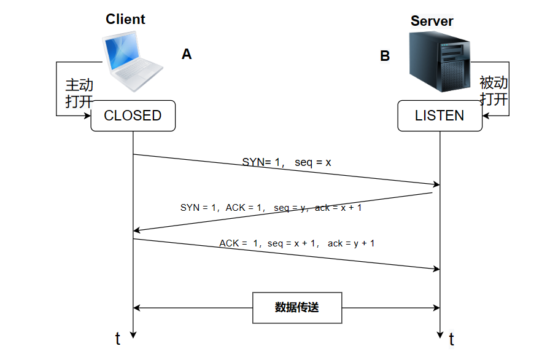
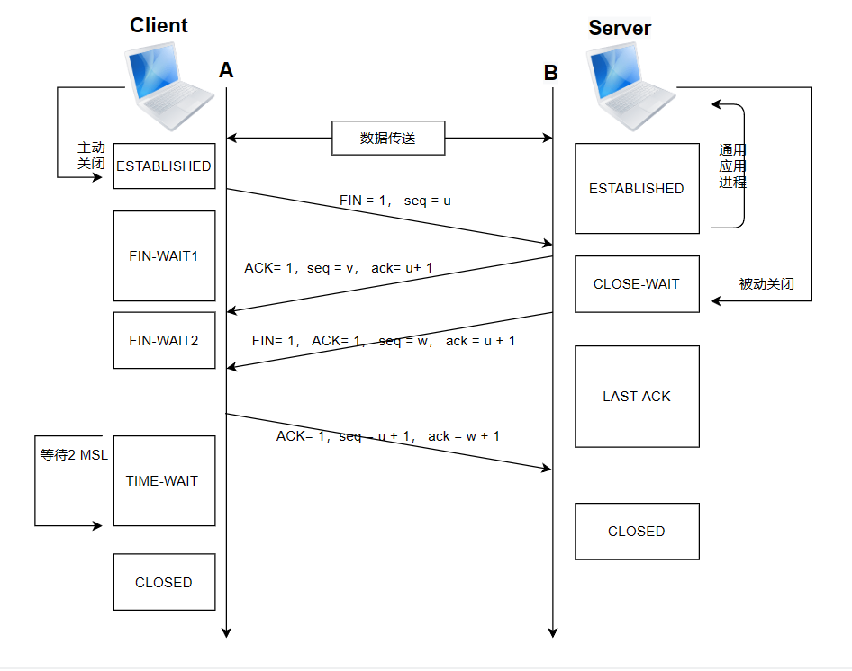
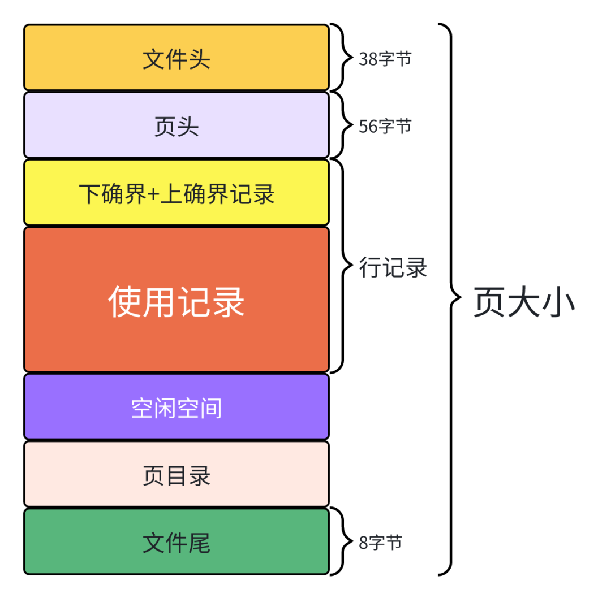

# 面经

## 一个系统进程大概多大

Linux系统进程的大小会受到多种因素的影响，包括进程的功能、所加载的库和模块、进程的数据结构、系统架构等。通常情况下，一个典型的用户空间进程的大小可以在几十 KB 到几百 MB 之间。

在 Linux 中，可以使用 pmap 命令查看进程的内存映射，包括各个段的大小。

参考命令：``pmap <pid>``

可以看到进程的内存布局和各个段的大小。

需要注意的是，这里提到的大小是虚拟内存的大小，而不是物理内存。实际占用的物理内存可能会更少，因为虚拟内存中的一部分可以尚未实际分配物理内存。

## 最大socket数量？

在一个系统中，能够同时打开的文件描述符（包括网络套接字）的数量是有限的。这个限制通常由系统的资源限制、文件描述符表的大小等因素决定。具体的限制因系统而异。

在 Linux 系统中，可以通过以下命令查看文件描述符的限制：
ulimit -n

这个命令会显示当前用户对于文件描述符数量的限制。如果你需要修改这个限制，可以使用 ulimit 命令，但是需要注意的是这只是对当前 shell 会话有效，而不是全局设置。

另外，还可以通过修改系统级别的文件描述符限制，例如修改 /etc/security/limits.conf 文件或者 /etc/sysctl.conf 文件中的相关配置。但是，这样的修改可能需要重启系统才能生效。

## 想让一个可执行程序只能运行一个实例应该怎么办？查找运行进程可行吗？写文件作为锁有问题吗？

查找运行进程：

这种方法通过检查当前是否已经有相同的进程在运行，如果有，则终止当前实例。这种方法的实现方式因操作系统而异，例如在 Linux 下可以通过查找进程列表，而在 Windows 下可以使用互斥体。

Linux下参考实现：

```c++
#include <cstdlib>
#include <cstring>
#include <unistd.h>
#include <sys/types.h>
#include <sys/stat.h>
#include <fcntl.h>

bool IsAnotherInstanceRunning() {
    const char* process_name = "your_program_name";
    pid_t pid = getpid();

    char path[1024];
    snprintf(path, sizeof(path), "/proc/%d/cmdline", pid);

    int fd = open(path, O_RDONLY);
    if (fd != -1) {
        char cmdline[1024];
        ssize_t len = read(fd, cmdline, sizeof(cmdline) - 1);
        close(fd);

        if (len > 0) {
            cmdline[len] = '\0';
            return strstr(cmdline, process_name) != nullptr;
        }
    }

    return false;
}

int main() {
    if (IsAnotherInstanceRunning()) {
        // 程序已经有实例在运行
        return 0;
    }

    // 正常程序逻辑...
    return 0;
}
```

使用文件作为锁：

这种方法通过创建或锁定一个文件，确保只有一个实例可以拥有该文件的锁。在 Linux 下通常使用文件锁（fcntl 或 flock），在 Windows 下可以使用互斥体。

Linux 下的参考实现：

```c++
#include <fcntl.h>
#include <unistd.h>

bool IsAnotherInstanceRunning() {
    int fd = open("/tmp/your_program.lock", O_RDWR | O_CREAT, 0666);

    if (fd == -1 || flock(fd, LOCK_EX | LOCK_NB) == -1) {
        // 程序已经有实例在运行
        close(fd);
        return true;
    }

    return false;
}

int main() {
    if (IsAnotherInstanceRunning()) {
        // 程序已经有实例在运行
        return 0;
    }

    // 正常程序逻辑...

    flock(fd, LOCK_UN);
    close(fd);
    return 0;
}
```

4、Kill -9，这个信号可以捕获吗？

kill -9 发送的是 SIGKILL 信号，它是一个不可被捕获、处理或忽略的信号。该信号会立即终止目标进程，不给进程进行清理或处理的机会。因此，无法在程序中捕获 kill -9 发送的 SIGKILL 信号。

对于其他一些信号，可以使用信号处理器（signal handler）来捕获和处理，但是 SIGKILL 不是其中之一。如果需要在程序中处理某些退出信号，可以考虑使用其他信号，如 SIGTERM（15）等，这些信号可以被捕获并在程序中进行处理。

## 动态链接和静态链接？

静态链接（Static Linking）：

* 在编译时将所有的程序模块和库文件链接成一个完整的可执行文件。

* 静态链接的结果是生成一个包含所有程序和库函数的可执行文件，这个文件在运行时不再依赖于原始的模块和库文件。
* 优点是执行速度较快，因为所有的链接和地址解析在编译时完成。
* 缺点是生成的可执行文件较大，且每次更新程序或库时都需要重新编译和链接。

动态链接（Dynamic Linking）：

* 在编译时只生成程序模块的目标文件，在运行时再动态加载所需的库文件。
* 程序在运行时需要一些共享库，这些库在系统中单独存储，程序在运行时通过动态链接器将它们加载到内存中。
* 优点是可执行文件较小，且共享库的更新不需要重新编译程序。
* 缺点是每次运行程序都需要进行动态链接，可能稍微降低执行速度。

## 如果要更新一个运行中的动态链接库，可以直接替换吗，mv和cp分别会有问题吗？

更新一个运行中的动态链接库通常是可以的，但需要注意一些细节，以确保平滑的切换。

使用 mv 命令：

``mv new_lib.so old_lib.so``

这将新库重命名为旧库的名称。这样做的好处是，已经在运行的程序将继续使用旧版本的库，而新启动的程序将使用新版本的库。但是，这种方式也可能导致新旧库混用的问题，特别是在长时间运行的程序中。

使用 cp 命令：

``cp new_lib.so old_lib.so``

这样会在文件系统中创建一个新的文件，两个文件名都指向相同的物理文件。这种方式对于长时间运行的程序可能更为安全，因为不会在运行过程中切换库文件。

## 进程间通信，共享内存为什么快

管道（Pipes）：管道是一种半双工通信机制，它允许一个进程写入数据，另一个进程读取这些数据。在父子进程或者兄弟进程之间使用较为方便。Linux/Unix 系统中使用 pipe 函数创建。

命名管道（Named Pipes）：与管道类似，但是命名管道是有名字的，可以在无亲缘关系的进程之间进行通信。在文件系统中有对应的文件名，可以通过文件名在不同的进程之间进行通信。

消息队列（Message Queues）：进程可以通过消息队列向其他进程发送消息。消息队列允许进程通过消息进行异步通信，发送方将消息放入队列，接收方从队列中读取消息。不同进程可以通过消息队列进行通信。

共享内存（Shared Memory）：多个进程可以访问同一块共享的内存区域，从而实现高效的数据传输。需要使用同步机制（如信号量）来避免竞态条件。

信号（Signals）：进程可以通过发送信号来通知其他进程发生了某个事件。例如，用于处理中断、异常等情况。信号的使用需要处理信号的机制。

套接字（Sockets）：进程可以使用套接字进行网络通信，也可以在本地进行进程间通信。套接字提供了一种通用的通信机制，可以用于不同计算机之间的通信。

文件锁（File Locking）：进程可以使用文件锁来实现对文件的互斥访问，从而实现进程间的通信。文件锁可以避免多个进程同时对文件进行写入操作。

信号量（Semaphores）：信号量是一种用于进程同步的机制，也可用于进程间通信。信号量可以用于控制多个进程对共享资源的访问。

### 共享内存为什么那么快？

直接内存访问：共享内存允许多个进程直接访问同一块物理内存空间，而不需要通过内核进行数据的复制或传递。这使得进程可以直接读写内存，而无需进行复杂的数据拷贝。

无需内核参与：在共享内存中，内核不需要进行数据传输或者维护通信的状态，因为共享内存区域被映射到各个进程的地址空间中，进程可以直接读写。这避免了进程切换和内核态与用户态的切换，从而提高了通信效率。

低开销：由于共享内存无需内核进行数据复制，通信开销较低。相对于一些其他通信方式（如管道、消息队列等），它不需要进行额外的数据拷贝，减少了额外的开销。

高吞吐量：共享内存对于数据的读写是非常高效的，特别是对于需要频繁通信的大量数据。这使得它适用于一些需要高吞吐量的应用场景，如图像处理、科学计算等。

## 网络编程基本流程，socket，客户端/服务端一定要绑定端口吗

1. 创建套接字：使用socket函数创建一个套接字。在C/C++中，可以使用socket函数，返回的套接字描述符用于后续的操作。

``int sockfd = socket(AF_INET, SOCK_STREAM,0);``

这里的AF_INET表示使用IPv4地址族，SOCK_STREAM表示使用TCP协议，0表示使用默认协议。

2. 绑定地址和端口（服务端）：服务端需要绑定一个具体的地址和端口，以监听客户端的连接请求。

```c++
struct sockaddr_in server_addr;
server_addr.sin_family = AF_INET;
server_addr.sin_addr.s_addr = INADDR_ANY;// 监听所有网络接口
server_addr.sin_port = htons(PORT);// 端口号
bind(sockfd, (structsockaddr*)&server_addr,sizeof(server_addr));
```

这里PORT是选择的端口号。

3. 监听连接（服务端）：在服务端调用listen函数开始监听客户端连接请求。

``listen(sockfd, backlog);``

backlog参数指定连接队列的最大长度。

4. 建立连接（客户端）：客户端使用connect函数连接到服务端。

```c++
struct sockaddr_in server_addr;
server_addr.sin_family = AF_INET;
server_addr.sin_addr.s_addr = inet_addr("服务器IP地址");
server_addr.sin_port = htons(PORT);
connect(sockfd, (structsockaddr*)&server_addr,sizeof(server_addr));
```

5. 这里的服务器IP地址和端口号应该是服务端绑定的地址和端口。
6. 发送和接收数据：使用send和recv函数进行数据的发送和接收。在服务端和客户端之间可以通过套接字进行双向通信。

```c++
send(sockfd, buffer,sizeof(buffer),0);
recv(sockfd, buffer,sizeof(buffer),0);
```

7. 关闭连接：使用close函数关闭套接字。
``close(sockfd);``

客户端和服务端在使用套接字进行通信时，一般需要绑定端口。服务端需要绑定一个固定的端口用于监听客户端的连接请求。客户端在连接服务端时，可以让系统自动分配一个可用的本地端口。

## 端口数范围，为什么是这个范围，TCP和UDP，TCP header，七层网络/五层网络

端口号是一个16位的整数，取值范围是0到65535。端口号按照使用目的分为三个范围：

* 知名端口：范围是0到1023。这些端口通常被系统和服务占用，例如HTTP服务使用80端口，FTP服务使用21端口等。
* 注册端口：范围是1024到49151。这些端口是由一些应用程序注册的，用于提供特定的服务。
* 动态和/或私有端口：范围是49152到65535。这些端口通常被客户端应用程序使用，用于发起临时会话。

这个范围的划分主要是为了方便管理和避免冲突。知名端口是为了让系统和服务 易于识别，注册端口是为了让应用程序易于管理，而动态和/或私有端口是为了让客户端应用程序有足够的选择空间。

tcp和udp概念和区别这里不讲，可以去看看我别的文章。

TCP头部还包含了序号、确认号、窗口大小等信息，用于实现可靠的连接。这些头部信息都是在数据传输过程中用于控制和管理的。

1. 七层网络模型（OSI模型）：
    物理层（Physical Layer）

    数据链路层（Data Link Layer）

    网络层（Network Layer）

    传输层（Transport Layer）

    会话层（Session Layer）

    表示层（Presentation Layer）

    应用层（Application Layer）
2. 五层网络模型（TCP/IP模型）：

    物理层（Physical Layer）

    数据链路层（Data Link Layer）

    网络层（Network Layer）

    传输层（Transport Layer）

    应用层（Application Layer）

## IO多路复用，select, poll, epoll？

1. select：

* select 是最早的实现之一，可用于检测多个文件描述符的状态。
* 它使用了三个位集合，分别表示可读、可写和异常事件，通过传入这三个集合进行监听。
* 缺点包括效率较低，受到文件描述符数量的限制，复杂度为 O(n)。

2. poll：

* poll 是对 select 的改进，也可以用于检测多个文件描述符的状态。
* 只在 Linux/Unix 等类 Unix 系统上实现。
* 使用一个结构数组来存储每个文件描述符的状态，并将整个数组传递给 poll 函数。
* 也受到文件描述符数量的限制，复杂度为 O(n)。

3. epoll：

* epoll 是 Linux 特有的实现，为了克服 select 和 poll 的限制而设计。
使用了事件驱动的方式，通过注册事件，只关心那些真正发生了事件的文件描述符。
* epoll 提供了三个函数：epoll_create 创建一个 epoll 句柄，epoll_ctl 修改事件注册，epoll_wait 等待事件发生。
* 支持 Edge Triggered (ET) 和 Level Triggered (LT) 两种模式，其中 ET 模式效率更高。
* 复杂度为 O(1)，性能更好。

## 什么时候多线程，什么时候多进程？

多线程：

* 共享内存：如果任务之间需要共享内存，多线程可能是更合适的选择。线程共享相同的地址空间，因此数据传递相对更简单。
* 轻量级任务：对于一些轻量级的任务，使用多线程可能更加方便。线程的创建和销毁相对于进程来说更加轻量级。
* 通信开销小：如果任务之间需要频繁通信，并且通信开销相对较小，多线程可能更适用。

多进程：

* 独立性要求高：如果任务之间需要高度的独立性，以防止彼此之间的干扰，多进程可能更适合。每个进程都有独立的地址空间，减少了数据共享带来的复杂性。
* 可伸缩性：多进程在处理多核心系统上有更好的可伸缩性，因为每个进程都能够运行在一个独立的核心上。
* 容错性：进程之间的容错性更好，一个进程崩溃不会影响其他进程。

## 客户端和服务端通信要怎么做？

1. Socket通信：

* 使用套接字（Socket）进行通信是一种底层的、通用的方式。它可以实现多种协议，如TCP和UDP。
* 通过Socket编程，客户端和服务端可以建立连接，并通过发送和接收数据进行通信。

2. HTTP/HTTPS通信：

* 使用HTTP或HTTPS协议进行通信是一种常见的应用层协议。
* 客户端通过发送HTTP请求，服务端通过HTTP响应进行通信。HTTPS在HTTP的基础上加入了加密层，提供了更安全的通信。

3. RPC（远程过程调用）：

* RPC是一种通过网络调用远程服务的机制，使得客户端可以像调用本地函数一样调用远程服务器上的函数。
* 常见的RPC框架包括gRPC、Apache Thrift等。

4. WebSocket通信：

* WebSocket提供了一种在单个TCP连接上进行全双工通信的协议，适用于实时性要求较
高的应用。

* WebSocket通信始于一个HTTP握手，之后客户端和服务端可以直接在一个持久化的连接上进行双向数据传输。

5. 消息队列通信：

* 使用消息队列（例如RabbitMQ、Kafka、ActiveMQ等）作为中间件，实现客户端和服务端之间的异步通信。
* 客户端通过向消息队列发送消息，服务端从消息队列中接收并处理消息。

## 客户端服务端在同一台机器要怎么通信？

* 本地套接字（Local Socket）：

    使用本地套接字，也称为Unix域套接字，可以在同一台机器上的进程之间建立通信。
    这种方式速度较快，适用于进程之间的本地通信。

* Loopback地址（127.0.0.1）：
  
    客户端和服务端可以通过使用Loopback地址（通常是127.0.0.1）来进行TCP或UDP通信。
    这种方式相当于在同一台机器上模拟网络通信，适用于需要网络协议的场景。

* 进程间通信（IPC）机制：

    在同一台机器上的不同进程之间可以使用进程间通信机制，如共享内存、消息队列、信号等。
    这种方式适用于需要高效数据共享或异步通信的场景。
* 本地HTTP服务：

    可以在同一台机器上运行一个HTTP服务器，客户端通过HTTP请求与服务端进行通信。
    这适用于Web应用或其他基于HTTP的应用。

* RPC（本地调用）：

如果采用RPC框架，可以在同一台机器上通过RPC进行本地调用，实现客户端和服务端之间的函数调用。

* 共享内存：

    客户端和服务端可以使用共享内存来实现数据的共享，以达到进程间通信的目的。

## RPC，为什么用RPC，介绍RPC框架，如何设计一个RPC框架，RPC框架如何性能调优

RPC（Remote Procedure Call，远程过程调用）是一种用于实现分布式系统中进程间通信的协议，它允许程序调用另一个地址空间（通常是网络上的另一台机器上）的过程或函数，而就像本地调用一样。RPC的目标是使远程过程调用看起来像本地调用一样，尽可能地屏蔽底层通信细节。

### 为什么使用RPC？

1. 抽象分布式通信：RPC使分布式系统中的通信更加抽象，使开发者不必关心底层的通信细节，而可以专注于业务逻辑。

2. 代码结构清晰：RPC可以让开发者编写更为清晰和结构化的代码，就像调用本地函数一样调用远程函数。

3. 模块化：RPC支持模块化设计，允许系统通过服务的方式进行组织，各个服务之间通过RPC进行通信。

4. 跨语言支持：RPC框架通常支持跨语言调用，使得不同语言编写的程序可以方便地进行通信。

### RPC框架设计要点

协议定义：设计通信协议，包括数据序列化和反序列化规则，通常使用类似Protocol Buffers、Thrift或JSON等。

服务接口定义：定义服务接口，包括服务的方法、参数和返回值等。

通信：设计底层通信机制，可以选择使用HTTP、TCP、UDP等协议。

服务注册和发现：提供服务注册和发现机制，使得客户端可以找到可用的服务。

安全性：考虑通信的安全性，可以采用加密协议等手段保障数据的安全。

错误处理：设计良好的错误处理机制，使得客户端和服务端能够对各种错误进行适当处理。

### RPC框架性能调优

序列化和反序列化优化：选择高效的序列化框架，并进行相应的优化。

连接池：使用连接池来重用已经建立的连接，减少连接建立和断开的开销。

异步调用：使用异步调用来提高并发性能，允许同时处理多个请求。

负载均衡：在多个服务提供者之间进行负载均衡，确保请求被合理地分配。

缓存：对频繁调用的数据进行缓存，减少对远程服务的请求。

压缩：对通信的数据进行压缩，减少网络传输的数据量。

连接复用：复用连接，避免频繁地建立和关闭连接。

超时设置：合理设置超时时间，防止长时间的等待。

并发控制：对服务端资源进行并发控制，防止过多的并发请求导致性能下降。

## HTTP和RPC区别，使用JSON传输和使用protobuf传输区别？

1. 通信模型：

    HTTP：是一种无状态协议，每次请求之间不会保存状态信息。通常使用请求-响应模型，客户端发起请求，服务器回送响应。

    RPC：通常基于远程过程调用的模型，允许程序调用另一台计算机上的过程或函数。

2. 语义：

    HTTP：主要用于传输超文本，支持不同的操作（GET、POST、PUT、DELETE等），但语义相对较为简单。

    RPC：专注于调用远程服务或过程，提供更丰富的语义。

3. 性能：
    HTTP：通常基于文本传输，相对较为庞大，可能存在较大的传输开销。

    RPC：通常采用二进制协议，如Protocol Buffers、Thrift等，可以更有效地利用网络带宽。
4. 序列化：

    HTTP：通常使用文本格式（如JSON、XML）进行数据序列化。

    RPC：可以使用更为高效的二进制序列化格式，例如Protocol Buffers、MessagePack等。

5. 协议：
    HTTP：基于TCP协议，是一种应用层协议。

    RPC：可以基于不同的传输层协议，如HTTP、TCP、UDP等。

6. 使用场景：

    HTTP：适用于Web应用、浏览器与服务器之间的通信。

    RPC：适用于分布式系统、微服务架构中各个服务之间的通信。

7. Json和protobuf使用区别

    JSON：文本格式，易读易写，但相对占用带宽和解析开销较大。

    Protocol Buffers：二进制格式，更为紧凑，解析效率高，但不易读。

## 负载均衡，nginx为什么吞吐量大/快？

事件驱动架构：Nginx采用事件驱动的异步非阻塞模型，它使用少量的固定的工作进程来处理大量的并发连接。这种事件驱动模型使得 Nginx 能够高效地处理大量并发请求而不会导致线程阻塞，从而提高了系统的并发处理能力。

高效的内存管理：Nginx 的内存分配采用了内存池的方式，减少了内存碎片，提高了内存使用效率。这使得 Nginx 能够在高并发环境下更加稳定地运行。

单机多核支持：Nginx 的多进程和多线程设计使得它能够充分利用多核处理器的性能。每个工作进程都是独立的，可以独立处理请求，提高了整体的并发处理能力。

事件模块：Nginx 提供了丰富的事件模块，包括反向代理、负载均衡、SSL/TLS、HTTP/2 等，这些模块的性能都经过优化，能够高效地处理不同类型的请求。

高度可定制性：Nginx 具有高度可定制性，可以根据具体的需求进行灵活配置。这使得它适用于各种场景，包括反向代理、负载均衡、静态文件服务等。

精简而高效的代码：Nginx 的代码精简而高效，注重性能。通过避免过度的模块化和提供高效的底层数据结构，Nginx 能够更快速地处理请求。

## tcp三次握手


在建立连接之前，Client处于CLOSED状态，而Server处于LISTEN的状态。

第一次握手：客户端主动给服务端发送一个SYN报文，并携带自己的初始化序列号一起发送给服务端。此时客户端处于一个SYN_SEND的状态。

第二次握手：服务端收到客户端发来的SYN报文之后，就会以自己的SYN报文作为应答，然后将自己的初始化序列号发送给客户端，并且会将客户端的初始化序列号+1作为自己的ACK值发送给客户端，以表示自己已经收到了客户端的SYN报文。此时服务端处于一个SYN_RECV的状态。

第三次握手：客户端收到服务端发来的SYN报文之后，会把服务端的初始化序列号+1作为ACK值发送给服务端，用来表示自己已经收到了服务端发来的SYN报文。此时客户端处于一个ESTABLISHED的状态。

## tcp传输数据过程中会粘包问题，解释一下为什么会发生，解决方案？

TCP传输数据过程中会出现粘包问题的主要原因是TCP是面向流的协议，数据被划分为小的数据块，而底层的网络则是面向数据包的。这就导致了在传输过程中，数据块的边界和数据包的边界之间可能不一致，从而发生粘包问题。具体来说，有以下两个主要原因：

1. TCP缓冲区：发送方在发送数据时，TCP会将数据划分为合适大小的数据块，然后将这些数据块放入TCP缓冲区。接收方从TCP缓冲区中读取数据，但它并不知道发送方在发送时划分的数据块边界。

2. 网络传输：数据在网络上传输时，可能会因为网络拥塞、路由器缓冲区满等原因导致数据包的延迟、重新排序或合并。

解决TCP粘包问题的常见方法有：

1. 消息定界：在数据包中添加消息的长度信息，接收方通过消息长度来判断消息的边界。常见的方式有在消息头部加入消息长度字段。
2. 使用特殊字符：在消息末尾添加特殊字符作为分隔符，接收方根据特殊字符来切分消息。这种方式需要确保特殊字符不会在消息内容中出现。
3. 固定长度：规定每个数据包的固定长度，不足部分用空格或其他填充字符补齐。
4. 使用回车换行符：在文本协议中，可以使用回车换行符（\r\n）来作为消息的结束符，接收方根据这个符号来切分消息。
5. 应用层协议：在应用层设计自定义的协议，通过在消息头部包含长度字段或其他标识信息来标明消息的边界。

## tcp四次挥手，为什么多一次？



1. 客户端向服务端发送一个报文FIN为1，序号为u然后进入FIN-WAIT1状态。
2. 服务端向客户端发送确认报文序号为v，确认序号为u+1然后进入CLOSE-WAIT状态。
3. 客户端收到服务端发回的确认报文之后进入FIN-WAIT2状态此时客户端连接已经关闭客户端无法向服务端传送数据。
4. 然后服务端被动关闭它向客户端发送一个FIN为1的报文段要求释放服务端到客户端的连接。进入LAST-ACK等待客户端发送最后一个ACK报文。
5. 客户端发送最后一次挥手确认报文然后进行closed，服务端直接CLOSED。
6. 客户端要等待2MSL才CLOSED。

### 为什么多一次？

当Client端发出FIN报文段时，只可以说明Client端没有数据发送了，但是Client端还可以从Server端接收数据。

当Server端发送ACK报文段时，只可以说明它知道了Client端没有数据发送了，但是Server端还可以发送数据。

当Server端发送FIN报文段时，表示Server端也没有数据发送了。

当Client端接收到后会返回ACK，之后彼此就会愉快的中断这次TCP连接。

第二次和第三次是需要分开发送的。

## reactor模式？

Reactor 模式是一种用于处理事件驱动应用程序中并发请求的设计模式。它主要涉及到两个组件：事件源和事件处理器。

1. 事件源(Event Source):事件源是产生事件的对象，可以是网络套接字、文件描述符、定时器等。这些事件源通常被注册到事件处理器中，当事件源上发生事件时，事件处理器会得到通知。
2. 事件处理器(Event Handler):事件处理器是负责响应和处理事件的组件。它包含有关如何处理事件的逻辑。在 Reactor模式中，事件处理器需要注册到一个中央调度器（也称为 Reactor），以便随时接收和处理事件。

Reactor模式的基本流程：

* 多个事件源注册到 Reactor 中。
* Reactor 不断地检查这些事件源，看它们是否有事件发生。
* 一旦事件发生，Reactor 负责分发事件给对应的事件处理器进行处理。

Reactor模式有两种实现方式：

1. 同步（同步事件处理模型）：Reactor 在单个线程中运行，并负责事件的检测和事件分发。事件处理器在 Reactor 中同步执行。这种方式适用于事件处理逻辑简单的场景。
2. 异步（多线程/多进程事件处理模型）：Reactor 可以在多个线程或多个进2程中运行，事件源和事件处理器可能在不同的线程或进程中。这种方式适用于需要处理复杂逻辑或处理大量并发请求的场景。

Reactor 模式的优点：

1. 可扩展性：可以通过添加新的事件源和事件处理器来轻松扩展系统。
2. 并发处理：适用于处理大量并发请求的场景，提供了一种高效的事件驱动的编程模型。

## muduo网络库内存拷贝？

Muduo 是一个基于 Reactor 模式的 C++ 网络库，设计简洁高效，提供了事件驱动的编程模型，用于构建高性能的网络服务器。

零拷贝（Zero-Copy）：Muduo利用操作系统提供的零拷贝技术，避免了在用户态和内核态之间的多次数据拷贝。在网络传输过程中，数据可以从应用程序的缓冲区直接传递给网络协议栈，而无需中间的用户态缓冲区。这减少了不必要的内存拷贝，提高了性能。
缓冲区管理：Muduo中使用了一个高效的缓冲区管理机制，通过预分配一定数量的固定大小的缓冲区（Buffer），在需要时进行缓冲区的借用和归还。这减少了频繁的内存分配和释放操作，提高了内存使用效率。
文件描述符传递：在 Muduo 中，使用了文件描述符传递的方式，可以将一个已打开的文件描述符从一个进程传递给另一个进程，避免了通过套接字传递数据时的数据拷贝。

## 消息队列的使用？

消息队列是一种进程间通信的方式，它可以在不同的进程之间传递消息，实现进程之间的解耦。消息队列的基本使用包括以下几个方面：

1. 创建消息队列：
    在消息队列的使用之前，需要先创建消息队列。不同的操作系统和编程语言提供了不同的消息队列接口，通常有相应的创建函数或工具。
2. 发送消息：
    通过消息队列将消息发送到队列中。消息可以是结构化的数据，也可以是简单的文本。发送消息的进程称为生产者。
3. 接收消息：
    从消息队列中接收消息。接收消息的进程称为消费者。通常，多个进程可以同时从同一个消息队列中接收消息，实现消息的广播。
4. 消息队列的特性：
    消息队列通常具有一些特性，如容量限制、优先级等。生产者和消费者需要遵守相应的规则，以确保消息的正确发送和接收。
5. 错误处理：
    在使用消息队列时，需要考虑错误处理机制，例如处理发送消息失败、接收消息失败等情况。
给个demo：

```c++
#include <iostream>
#include <queue>
#include <mutex>
#include <condition_variable>
#include <thread>

class MessageQueue {
public:
    // 向队列中发送消息
    void sendMessage(const std::string& message) {
        std::unique_lock<std::mutex> lock(mutex_);
        messages_.push(message);
        condition_.notify_one();
    }

    // 从队列中接收消息
    std::string receiveMessage() {
        std::unique_lock<std::mutex> lock(mutex_);
        condition_.wait(lock, [this] { return !messages_.empty(); });

        std::string message = messages_.front();
        messages_.pop();
        return message;
    }

private:
    std::queue<std::string> messages_;
    std::mutex mutex_;
    std::condition_variable condition_;
};

// 生产者线程函数
void producer(MessageQueue& mq) {
    for (int i = 0; i < 5; ++i) {
        std::string message = "Message " + std::to_string(i);
        mq.sendMessage(message);
        std::this_thread::sleep_for(std::chrono::seconds(1));
    }
}

// 消费者线程函数
void consumer(MessageQueue& mq) {
    for (int i = 0; i < 5; ++i) {
        std::string message = mq.receiveMessage();
        std::cout << "Received: " << message << std::endl;
    }
}

int main() {
    MessageQueue messageQueue;

    // 创建生产者和消费者线程
    std::thread producerThread(producer, std::ref(messageQueue));
    std::thread consumerThread(consumer, std::ref(messageQueue));

    // 等待线程执行完成
    producerThread.join();
    consumerThread.join();

    return 0;
}

```
1、说说 TCP 的拥塞控制？

慢启动：TCP 连接初始化时，发送方将初始的拥塞窗口设为一个较小的值，然后逐渐增加。这个增长是指数级的，即拥塞窗口大小按照指数增长。这有助于确保在网络中发送的数据量逐渐增加，直到达到网络的容量。
拥塞避免：一旦拥塞窗口大小达到一个阈值（通常是慢启动阈值），TCP 切换到拥塞避免模式。在这个模式下，拥塞窗口以线性方式增加，而不是指数方式。这有助于防止拥塞窗口过快增长，从而更好地适应网络的状况。
快速重传：当发送方检测到丢失的数据包时，它不必等到超时发生，而是可以快速重传丢失的数据包。这减少了等待时间，提高了网络的效率。
快速恢复：当发生数据包丢失时，TCP 通过减半拥塞窗口的大小，然后逐渐增加，而不是将窗口大小直接设置为 1。这有助于保持一定的网络吞吐量，而不是完全暴力减少。
超时重传：如果在一段时间内未收到确认，TCP 将假定数据包已丢失，并重新发送未确认的数据包。这是一种保守的拥塞控制机制，用于处理某些未检测到的数据包丢失情况。
2、TCP 怎么保证可靠？

TCP 通过多种机制来保证可靠性，确保在数据传输过程中不丢失、不重复、不失序，并能正确处理网络中可能出现的错误。

保证可靠性的主要机制：

序号和确认应答：使用序号对每个发送的字节进行标记，并通过确认应答机制来追踪已经成功接收的字节。发送方会等待接收方的确认应答，以确认数据已经安全到达，如果没有收到确认，则会重新发送数据。
超时重传：如果发送方在一定时间内未收到接收方的确认应答，就会认为数据包可能丢失了，触发超时重传机制，重新发送未确认的数据。
滑动窗口：使用滑动窗口机制来限制在网络中的未确认数据量。滑动窗口通过动态调整窗口大小，确保发送方不会同时发送过多的数据，以防止网络拥塞。
流量控制：通过流量控制机制来调整发送方的发送速率，以适应接收方的处理能力。接收方可以通过 TCP 报文中的窗口大小告诉发送方它还能接收多少字节的数据。
拥塞控制：通过拥塞控制机制来避免网络拥塞。拥塞控制包括慢启动、拥塞避免、快速重传和快速恢复等算法，可以动态调整发送速率，确保网络的稳定性。
有序交付：确保接收方按正确的顺序交付数据。每个 TCP 报文段都有一个序列号，接收方根据这些序列号将数据按正确的顺序组装。
ACK 机制：使用确认（ACK）机制，接收方会定期发送确认报文，告知发送方已成功接收到数据。发送方根据这些确认来确认数据的成功传输。
连接管理：通过三次握手和四次挥手来建立和关闭连接，确保通信的可靠性。这些过程包含了严格的状态转换和确认机制。
3、为什么握手只要三次而挥手要四次？

为什么握手是三次？

TCP 建立连接时之所以只需要"三次握手"，是因为在第二次"握手"过程中，服务器端发送给客户端的 TCP 报文是以 SYN 与 ACK 作为标志位的。SYN 是请求连接标志，表示服务器端同意建立连接；ACK 是确认报文，表示告诉客户端，服务器端收到了它的请求报文。

即 SYN 建立连接报文与 ACK 确认接收报文是在同一次"握手"当中传输的，所以"三次握手"不多也不少，正好让双方明确彼此信息互通。

为什么挥手是四次？

TCP 释放连接时之所以需要“四次挥手”,是因为 FIN 释放连接报文与 ACK 确认接收报文是分别由第二次和第三次"挥手"传输的。

为何建立连接时一起传输，释放连接时却要分开传输？

建立连接时，被动方服务器端结束 CLOSED 阶段进入“握手”阶段并不需要任何准备，可以直接返回 SYN 和 ACK 报文，开始建立连接。
释放连接时，被动方服务器，突然收到主动方客户端释放连接的请求时并不能立即释放连接，因为还有必要的数据需要处理，所以服务器先返回 ACK 确认收到报文，经过 CLOSE-WAIT 阶段准备好释放连接之后，才能返回 FIN 释放连接报文。
4、HTTP 的发展历史？

HTTP 是一种用于传输超文本的协议，它在不同版本中不断演化和改进，以满足不断增长的网络需求。

HTTP 1.0:

HTTP 1.0 是最早的 HTTP 版本，定义于 1996 年。

它的特点如下：

短连接：每次请求/响应都需要建立和关闭 TCP 连接，导致了多次握手和释放的开销，降低了性能。
无状态：HTTP 1.0 是无状态的，每个请求/响应都是独立的，服务器不会保存连接状态，需要在每次请求中包含所有信息。
明文传输：HTTP 1.0 数据传输通常以明文方式进行，缺乏加密和安全性。
HTTP 头部：头部信息较简单，只包含必要的元数据。
HTTP 1.1:

HTTP 1.1 是 HTTP 1.0 的后续版本，于 1999 年发布。

它引入了以下改进：

长连接：HTTP 1.1 引入了持久连接，允许多个请求/响应共享一个 TCP 连接，减少了握手和释放的开销，提高了性能。

管道化：HTTP 1.1 支持请求/响应的管道化，允许客户端发送多个请求而不等待响应，进一步提高了性能。

Host 头部：引入了 Host 头部字段，允许在同一台服务器上托管多个域名，从而支持虚拟主机。

缓存控制：引入了更精细的缓存控制机制，使缓存更有效。

HTTP/2.0:

HTTP/2.0 是 HTTP 1.1 的进一步改进，于 2015 年发布。

它引入了以下特性：

多路复用：HTTP/2.0 允许多个请求/响应流共享一个 TCP 连接，通过二进制帧实现多路复用，提高了并发性能。
头部压缩：引入了头部字段压缩，减小了每个请求的开销，减少了带宽占用。
服务器推送：服务器可以主动将与请求相关的资源推送给客户端，减少了客户端请求的延迟。
优化流：HTTP/2.0 通过优化请求和响应流的传输，提高了性能。
HTTP/3.0:

HTTP/3.0 是最新的 HTTP 版本，于 2020 年发布。

它采用了一种名为 QUIC（Quick UDP Internet Connections）的新的传输协议，以进一步提高性能和安全性：

基于 UDP：HTTP/3.0 不再依赖于 TCP，而是基于 UDP 传输，减少了连接建立的时延，提高了网络性能。
多路复用：类似 HTTP/2.0，HTTP/3.0 支持多路复用，允许多个请求/响应流在一个连接上并发传输。
头部压缩：HTTP/3.0 继续采用头部字段压缩，降低了请求开销。
连接迁移：HTTP/3.0 支持在不同网络条件下迁移连接，以适应移动设备的切换。
总的来说，HTTP 1.0 到 HTTP/3.0 的演化过程主要关注了性能、效率和安全性的提升。HTTP/2.0 和 HTTP/3.0 引入了多路复用和头部压缩等重要特性，以改进传输效率和降低延迟。HTTP/3.0 更进一步通过使用 QUIC 协议提供了更佳的性能和网络适应性。

18、场景题：在大文件中找关键字->长字符串中找子串

在大文件中找关键字：

基于字符串匹配算法：对于大文件，可以使用经典的字符串匹配算法，例如 Knuth-Morris-Pratt (KMP) 算法或 Boyer-Moore 算法。这些算法可以在 O(n + m)的时间内找到关键字，其中 n 是文本长度，m 是关键字长度。
基于正则表达式：如果关键字有一定的规律，可以使用正则表达式进行匹配。在大文件中，正则表达式引擎可能会提供一些优化。
分块处理：将大文件划分为较小的块，然后逐块进行搜索。这有助于减小每次搜索的规模。
在长字符串中找子串：

基于标准库函数：大多数编程语言的标准库都提供了字符串查找的函数，例如 C++的 std::string::find 或 Python 的 str.find。
KMP 算法或 Boyer-Moore 算法：这些经典的字符串匹配算法同样适用于在长字符串中找子串。
正则表达式：如果子串有一定的规律，可以使用正则表达式进行匹配。
滑动窗口算法：对于特定场景，可以使用滑动窗口算法，逐步移动窗口寻找子串。
基于后缀树或后缀数组：对于较大规模的字符串匹配，可以考虑构建后缀树或后缀数组，以支持高效的子串匹配。
19、线程与进程？

进程：

定义：进程是一个独立的执行单元，有自己的地址空间、代码、数据和系统资源。
独立性：进程之间相互独立，一个进程的崩溃通常不会影响其他进程。
通信：进程之间通信相对较为复杂，通常需要使用进程间通信（IPC）机制，如管道、消息队列、共享内存等。
资源开销：进程有较大的资源开销，包括独立的内存空间、文件描述符、系统资源等。
创建：进程的创建和销毁相对较慢。
线程：

定义：线程是一个轻量级的执行单元，共享同一进程的地址空间和资源。
独立性：线程是进程的一部分，同一进程内的线程共享相同的资源，一个线程的问题可能影响整个进程。
通信：线程之间通信相对简单，可以直接共享进程内的数据。
资源开销：线程的资源开销相对较小，因为它们共享大部分资源。
创建：线程的创建和销毁相对较快。
共同点：

都是执行单元，执行一段代码。
都可以并发执行，提高程序的性能。
都能被操作系统调度和管理。
20、线程间通信？

共享内存：多个线程共享同一块内存区域，通过读写这块内存来实现通信。需要注意的是，在共享内存的情况下，需要确保对共享数据的访问是原子的，否则可能发生竞态条件。
互斥锁（Mutex）：通过互斥锁可以保证在同一时刻只有一个线程能够访问共享资源。一个线程在访问共享资源之前会尝试获取锁，如果获取不到就等待，直到锁被释放。
条件变量（Condition Variable）：条件变量用于线程之间的条件同步。一个线程可以在满足特定条件时等待条件变量，而另一个线程在满足条件时发出信号或广播通知其他线程。
信号量（Semaphore）：信号量是一个计数器，用于控制对共享资源的访问。线程在访问资源之前必须获取信号量，访问完后释放信号量。
管道（Pipe）：管道是一种单向通信机制，可以用于父子进程或者通过线程间进行通信。一个线程写入管道，另一个线程从管道读取。
消息队列（Message Queue）：线程可以通过消息队列发送和接收消息。一个线程将消息放入队列，而另一个线程则从队列中取出消息。
套接字（Socket）：在网络编程中，套接字可以用于不同计算机上的线程间通信。套接字提供了一种通过网络进行通信的方式。

17、16kb 的页一行 1kb 可以存多少数据?

如果不思考直接回答 16 行那可能就是对数据库存储这块不怎么了解，所以一起看看阿 Q 怎么解的吧！

众所周知，MySQL 的数据都储存在磁盘中而不是内存，具体的数据是存在行中的，而行是存在页中的。

页是 InnoDB 存储引擎磁盘管理的最小单位，默认一页是 16k，那么可以存多少行呢？

学过计算机基础的都知道，1kb=1024b，那么 16kb=1024x16=16384b。

我们常用的 mysql 5.7 版本，UTF 编码，一个汉字等 3b，那么 16 kb = 16384 / 3 个汉字

看个图：


所以说一行 1kb，能存（16384-38-56-8）/1024 大概是 15 行数据。

6、进程的通信方式有哪些？
1.管道：管道是一种半双工通信方式，主要用于具有亲缘关系的进程之间的通信。管道是一种线性数据流，数据只能单向流动。它有两种类型：

• 无名管道：通常用于父子进程之间的通信。创建管道使用 pipe() 系统调用。

• 命名管道：用于无关联的进程之间的通信，它们以文件系统中的命名管道文件形式存在。

2.消息队列：消息队列允许进程通过消息进行异步通信。消息队列允许多个进程通过将消息发送到队列，然后其他进程从队列中接收消息来进行通信。消息队列通常有操作系统提供的 API 来管理消息的发送和接收。

3.共享内存：共享内存是一种高效的通信方式，允许多个进程共享相同的物理内存区域。这使得数据在进程之间的传输非常快速，因为它们可以直接读写相同的内存。然而，共享内存需要进行同步以避免数据竞争。

4.信号：信号是异步通信的一种方式，用于通知进程某些事件的发生，如错误或异常。每个信号都有一个数字标识符，当事件发生时，进程可以注册信号处理程序来处理信号。

5.套接字：套接字是一种用于网络通信的通用通信机制，但也可以在同一台计算机上的不同进程之间使用。套接字提供了面向流和面向数据报的通信方式，允许进程通过网络套接字进行通信。

6.文件：进程可以通过读写文件来实现通信。一个进程可以将数据写入文件，而另一个进程则可以读取该文件的内容。这种方式不够高效，但是可以应用在不同进程之间的通信需求较少的情况下。

7.信号量：信号量是一种用于控制多个进程对共享资源的访问的同步机制。信号量可以用于避免竞争条件，确保一次只有一个进程可以访问共享资源。

8.共享文件映射：共享文件映射允许进程将文件映射到它们的地址空间中，以便多个进程可以访问相同的文件数据。这在共享大量数据时非常有用。

7、无锁队列如何实现？
这里给大家贴一个参考代码：

参考代码：
#include <atomic>

template <typename T>
class LockFreeQueue {
private:
    // 节点结构
    struct Node {
        T data;                    // 节点存储的数据
        std::atomic<Node*> next;   // 指向下一个节点的原子指针

        Node(const T& val) : data(val), next(nullptr) {}
    };

    // 队列头部和尾部指针
    alignas(64) std::atomic<Node*> head;
    alignas(64) std::atomic<Node*> tail;

public:
    // 构造函数，初始化队列头部和尾部
    LockFreeQueue() : head(new Node(T())), tail(head.load()) {}

    // 析构函数，释放队列中的所有节点
    ~LockFreeQueue() {
        while (Node* temp = head.load()) {
            head.store(temp->next);
            delete temp;
        }
    }

    // 入队操作
    void enqueue(const T& value) {
        Node* newNode = new Node(value);
        Node* currentTail = tail.load(std::memory_order_relaxed);

        while (true) {
            Node* currentNext = currentTail->next.load(std::memory_order_relaxed);
            if (currentNext == nullptr) {
                if (currentTail->next.compare_exchange_weak(currentNext, newNode, std::memory_order_release, std::memory_order_relaxed)) {
                    break;
                }
            } else {
                tail.compare_exchange_weak(currentTail, currentNext, std::memory_order_release, std::memory_order_relaxed);
            }
        }

        tail.compare_exchange_weak(currentTail, newNode, std::memory_order_release, std::memory_order_relaxed);
    }

    // 出队操作
    bool dequeue(T& result) {
        Node* currentHead = head.load(std::memory_order_relaxed);

        while (true) {
            Node* currentTail = tail.load(std::memory_order_relaxed);
            Node* currentNext = currentHead->next.load(std::memory_order_relaxed);

            if (currentHead == currentTail) {
                if (currentNext == nullptr) {
                    return false;  // 队列为空
                }
                tail.compare_exchange_weak(currentTail, currentNext, std::memory_order_release, std::memory_order_relaxed);
            } else {
                if (head.compare_exchange_weak(currentHead, currentNext, std::memory_order_release, std::memory_order_relaxed)) {
                    result = currentNext->data;
                    delete currentHead;
                    return true;
                }
            }
        }
    }
};
8、ping是在哪一层，实现的原理是什么？
它是一个网络工具，它用于测试两台主机之间是否可以通信，以及在网络上发送数据包的往返时间。Ping工具工作在网络层（第三层）和传输层（第四层），主要通过 ICMP 协议来实现。

实现原理：

1. ICMP协议：Ping主要使用Internet控制报文协议（ICMP）来发送探测消息。ICMP是在网络层（第三层）工作的协议，它通常用于主机和路由器之间的错误报告和网络状况的检测。

2. Echo请求和回应：Ping通过发送Echo请求消息到目标主机，目标主机收到请求后，会返回Echo回应消息。Ping工具根据回应消息的时间来计算往返时间（Round-Trip Time，RTT）。

3. 时间戳：Ping可以使用时间戳来测量往返时间。它在发送的Echo请求消息中包含一个时间戳，接收方在返回的Echo回应消息中将这个时间戳原封不动地返回，发送方通过时间戳的差值计算出往返时间。

4. TTL：Ping可以设置TTL字段，TTL是生存时间，每经过一个路由器，TTL减1。当TTL为0时，路由器会丢弃该数据包并发送ICMP "Time Exceeded"消息给源主机，源主机通过这个消息可以知道到达目标主机所经过的路由器数。

5. 连通性测试：如果目标主机能够正常收到并响应Echo请求，说明网络通畅。如果目标主机无法响应，Ping会报告超时错误。

9、HTTPS的流程说一下？
1. 客户端发起请求：与HTTP一样，HTTPS通信始于客户端向服务器发起请求。这个请求是明文的，因为在此阶段还没有进行加密。

2. 服务器证书：服务器在响应中返回自己的数字证书，该证书通常由可信的第三方机构（CA，Certificate Authority）签发。证书中包含了服务器的公钥和相关信息。

3. 客户端验证证书：客户端收到服务器的证书后，会验证证书的有效性。验证包括检查证书的签发机构是否受信任，证书是否过期，以及域名是否匹配。

4. 生成随机密钥：一旦证书被验证，客户端生成一个用于后续加密通信的随机对称密钥。这个密钥称为"Pre-master secret"。

5. 用服务器公钥加密密钥：客户端使用服务器的公钥对生成的随机密钥进行加密，然后将加密后的密钥发送给服务器。

6. 服务器解密密钥：服务器使用自己的私钥对接收到的密文进行解密，得到客户端生成的随机密钥。

7. 建立加密通道：双方现在都拥有了相同的随机密钥，可以用它来加密和解密后续的通信内容。通信的数据将使用对称密钥进行加密，提供保密性。

8. SSL握手完成：至此，SSL握手完成，双方可以开始使用加密通道进行安全的通信。客户端和服务器会共享密钥来保护数据的机密性，并确保通信的完整性。

13、coredump 和 minidump 的差别是什么？
1.Core Dump:

• 格式：coredump 是一种标准的操作系统级别的崩溃信息。通常以 core 文件的形式存在。

• 内容：包含了程序崩溃时的内存内容、寄存器状态等详细信息。

• 使用：可以使用调试器（如gdb）来分析 core 文件，从而了解程序崩溃的原因。

• 适用范围：主要用于本地开发环境，对于生产环境可能泄露敏感信息。

2.Minidump:

• 格式：minidump 是一种跨平台的、轻量级的崩溃报告格式。

• 内容：包含了程序崩溃时的关键信息，但相较于 coredump 来说，它的体积较小。

• 使用：可以使用专门的工具或库来分析 minidump文件，例如Google Breakpad或 Microsoft Crashpad。

• 适用范围：更适用于生产环境，可以更轻便地传递并在没有源代码的情况下进行分析。

3.用途：

• Core Dump：主要用于本地开发、调试和故障排查，通常用于研究问题的根本原因。

• Minidump：主要用于产品发布环境，以便在不暴露敏感信息的情况下进行崩溃分析。

4.安全性：

• Core Dump：可能包含敏感信息，需要小心处理以防泄漏。

• Minidump：通常设计成不包含敏感信息，以增加安全性。
1、对 docker 的理解？
docker 是一个开源的应用容器引擎，让开发者可以打包他们的应用以及依赖包到一个可移植的容器中，然后发布到任何流行的 Linux 机器上，也可以实现虚拟化，容器是完全使用沙箱机制，相互之间不会有任何接口。简言之，就是可以在 Linux 上镜像使用的这么一个容器。

特点：

• 轻量级：单机可以轻松支持上百 Container，让各种个位数虚拟化的方案相形见绌。

• 快速就绪：一秒以内启动，即使是以资源快速就绪著称的青云 IAAS 也无法相比。

• 弱安全（容器隔离）：Docker 能够对多种 OS 资源进行隔离，但是它本质上依托于内核，因此所有的内核漏洞都是 Docker 的致命伤。VMware 就不存在这个问题。

• 简化配置：构建一次后打包后就可以用作测试环境，也可以用作生产环境或与预生产环境，可以省去很多测试环节。比如一台服务器可以进行测试多个版本的测试，不用等待

• 动态扩容：对于运维来说，可以快速的进行扩容，减少原利用率

2、虚拟引擎跟 docker 这种容器引擎的区别？
1. 架构差异

Docker 容器是基于操作系统级虚拟化技术的解决方案。它利用 Linux 内核的命名空间和控制组特性，实现了资源隔离和轻量级的应用容器化。在 Docker 容器中，每个容器都运行在宿主机的操作系统上，并共享操作系统的内核，从而使得容器之间的隔离开销非常低。

虚拟引擎则是一种基于硬件级虚拟化技术的解决方案。它通过虚拟化软件（如 VMware、VirtualBox 等）创建一个完整的虚拟计算机环境，包括操作系统、应用程序和硬件资源。虚拟引擎在宿主机上运行一个独立的操作系统，并通过虚拟化软件进行管理和调度。

2.性能差异

由于 Docker 容器共享宿主机的操作系统内核，容器的启动速度非常快，通常只需要几秒钟的时间。此外，Docker 容器的资源消耗也较低，因为它们与宿主机共享内核和硬件资源，无需额外的操作系统运行。

相比之下，虚拟引擎需要启动独立的操作系统，并模拟硬件资源，因此启动时间通常较长。而且，虚拟引擎需要占用较多的系统资源，包括内存、磁盘空间和计算资源。

3.部署方式差异

Docker 容器使用镜像的方式进行部署。镜像是一个轻量级、可移植的打包格式，包含了应用程序及其运行环境的所有依赖。通过使用镜像，可以实现快速部署、扩展和迁移。

虚拟引擎则需要使用虚拟机镜像进行部署。虚拟引擎镜像是一个包含完整操作系统和应用程序的磁盘映像，它需要在虚拟机管理器中进行安装和配置。部署和迁移虚拟机需要较长的时间，并且需要额外的存储空间。

4.资源利用率差异

Docker 容器具有较高的资源利用率。由于容器共享宿主机的内核和硬件资源，容器本身的体积相对较小，占用的存储空间较少。此外，容器可以动态调整资源配额，根据实际需求进行资源分配。虚拟引擎的资源利用率较低。每个虚拟引擎都需要独立的操作系统和运行时环境，因此虚拟引擎的磁盘占用和内存消耗较高。同时，虚拟引擎的资源分配是静态的，需要预先配置好虚拟引擎的资源配额。

5.隔离性差异

Docker 容器提供了一定程度的隔离性，但并不像虚拟引擎那样完全隔离。容器内的进程运行在宿主机的命名空间中，可以访问宿主机上的文件和网络资源。虽然容器之间是相互隔离的，但它们共享同一个内核，因此存在一定的安全风险和潜在的冲突可能性。

虚拟引擎提供了更强的隔离性。每个虚拟引擎运行在独立的虚拟环境中，具有自己的操作系统、网络栈和文件系统。虚拟引擎之间的进程无法直接访问宿主机上的资源，彼此之间的隔离性更高，有利于提高安全性和稳定性。

6.环境一致性差异

Docker 容器可以实现环境的一致性。通过使用镜像，可以确保在不同的环境中运行相同的容器时，应用程序的行为和依赖关系保持一致。容器化的应用程序可以在开发、测试和生产环境中进行无缝部署，简化了应用程序的交付和维护。

虚拟引擎也可以实现环境的一致性，但相对来说更加复杂。由于虚拟引擎是完整的操作系统环境，需要在每个虚拟引擎中进行操作系统和应用程序的安装和配置。这增加了环境一致性的挑战，尤其是在跨不同的虚拟化平台和版本之间迁移时。

7.可移植性差异

Docker 容器具有较高的可移植性。容器化的应用程序可以在不同的主机上运行，只要主机上安装了相同版本的 Docker 引擎。容器的可移植性使得应用程序的部署和迁移变得简单快捷，有利于构建跨平台的应用程序。

虚拟引擎的可移植性相对较低。由于虚拟引擎依赖于虚拟化软件和硬件资源，不同的虚拟化平台之间可能存在不兼容的情况。虚拟引擎的迁移需要考虑到不同平台的差异，增加了部署和维护的复杂性。

3、TCP 为什么三次握手？
TCP 建立连接时之所以只需要"三次握手"，是因为在第二次"握手"过程中，服务器端发送给客户端的 TCP 报文是以 SYN 与 ACK 作为标志位的。SYN 是请求连接标志，表示服务器端同意建立连接；ACK 是确认报文，表示告诉客户端，服务器端收到了它的请求报文。

即 SYN 建立连接报文与 ACK 确认接收报文是在同一次"握手"当中传输的，所以"三次握手"不多也不少，正好让双方明确彼此信息互通。

4、如何识别 TCP 的唯一性？
对 TCP 而言在三次握手时的 SYN 标志会使用上一个 ISN 值，这个值是使用 32 位计数器，由 0-4294967295，每一次连接都会分配到一个 ISN 值，连接双方对这个值会记录共识，假如这个值不一样，就说明了这个连接已超时或无效甚至是被人恶意攻击冒充连接。

5、TCP UDP 区别？
1.连接性：

• TCP 是面向连接的协议。在建立通信之前，TCP 会建立一个连接，确保数据的可靠传输，然后在通信结束后关闭连接。这种连接性保证了数据的可靠性，但会引入一定的延迟。

• UDP 是无连接的协议。它不会建立连接，直接将数据包发送到目标，不保证数据的可靠性，但具有低延迟的优势。

2.数据可靠性：

• TCP 提供数据的可靠传输。它使用确认机制和重传来确保数据的完整性和可靠性。如果数据包在传输过程中丢失或损坏，TCP 会重新发送丢失的数据。

• UDP 不提供数据的可靠性。它将数据包发送出去，但不保证它们的到达。丢失、重复或无序的数据包在 UDP 中是常见的，应用程序需要自行处理。

3.流量控制：

• TCP 具有流量控制机制，可以根据接收端的处理能力来调整数据的发送速率，以避免过载。

• UDP 没有流量控制机制，发送方将数据包发送出去，不考虑接收方的处理速度，可能导致网络拥塞。

4.顺序性：

• TCP 保持数据的顺序性。发送的数据包将按照发送顺序在接收端被重建。

• UDP 不保证数据包的顺序性。数据包可能以不同的顺序到达接收端。

5.头部开销：

• TCP 头部较大，包含许多控制信息，这增加了数据包的大小。

• UDP 头部较小，只包含少量的必要信息。

6.适用场景：

• TCP 适用于需要可靠数据传输的应用程序，如网页浏览、电子邮件、文件传输等。

• UDP 适用于对数据传输延迟要求较高的应用程序，如音频和视频流、在线游戏等。

6、操作系统内存管理怎么实现的？
操作系统内存管理包括物理内存管理和虚拟内存管理。

1.物理内存管理：包括程序装入等概念、交换技术、连续分配管理方式和非连续分配管理方式（分页、分段、段页式）。

2.虚拟内存管理：虚拟内存管理包括虚拟内存概念、请求分页管理方式、页面置换算法、页面分配策略、工作集和抖动。

• 虚拟内存是现代操作系统普遍使用的一种技术。前面所讲的抽象满足了多进程的要求，但很多情况下，现有内存无法满足仅仅一个大进程的内存要求。物理内存不够用的情况下，如何解决呢？

• 覆盖 overlays：在早期的操作系统曾使用覆盖技术来解决这个问题，将一个程序分为多个块，基本思想是先将块 0 加入内存，块 0 执行完后，将块 1 加入内存。依次往复，这个解决方案最大的问题是需要程序员去程序进行分块，这是一个费时费力让人痛苦不堪的过程。后来这个解决方案的修正版就是虚拟内存。

• 交换 swapping：可以将暂时不能执行的程序（进程）送到外存中，从而获得空闲内存空间来装入新程序（进程），或读人保存在外存中而处于就绪状态的程序。

• 虚拟内存：虚拟内存的基本思想是，每个进程有用独立的逻辑地址空间，内存被分为大小相等的多个块,称为页(Page).每个页都是一段连续的地址。对于进程来看,逻辑上貌似有很多内存空间，其中一部分对应物理内存上的一块(称为页框，通常页和页框大小相等)，还有一些没加载在内存中的对应在硬盘上。

3.虚拟内存与物理内存的关系？

• 当进程在虚拟内存中分配内存或执行指令时，操作系统负责将虚拟地址转换为物理地址。这个过程通常被称为地址映射。

• 操作系统使用页表（Page Table）或类似的数据结构来维护虚拟地址到物理地址的映射关系。

• 虚拟内存允许多个进程共享相同的物理内存，同时通过分页和分段等技术，允许操作系统将数据从物理内存中交换到磁盘上以释放内存资源。

• 当进程访问虚拟内存中的数据时，操作系统会根据页表将对应的物理内存数据加载到 RAM 中，或者在需要时从磁盘加载。

• 虚拟内存还提供了内存隔离和保护，一个进程不能直接访问其他进程的虚拟内存，从而增加了系统的稳定性和安全性。

7、内存压缩是怎么压缩的？
内存压缩技术的主要思想是将数据按照一定的算法压缩后存入压缩内存中，系统从压缩内存中找到压缩过的数据，将其解压后即可以供系统使用。这样既可以增加实际可用的内存空间，又可以减少页面置换所带来的开销，从而以较小的成本提高系统的整体性能。

内存压缩机制是在系统的存储层次中逻辑地加入一层——压缩内存层。系统在该层中以压缩的格式保存物理页面，当页面再次被系统引用时，解压该压缩页后，即可使用。我们将管理这一压缩内存层的相关硬件及软件的集合统称为内存压缩系统。内存压缩系统对于 CPU、I/O 设备、设备驱动以及应用软件来说是透明的，但是操作系统必须具有管理内存大小变化以及压缩比率变化的功能。

对于大多数的操作系统而言，要实现内存压缩，大部分体系结构都不需要改动。在标准的操作系统中，内存都是通过固定数目的物理页框（page frame）来描述的，由操作系统的 VMM 来管理。要支持内存压缩，OS 要管理的实际内存大小和页框数目是基于内存的压缩比率来确定的。这里的实现内存是指操作系统可的内存大小，它与物理内存的关系如下：假设 PM 是物理内存，RM（t）是系统在 t 时刻的实际内存，而 CR（t）是压缩比率，在给定时刻 t 可支持的最大实际内存为 RM（t）=CR1（t）×PM。然而，由于应用程序的数据压缩率是不依赖于 OS 而动态变化的，未压缩的数据可能会耗尽物理内存，因此当物理内存接近耗尽时，操作系统必须采取行动来解决这个问题。

8、内存压缩具体有哪些算法？实际使用的是哪种？
1.zSwap

zSwap 是在 memory 与 flash 之间的一层“cache”,当内存需要 swap 出去磁盘的时候，先通过压缩放到 zSwap 中去，zSwap 空间按需增长。达到一定程度后则会按照 LRU 的顺序(前提是使用的内存分配方法需要支持 LRU)将就最旧的 page 解压写入磁盘 swap device，之后将当前的 page 压缩写入 zSwap。

2.zRram

zRram 即压缩的内存， 使用内存模拟 block device 的做法。实际不会写到块设备中去，只会压缩后写到模拟的块设备中，其实也就是还是在 RAM 中，只是通过压缩了。由于压缩和解压缩的速度远比读写 IO 好，因此在移动终端设备广泛被应用。zRam 是基于 RAM 的 block device, 一般 swap priority 会比较高。只有当其满，系统才会考虑其他的 swap devices。当然这个优先级用户可以配置。

3.zCache

zCache 是 oracle 提出的一种实现文件页压缩技术，也是 memory 与 block dev 之间的一层“cache”,与 zswap 比较接近，但 zcache 目前压缩的是文件页，而 zSwap 和 zRAM 压缩是匿名页。

这些算法可以将原始数据块压缩成较小的文件，但是解压缩的工作量相对较大，会消耗相对较多的 CPU 资源。因此，在内存压缩方案中，我们需要综合考虑压缩比和解压缩速度等方面的因素。

在实现内存压缩时，还需要根据不同的数据类型和场景选择最适合的压缩算法。比如，在文本数据的压缩中，可以采用诸如 Huffman 编码、Lempel-Ziv 等算法；对于二进制数据（例如图片、音频等）则可以使用 PNG、JPEG 等图像编码标准进行压缩。同时，也有一些专门针对内存压缩的算法被开发出来，例如 LZ4、Snappy 等。

9、Linux 中实际中使用的内存容量是否能大于实际的内存容量？
能，虚拟内存技术就是。

• 虚拟内存是操作系统为每个进程提供的一种抽象概念，它为每个进程分配一块连续的地址空间，通常是 4GB（32 位系统）或更大（64 位系统）。

• 进程中的程序可以认为是运行在自己的独立虚拟地址空间中，这使得每个进程都有相同的地址范围，简化了程序的编写。

• 虚拟内存的主要目的是提供了一个抽象层，将程序员从底层物理内存的管理中解脱出来，同时允许更多的进程共享物理内存。

10、进程跟进程之间是共享内存的吗？
共享内存是系统出于多个进程之间通讯的考虑，而预留的的一块内存区。

共享内存允许两个或更多进程访问同一块内存，就如同 malloc() 函数向不同进程返回了指向同一个物理内存区域的指针。当一个程序想和另外一个程序通信的时候，那内存将会为这两个程序生成一块公共的内存区域。这块被两个进程分享的内存区域叫做共享内存。

因为所有进程共享同一块内存，共享内存在各种进程间通信方式中具有最高的效率。访问共享内存区域和访问进程独有的内存区域一样快，并不需要通过系统调用或者其它需要切入内核的过程来完成。同时它也避免了对数据的各种不必要的复制。

如果没有共享内存的概念，那一个进程不能存取另外一个进程的内存部分，因而导致共享数据或者通信失效。因为系统内核没有对访问共享内存进行同步，您必须提供自己的同步措施。

当一个进程想和另外一个进程通信的时候，它将按以下顺序运行：

• 获取 mutex 对象，锁定共享区域。

• 将要通信的数据写入共享区域。

• 释放 mutex 对象。

当一个进程从从这个区域读数据时候，它将重复同样的步骤，只是将第二步变成读取。

11、同一进程下多个线程访问内存空间怎么处理并发性问题？
1.共享内存：

• 多个线程可以访问和操作同一块共享内存区域。

• 线程通过读取和写入共享内存来实现数据共享。

• 在并发访问共享内存时，需要使用同步机制来确保数据的一致性和正确性。

2.互斥锁（Mutex）：

• 互斥锁用于保护共享资源的访问，只允许一个线程访问共享资源，其他线程需要等待。

• 当一个线程获得互斥锁时，其他线程将被阻塞，直到该线程释放互斥锁。

3.信号量（Semaphore）：

• 信号量用于控制多个线程对共享资源的访问权限。

• 信号量维护一个计数器，当计数器大于零时，允许线程访问共享资源；当计数器等于零时，线程需要等待。

• 线程可以通过增加或减少信号量的计数器来申请或释放共享资源的访问权限。

4.条件变量（Condition Variable）：

• 条件变量用于线程间的通信和同步，可以让线程等待某个条件的满足后再继续执行。

• 线程可以通过条件变量来等待其他线程发出的通知，并在满足条件时被唤醒。

5.屏障（Barrier）：

• 屏障用于同步多个线程的执行，确保这些线程在某个点上汇合并继续执行。

• 当线程达到屏障点时，需要等待其他线程也到达屏障点，然后才能一起继续执行。

12、进程创建的流程是什么？
许多操作系统都提供了专门的进程产生机制，比较典型的过程是：首先在内存新的地址空间里创建进程，然后读取可执行程序，装载到内存中执行。

Linux 系统创建线程并未使用上述经典过程，而是将创建过程拆分到两组独立的函数中执行：fork() 函数和 exec() 函数族。

基本流程是这样的：首先，fork() 函数拷贝当前进程创建子进程。产生的子进程与父进程的区别仅在与 PID 与 PPID 以及某些资源和统计量，例如挂起的信号等。准备好进程运行的地址空间后，exec() 函数族负责读取可执行程序，并将其加载到相应的位置开始执行。

Linux 系统创建进程使用的这两组函数效果与其他操作系统的经典进程创建方式效果是相似的，可能有读者会觉得这么做会让进程创建过于繁琐，其实不是的，Linux 这么做的其中一个原因是为了提高代码的复用率，这得益于 Linux 高度概括的抽象，无需再额外设计一套机制用于创建进程。

10、ps命令能看到哪些信息？ls命令呢？

ps 命令是 "进程状态" 的缩写，它用于查看有关正在运行的进程的信息。

ps 命令能够看到的一些信息：

进程的状态和运行时间。
进程的ID（PID）和父进程的ID（PPID）。
进程的资源使用情况，如CPU和内存占用情况。
进程的命令行参数。
用户和用户组信息。
终端信息，如果进程在终端上运行。
ls 命令用于列出文件和目录。它可以显示文件和目录的名称，权限，大小，时间戳等信息。

ls 命令可以看到的信息：

文件和目录的名称。
文件和目录的权限。
文件大小。
文件的创建时间或最后修改时间。
文件类型（普通文件、目录、符号链接等）。
12、文件的权限有哪些？目录的读写执行权限代表什么意思？

在Unix/Linux系统中，文件和目录的权限由文件权限模式（File Permission Mode）来控制，通常以三组字符表示，每组字符代表不同的用户类型。每组字符包含三个权限位，分别用于读取、写入和执行。

文件权限（针对普通文件）：
"r" 表示读取权限，允许用户查看文件内容。
"w" 表示写入权限，允许用户修改文件内容。
"x" 表示执行权限，允许用户执行文件作为可执行程序。
"-" 表示没有相应的权限。
目录权限（针对目录）：
"r" 表示读取权限，允许用户列出目录中的文件和子目录。
"w" 表示写入权限，允许用户创建、删除或重命名目录中的文件和子目录。
"x" 表示执行权限，允许用户进入目录。
"-" 表示没有相应的权限。
文件和目录的权限字符按照用户类型，通常分为三组：

用户权限（Owner Permissions）：这些权限适用于文件或目录的所有者。
组权限（Group Permissions）：这些权限适用于文件或目录所属的用户组。
其他权限（Others Permissions）：这些权限适用于所有其他用户。
例如，对于一个文件，权限字符串可能是 rw-r--r--，它表示：

文件的所有者（用户）有读写权限。
文件所属的用户组有只读权限。
所有其他用户只有只读权限。
对于一个目录，权限字符串可能是 rwxr-x---，它表示：

目录的所有者（用户）有读、写、执行权限。
文件所属的用户组有读和执行权限，但没有写入权限。
所有其他用户没有任何权限。
13、TCP报文的flag知道哪些？

URG：紧急标志位。用于指示数据中包含紧急数据。与紧急指针字段一起使用，通常用于通知接收方应该优先处理这部分数据。
ACK：确认标志位。用于指示TCP报文中的确认号字段是否有效。如果ACK标志被设置，那么确认号字段包含了期望的下一个序列号。通常用于确认已经收到了数据。
PSH：推送标志位。用于告知接收方在接收到这个TCP报文后立即将数据传递给应用层，而不需要等待缓冲区满了再传递。
RST：重置连接标志位。用于终止一个TCP连接。通常用于处理异常情况，例如连接中断或无效连接尝试。
SYN：同步标志位。用于建立一个新的TCP连接。通常在连接的初始阶段使用，用于协商初始序列号等参数。
FIN：结束标志位。用于终止一个TCP连接。通常在连接的关闭阶段使用，通知对方不再发送数据。
14、socket连接一个未启动的服务器端口会产生什么情况？socket返回的错误码是什么？

当你尝试使用Socket连接到一个未启动的服务器端口时，会发生连接失败的情况。这通常会导致一个错误码，通常是"Connection Refused"（连接被拒绝）。在不同的编程语言和操作系统中，错误码可能会有所不同，但一般情况下，你可以期望得到一种类似的错误。

在C/C++的Socket编程中，你可以使用errno变量来获取最后一次发生的错误代码。在连接被拒绝的情况下，通常errno的值会被设置为ECONNREFUSED，其值通常是11。这个错误表示连接尝试被服务器拒绝。

15、HTTP协议的流程？单指应用层的流程。

建立连接：客户端（通常是Web浏览器）向服务器发起连接请求。这个连接通常是基于TCP/IP协议的。客户端使用标准端口80（HTTP）或443（HTTPS）发起连接。
请求：客户端向服务器发送HTTP请求。这个请求通常包括以下内容：
HTTP方法（GET、POST、PUT、DELETE等）：定义对资源的操作。
URL（Uniform Resource Locator）：指定要访问的资源的地址。
头部信息：包括请求的主机、客户端的信息、接受的数据格式等。
消息体（对于POST请求）：如果需要向服务器发送数据，数据将包含在请求消息体中。
服务器处理：服务器接收到HTTP请求后，会根据请求中的信息和服务器上的资源来处理请求。这可能涉及到从数据库检索数据、生成动态内容、访问文件系统等。
响应：服务器会生成HTTP响应，该响应包括以下内容：
状态码：指示请求是否成功，或是否发生了错误。
头部信息：包括响应的日期、服务器信息、响应的数据格式等。
消息体：包含实际的响应数据，例如HTML文档、图像、文本等。
传输数据：服务器将HTTP响应发送回客户端，通常是作为HTTP响应包。这是通过之前建立的TCP连接来完成的。
渲染页面：客户端接收到HTTP响应后，会解析响应的数据并在Web浏览器中呈现。这可能包括渲染HTML、JavaScript执行、加载图像和其他媒体等。
断开连接：一旦响应数据传输完毕，连接可以被断开，尤其对于非持久性连接。客户端和服务器都可以选择关闭连接，或者在需要时保持连接以获取其他资源。

2、操作系统大页了解吗？

它允许操作系统使用较大的页面（通常是传统页面大小的几倍）来管理物理内存和虚拟内存。大页有助于提高内存访问的性能和减少操作系统内存管理开销。

特点和优点：

较小的页 vs. 大页：传统操作系统使用较小的页面（通常为4KB），这些小页面用于虚拟内存和物理内存之间的映射。大页允许操作系统使用更大的页面，通常是2MB或更多，以减少页面表的条目数量。
减少页面表大小：通过使用大页，操作系统可以减少需要维护的页面表的大小，因为每个大页只需要一个表项而不是多个小页的表项。这减少了内存访问时需要查找页面表的开销。
减少TLB缓存失效：大页可以减少TLB缓存失效的机会，因为更多的虚拟地址范围可以映射到一个大页中。这有助于提高内存访问的速度，特别是对于大型数据集的访问。
提高性能：大页通常提高了内存访问的性能，尤其是对于需要频繁访问大数据集的应用程序，如数据库服务器和科学计算应用。
使用大页的注意事项：

硬件支持：大页需要硬件的支持，包括处理器和内存管理单元（MMU）的支持。不是所有的硬件都支持大页。
操作系统配置：操作系统需要正确配置以启用大页支持，并分配大页内存。不同操作系统可能有不同的配置方法。
应用程序支持：应用程序需要明确支持大页。一些应用程序可能需要特殊的配置或代码更改，以利用大页的优势。
3、虚拟地址如何转化成物理地址？TLB了解吗？

虚拟地址到物理地址的转换过程：

虚拟地址生成：当应用程序中的进程需要访问内存中的数据时，它会生成虚拟地址。
分页机制：操作系统通常使用分页机制将虚拟地址划分为固定大小的页面（通常为4KB）。这些页面被映射到物理内存中的页面框（页框）。
页表查找：虚拟地址中的页面号用于查找页表，页表存储了虚拟地址到物理地址的映射关系。操作系统将虚拟地址的页面号映射到物理地址的页面框号。
偏移量计算：虚拟地址中的偏移量用于计算物理地址中的偏移量。
物理地址生成：通过将页面框号和偏移量组合，可以生成物理地址。
内存访问：生成的物理地址用于访问物理内存中的数据。
TLB：

TLB是一种硬件缓存，它用于存储虚拟地址到物理地址的映射关系，以提高地址转换的速度。TLB通常是一种关联数组，可以在一个时钟周期内进行查找。

TLB的工作方式如下：

当CPU生成虚拟地址时，它首先查找TLB，看是否已经存在虚拟地址到物理地址的映射。如果存在，CPU可以直接从TLB中获取物理地址，从而避免了访问页表的开销。
如果TLB中没有找到映射，CPU将请求操作系统进行页表查找，以找到虚拟地址到物理地址的映射。一旦找到映射，操作系统将其存储在TLB中，以便下次访问相同虚拟地址时可以更快地进行转换。
TLB具有有限的大小，因此它通常只能存储部分虚拟地址到物理地址的映射。如果发生TLB未命中（TLB miss），则需要进行额外的页表查找，这可能需要更多的时钟周期。因此，优化TLB的使用对于提高内存访问速度非常重要。

4、有一个程序频繁访问操作系统很多页面，导致TLB miss率比较高，怎么优化？

如果一个程序频繁访问操作系统中的很多页面，导致TLB的命中率低，可以采取下面优化措施来提高TLB的性能：

局部性原则：优化算法和数据结构，以便程序在内存访问时表现出更好的局部性。这包括时间局部性和空间局部性。尽量让程序在访问内存时，访问附近的地址，以减小TLB未命中的概率。
增加页表项的大小：如果可能的话，增加操作系统页表中每个页表项的大小，以容纳更多的虚拟地址到物理地址的映射。这样，更多的映射可以存储在TLB中，提高了命中率。
使用大页面：如果硬件和操作系统支持，使用大页面（大页）可以减少页表项的数量，从而减小TLB未命中的概率。大页面通常是传统页面大小的多倍。
改进数据结构：确保程序的数据结构和算法在内存访问时尽量减小缓存未命中。例如，可以使用紧凑的数据结构，减少指针跳转和随机内存访问。
预取数据：使用预取技术，提前加载可能访问的数据到TLB，以减少未命中的概率。这可以通过硬件预取、编译器优化或手动预取指令来实现。
增加TLB的大小：如果硬件支持，增加TLB的大小可以容纳更多的虚拟地址到物理地址的映射。这可以通过升级硬件来实现，但可能需要考虑成本和兼容性问题。
TLB管理策略：使用合适的TLB管理策略，如LRU（最近最少使用）或LFU（最不常用）来替换TLB中的旧条目。这有助于更好地利用有限的TLB空间。
减小程序的工作集：如果程序访问的页面太多，可以考虑减小程序的工作集，只保留必要的数据和代码。这有助于降低内存访问的复杂性。
考虑多线程并发：在多线程应用中，不同线程之间的内存访问可能导致TLB冲突。优化线程间的内存访问模式可以改善TLB性能。

6、操作系统页大小是多大？为什么用4KB的大小？

操作系统中的页大小通常是4KB，尽管它在不同的计算机体系结构和操作系统中也可能有所不同。

原因：

经济因素：4KB页大小是一种经济和高效的选择。较小的页大小意味着更多的页表项，从而需要更多的内存来存储页表，而较大的页大小可能导致内部碎片。4KB的页大小通常在平衡内存管理效率和内存开销之间。
灵活性：较小的页大小使操作系统更灵活，能够更好地适应各种应用程序和工作负载。它可以更好地满足不同应用程序的内存分配需求。
页面置换效率：较小的页面允许更细粒度的页面置换。当操作系统需要将页面从内存中移出到磁盘以腾出空间时，使用小页面可以减小页面置换开销。大页可能导致不必要的数据移动，因为整个大页需要移动，而不仅是其中一部分。
内存碎片：较小的页面大小有助于减少内部碎片。如果页大小太大，会浪费更多的内存，因为无法完全填充每个页面，导致浪费。
尽管4KB页大小在许多系统中是常见的选择，但在某些特殊应用中，可以使用不同的页大小。例如，某些系统支持大页面（如2MB或4MB），以减少页表的大小和内存开销，适用于某些高性能计算工作负载。

7、操作系统申请大于4KB的页面的流程？

请求分配大页面：应用程序或内核需要大于4KB的页面时，它会向操作系统发出请求。这个请求通常包括所需页面的大小和数量。
内核响应：操作系统内核接收到请求后，会检查是否有足够的大页面可供分配。如果可用，操作系统将继续分配页面。
分配页面：操作系统会在内存中找到足够的物理内存页框来容纳所需的大页面。这些页框通常是物理内存中的连续区域。操作系统会将这些页框分配给应用程序或内核，并维护有关分配的元数据信息。
虚拟地址映射：一旦大页面分配完成，操作系统将建立虚拟地址到物理地址的映射，以便应用程序可以访问这些页面。这个映射通常包括更新页表或页目录，具体取决于操作系统的内存管理机制。
使用大页面：应用程序可以开始使用分配的大页面。这些页面通常用于存储大型数据结构或执行需要大量内存的任务。
释放大页面：当应用程序不再需要分配的大页面时，它可以通知操作系统释放这些页面。操作系统将页面标记为可用，并在需要时用于后续分配。
但是需要注意的是，大页面的分配通常需要硬件和操作系统的支持。不是所有的硬件和操作系统都支持大页面，因此可用性取决于特定的系统配置。此外，分配大页面通常会引入内存浪费，因为无法将这些页面细分成小的页面，从而导致内部碎片。

8、手撕：LRU？

问题描述：

请你设计并实现一个满足LRU (最近最少使用) 缓存约束的数据结构。

实现 LRUCache 类：

LRUCache(int capacity) 以 正整数 作为容量 capacity 初始化 LRU 缓存
int get(int key) 如果关键字 key 存在于缓存中，则返回关键字的值，否则返回 -1 。
void put(int key, int value) 如果关键字 key 已经存在，则变更其数据值 value ；如果不存在，则向缓存中插入该组 key-value 。如果插入操作导致关键字数量超过 capacity ，则应该 逐出 最久未使用的关键字。函数 get 和 put 必须以 O(1) 的平均时间复杂度运行。
思路：

首先，我们需要定义一个双向链表节点，用于存储键值对。这个节点包括键（key）和值（value），以及指向前一个节点（prev）和后一个节点（next）的指针。
我们需要维护一个哈希表（unordered_map），用于快速查找键对应的节点。哈希表的键是键（key），值是指向节点的指针。
双向链表的头部表示最近访问的节点，尾部表示最久未使用的节点。每次访问一个节点时，我们需要将它移动到链表头部。
当插入一个新的键值对时，如果缓存已满，我们需要移除链表尾部的节点，即最久未使用的节点，并从哈希表中删除它。
通过上述方法，我们可以实现以下操作：
get(key)：如果键存在于缓存中，首先从哈希表中查找该键，然后将访问的节点移动到链表头部，并返回值；如果键不存在，返回-1。
put(key, value)：如果键已存在，更新值并将节点移动到链表头部；如果键不存在，需要插入新的节点。如果缓存已满，需要移除最久未使用的节点，然后插入新节点到链表头部。
参考代码：

#include <unordered_map>
using namespace std;

class LRUCache {
public:
    LRUCache(int capacity) {
        capacity_ = capacity;
    }

    int get(int key) {
        // 如果键存在于缓存中
        if (cache_.find(key) != cache_.end()) {
            // 将访问的节点移动到链表头部，表示最近访问
            moveToFront(key);
            return cache_[key]->value;
        }
        return -1; // 如果键不存在，返回-1
    }

    void put(int key, int value) {
        // 如果键已存在，更新值并将节点移动到链表头部
        if (cache_.find(key) != cache_.end()) {
            cache_[key]->value = value;
            moveToFront(key);
        } else {
            // 如果键不存在，需要插入新的节点
            if (cache_.size() >= capacity_) {
                // 如果缓存已满，需要移除最久未使用的节点
                evictLast();
            }
            Node* newNode = new Node(key, value);
            cache_[key] = newNode;
            addToFront(newNode);
        }
    }

private:
    struct Node {
        int key;
        int value;
        Node* prev;
        Node* next;
        Node(int k, int v) : key(k), value(v), prev(nullptr), next(nullptr) {}
    };

    int capacity_;
    unordered_map<int, Node*> cache_;
    Node* head_ = nullptr;
    Node* tail_ = nullptr;

    // 辅助函数：将节点移动到链表头部
    void moveToFront(int key) {
        Node* node = cache_[key];
        if (node == head_) {
            return;
        }
        if (node == tail_) {
            tail_ = tail_->prev;
            tail_->next = nullptr;
        } else {
            node->prev->next = node->next;
            node->next->prev = node->prev;
        }
        node->next = head_;
        head_->prev = node;
        head_ = node;
    }

    // 辅助函数：将节点插入到链表头部
    void addToFront(Node* node) {
        if (!head_) {
            head_ = tail_ = node;
        } else {
            node->next = head_;
            head_->prev = node;
            head_ = node;
        }
    }

    // 辅助函数：移除链表尾部的节点
    void evictLast() {
        int key = tail_->key;
        cache_.erase(key);
        if (head_ == tail_) {
            delete tail_;
            head_ = tail_ = nullptr;
        } else {
            Node* newTail = tail_->prev;
            newTail->next = nullptr;
            delete tail_;
            tail_ = newTail;
        }
    }
};
9、除了LRU，还了解哪些缓存替换策略？

FIFO（先进先出）：这是最简单的替换策略，即最早进入缓存的项最早被替换。这种策略不考虑项的访问频率或重要性，而只关注项的到达顺序。FIFO通常在实现上比较容易，但可能不适用于需要更智能的替换策略的情况。
LFU（最不经常使用）：LFU策略根据项的访问次数来选择替换项。当缓存满时，它会选择访问次数最少的项进行替换。LFU适用于需要考虑项访问频率的场景。
MRU（最近最常使用）：MRU策略选择最近被访问的项来替换。它假设最近访问的项是最有可能被再次访问的。MRU适用于特定类型的工作负载，其中最近的访问对性能影响较大。
Random（随机）：随机策略根据随机选择项来替换。它不基于访问历史或其他信息来做决策，而是纯粹的随机选择。这种策略通常不是最优选择，但有时在某些场景下可以表现得很好。
10、自旋锁和互斥锁的区别？各自使用场景？怎么实现的？写伪代码。

自旋锁（Spin Lock）：

自旋锁是一种忙等待的同步机制。当线程尝试获取锁但锁已经被其他线程占用时，它会在一个循环中不断尝试获取锁，而不会被挂起。
自旋锁通常在以下情况下使用：
临界区的锁被占用的时间非常短暂，而线程被挂起和唤醒的开销较大。
自旋锁适用于多核CPU，因为在线程自旋等待时，其他线程可以在不同的核上执行。
自旋锁的实现通常使用原子操作，如Compare-And-Swap（CAS）指令。
给个伪代码：

while true {
    if (lock_is_free) {
        if (atomic_compare_and_swap(&lock, 0, 1)) {
            // 成功获取锁
            break;
        }
    }
    // 自旋等待
}
// 访问临界区
lock = 0; // 释放锁
互斥锁（Mutex）：

互斥锁是一种阻塞式的同步机制。当线程尝试获取锁但锁已经被其他线程占用时，它会被挂起，等待锁的释放。
互斥锁通常在以下情况下使用：
临界区的锁被占用的时间较长，而线程被挂起和唤醒的开销相对较小。
互斥锁适用于单核或多核CPU。
互斥锁的实现依赖于操作系统提供的原语，通常使用系统调用来挂起和唤醒线程。
再来个伪代码：

mutex_lock(&lock); // 尝试获取锁，如果锁已被占用，线程被挂起
// 访问临界区
mutex_unlock(&lock); // 释放锁
自旋锁适用于短暂的临界区，而互斥锁适用于较长的临界区。自旋锁可能会在多核CPU上表现良好，但会浪费CPU资源，而互斥锁会挂起等待的线程，但在某些情况下性能更好。

9、如何查看计算机的内存使用情况？

使用 top 命令：

top 命令提供了实时的系统监视信息，包括内存使用情况。

top 命令将显示实时的系统性能信息。在顶部的部分，你可以看到内存信息，包括总内存、已用内存、空闲内存、缓存和缓冲区内存。这些信息以千字节（KB）为单位，并在不断更新。

使用 free 命令：

free 命令用于显示系统内存使用情况的摘要信息。

free 命令将显示内存信息的摘要，包括总内存、已用内存、空闲内存、缓存和缓冲区内存。这些信息以千字节（KB）为单位，并显示在一个静态输出中，而不是实时更新。

区别：

top 提供了更详细的系统性能信息，而不仅仅是内存。它还允许你监视正在运行的进程和 CPU 使用情况等。
free 提供了内存信息的静态摘要，适用于快速查看内存情况。
10、如何查看进程？

使用 ps 命令：

ps -aux | grep 进程名
ps -ef | grep 进程号
11、线程的同步机制及锁的介绍和应用？

互斥锁（Mutex）：互斥锁是最基本的线程同步机制，用于保护共享资源，确保一次只有一个线程可以访问被锁定的资源。线程在访问共享资源之前会尝试获取锁，如果锁已被其他线程占用，线程将被阻塞，直到锁可用。一旦线程完成操作，它会释放锁，允许其他线程访问。
信号量（Semaphore）：信号量是一种更通用的同步机制，用于控制对一组资源的访问。它可以允许多个线程同时访问资源，但受信号量的计数限制。信号量的计数可以增加或减少，线程可以等待信号量达到特定值或等待资源释放。
条件变量（Condition Variable）：条件变量通常与互斥锁一起使用，用于在线程之间进行协调和通信。一个线程可以在条件变量上等待某个条件的发生，而其他线程可以在满足条件时通知等待线程。条件变量在典型情况下用于线程的等待和唤醒操作。
读写锁（Read-Write Lock）：读写锁用于控制对共享资源的并发访问。多个线程可以同时读取共享资源，但只有一个线程可以写入。这提高了并发性，因为多个线程可以同时读取，但写入是互斥的。
自旋锁（Spin Lock）：自旋锁是一种无阻塞锁，线程在尝试获取锁时会一直自旋，直到锁可用。自旋锁适用于短期等待，不适合长时间的等待。
锁的应用场景：

共享资源保护：最常见的用途是保护共享资源，例如数据结构、文件、网络连接等，以确保多个线程不会同时访问导致数据损坏或不一致。
线程安全性：在多线程编程中，确保线程安全是至关重要的。锁用于协调多个线程的访问，以防止竞态条件和数据争用。
任务调度：锁可以用于任务调度，例如线程池中的任务队列。锁用于确保任务队列的同步访问，以避免多个线程同时访问任务队列。
缓存同步：在缓存应用中，锁可以用于确保多个线程对缓存的读取和写入操作不会导致数据不一致或并发问题。
生产者-消费者问题：锁经常用于解决生产者-消费者问题，确保生产者和消费者之间的协调和同步。
并发算法：在并发编程中，锁用于实现各种并发算法，例如并发队列、并发映射和并发数据结构。
线程间通信：锁通常与条件变量结合使用，以实现线程之间的通信和等待通知机制。
12、如何预防和解决死锁？

预防死锁的方法：

使用互斥锁和资源分配策略：使用互斥锁来确保一次只有一个线程可以访问共享资源，并实施合理的资源分配策略，以避免资源争用。
避免持有多个锁：尽量避免一个线程同时持有多个锁，因为这增加了死锁的可能性。如果必须使用多个锁，请确保以相同的顺序获取和释放锁。
使用超时机制：在获取锁时，可以设置一个超时时间，如果在规定时间内无法获取锁，线程可以释放已经获取的锁并重试，以避免死锁。
避免循环等待：设计资源分配策略，以避免循环等待的情况发生。例如，可以规定线程只能按顺序获取资源，而不是尝试同时获取多个资源。
解决死锁的方法：

检测和恢复：实施死锁检测算法，以检测死锁的发生。一旦检测到死锁，可以采取恢复措施，如终止其中一个或多个死锁线程，以解除死锁。
资源分配撤销：如果系统支持，可以实施资源分配撤销策略，即当检测到死锁时，释放某些资源以解锁死锁。
等待-通知机制：使用条件变量和等待-通知机制来协调线程的执行。线程可以等待特定条件的发生，而其他线程可以通知它们条件已满足。
资源分配有序性：定义资源的分配和释放的有序性，以确保线程按照相同的顺序获取和释放资源，以避免循环等待。
锁超时和重试：设置锁的超时时间，如果无法获取锁，线程可以释放已获取的锁并重试，以避免死锁。
避免阻塞：尽量减少线程的阻塞时间，避免在临界区内执行长时间的操作，以降低死锁的概率。
13、常见协议端口号？

HTTP：80（HTTP）和443（HTTPS）。
80端口用于HTTP通信，通常是未加密的。
443端口用于HTTPS通信，加密的HTTP通信。
FTP：21（控制连接）和20（数据连接）。
21端口用于FTP的控制连接，用于命令和控制操作。
20端口用于FTP的数据连接，用于实际文件传输。
SSH：22端口用于安全的远程登录和文件传输。
SMTP：25端口用于发送电子邮件。
POP3：110端口用于接收电子邮件。
IMAP：143端口也用于接收电子邮件，但提供了更多的功能和灵活性。
DNS：53端口用于域名解析，将域名映射到IP地址。
Telnet：23端口用于远程终端连接，通常是明文传输。
SMTPS：465端口用于通过加密通信的SMTP。
SNMP：161（SNMP）和162（SNMP Trap）。
161端口用于SNMP通信，允许管理和监视网络设备。
162端口用于SNMP陷阱，用于通知管理站点的事件。
HTTP Proxy：3128（常见代理端口）端口通常用于HTTP代理服务器。
RDP：3389端口用于远程桌面连接。
14、RPC协议？

RPC（远程过程调用）是一种协议，允许一个程序在网络上请求另一个程序或计算机上的函数或过程（通常称为远程服务器）执行，就像调用本地函数一样。RPC协议用于实现分布式系统和跨网络通信，允许远程计算机之间的数据交换和协作。

远程调用：RPC允许一个计算机上的应用程序调用另一台计算机上的函数或过程，就好像它们在同一台计算机上运行一样。这些函数可以接受参数并返回结果。
网络通信：通过网络进行通信，通常使用TCP/IP协议栈或其他网络协议。这使得远程计算机能够相互通信。
序列化和反序列化：在RPC调用中，参数和结果需要在网络上传输。因此，它们需要被序列化（编码为字节流）并在目标计算机上被反序列化（解码为数据）。这确保了数据的正确传输。
协议定义：RPC协议需要明确定义可调用函数的接口，包括函数的名称、参数和返回值。通常使用IDL或其他接口描述语言来定义接口。
多语言支持：RPC协议通常支持多种编程语言，因此可以实现跨语言的远程调用。
通信模式：RPC可以采用同步或异步通信模式。在同步模式下，调用方会等待远程调用的完成并返回结果。在异步模式下，调用方可以继续执行其他任务，而不必等待结果返回。
15、TCP的三次握手和四次挥手？

三次握手

第一次握手：客户端发送一个TCP报文段，其中包含一个SYN（同步）标志位，以及客户端的初始序列号（ISN，Initial Sequence Number）。这表示客户端请求建立连接，并设置了初始序列号，以便后续的数据传输。
第二次握手：服务器接收到客户端的SYN后，确认收到，并发送回一个带有SYN和ACK（确认）标志位的报文段。服务器也会为自己设置一个初始序列号。
第三次握手：客户端接收到服务器的SYN-ACK后，确认收到，并发送一个ACK标志位的报文段。这个报文段表示连接已经建立，双方可以开始进行数据传输。此时，TCP连接已经建立，双方可以安全地传输数据。
四次挥手

第一次挥手：当客户端完成了数据传输后，它会发送一个FIN标志位的报文段，表示它不再有数据要发送，但仍然愿意接收数据。客户端进入FIN_WAIT_1状态。
第二次挥手：服务器接收到客户端的FIN后，确认收到，并发送一个ACK标志位的报文段。此时，服务器可以继续向客户端发送数据。
第三次挥手：当服务器也完成了数据传输后，它会发送一个FIN标志位的报文段，表示它不再有数据要发送。服务器进入CLOSE_WAIT状态，等待客户端的确认。
第四次挥手：客户端接收到服务器的FIN后，确认收到，并发送一个ACK标志位的报文段。客户端进入TIME_WAIT状态，等待可能出现的服务器重传。
在TIME_WAIT状态等待一段时间后，客户端和服务器都可以关闭连接。整个四次挥手过程确保双方都完成了数据传输并关闭了连接。

16、HTTP和TCP的关系和区别？

关系：

HTTP建立在TCP之上：HTTP是一个应用层协议，而TCP是传输层协议。HTTP通常使用TCP作为它的传输层协议，以在网络上传输数据。HTTP与TCP之间的关系可以类比为在实体之上建立一个通信通道。
HTTP利用TCP的可靠性：TCP提供了可靠的、面向连接的数据传输。HTTP利用TCP的可靠性来确保数据的正确传递，包括数据的分段和重新组装、错误检测和重传等。
区别：

层次：TCP是传输层协议，负责在两台计算机之间建立连接、可靠地传输数据流，以及处理数据分段和重传等传输细节。HTTP是应用层协议，负责定义数据的格式和如何在客户端和服务器之间传输数据。
功能：TCP关注于数据传输的可靠性和流控制，而HTTP关注于定义如何呈现和传输文档、图像、视频等内容。HTTP通过请求-响应模型允许客户端请求网络资源，并服务器响应这些请求。
端口：TCP使用端口来标识不同的应用程序或服务，允许多个不同的应用程序在同一台计算机上共享网络连接。HTTP默认使用TCP端口80（HTTP）或443（HTTPS）。
通信模式：TCP是一种点对点的通信协议，即两台计算机之间的通信。HTTP是一种客户端-服务器通信模式，客户端发送请求，服务器返回响应。
状态：TCP是无状态的协议，它不保留关于连接的持久状态信息。HTTP也是无状态的，每个HTTP请求和响应之间是相互独立的，不保留客户端之间的状态。
17、HTTP和HTTPS的关系和区别？

HTTPS是HTTP的安全版本，两者都用于在客户端和服务器之间传输数据，但HTTPS添加了加密和安全性层，以保护数据的机密性和完整性。

区别：

安全性：
HTTP：HTTP是一种不安全的协议，数据在传输过程中以明文形式传输，容易受到窃听和篡改的风险。
HTTPS：HTTPS通过使用加密机制（通常是TLS/SSL）来保护数据的机密性，使数据在传输过程中加密，从而提供更高的安全性。
端口：
HTTP：HTTP默认使用端口80进行通信。
HTTPS：HTTPS默认使用端口443进行通信。
加密：
HTTP：HTTP不提供加密，数据可以在网络上传输时被窃听。
HTTPS：HTTPS使用TLS/SSL协议进行数据加密和解密，确保数据在传输过程中的保密性。
证书：
HTTP：HTTP不涉及数字证书的使用。
HTTPS：HTTPS需要服务器获得数字证书，并由权威的证书颁发机构（CA）签发，以验证服务器的身份。客户端可以使用证书来确保它们正在连接到合法的服务器。
认证和身份验证：
HTTP：HTTP不提供身份验证机制，任何人都可以发送HTTP请求。
HTTPS：HTTPS提供了对服务器和（可选）客户端的身份验证，确保双方的合法性。
SEO（搜索引擎优化）：
HTTP：搜索引擎可能更喜欢使用HTTPS的网站，因为它们提供了更高的安全性，可以影响搜索排名。
18、对称加密算法及常见的算法名称？

对称加密算法是一种加密技术，它使用相同的密钥（称为密钥）用于加密和解密数据。以下是一些常见的对称加密算法及其名称：

DES：DES是一种早期的对称加密算法，使用56位密钥进行加密。由于密钥长度较短，它已经不再被视为安全的加密方法，通常被更强大的算法替代。
3DES：3DES是DES的增强版本，使用三个56位密钥进行加密。虽然它比DES更强大，但由于其较长的密钥，它的性能相对较低。
AES：AES是一种现代的对称加密算法，广泛用于加密和解密数据。它支持128位、192位和256位密钥长度，被认为是高度安全的加密算法。
RC4：RC4是一种流密码算法，它可以使用不同长度的密钥。尽管它曾经广泛用于加密通信，但由于存在一些安全问题，现在不再被推荐使用。
Blowfish：一种块密码算法，支持不同长度的密钥，通常被用于数据加密和虚拟私人网络（VPN）等应用。
SEAL：SEAL是一种高度安全的对称加密算法，支持不同长度的密钥。它经常用于安全通信和数据保护领域。
19、非对称加密及常见的算法名称？

非对称加密算法，也称为公钥加密算法，是一种加密技术，使用一对密钥：一个公钥和一个私钥。这两个密钥用于加密和解密数据，其中一个用于加密，另一个用于解密。

RSA：一种非对称加密算法，以其数学基础和安全性而闻名。它使用一个公钥和一个私钥，通常用于数字签名、密钥交换和数据加密。
DSA：一种用于数字签名的非对称加密算法，通常与其他加密算法一起使用来确保数据的完整性和认证性。
ECC：一种基于椭圆曲线数学的非对称加密算法。它提供了与传统非对称算法相比更短的密钥长度，同时保持相同的安全性。
DH：一种密钥交换协议，而不是用于数据加密的具体算法。它允许两个通信方在不共享密钥的情况下协商共享的加密密钥。
ElGamal：一种基于离散对数问题的非对称加密算法，通常用于密钥交换和数字签名。